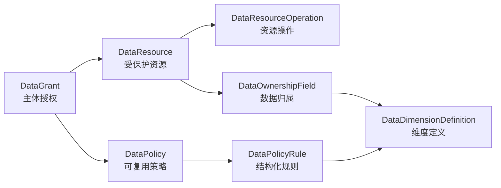

# Sweet Platform 数据权限设计

## 1. 文档目的

本文说明 Sweet Platform 当前唯一的数据权限领域模型、配置关系和运行链路。

数据权限回答“通过功能权限后，当前主体能访问哪些业务数据”。功能权限继续由
`sys_menu`、`sys_menu_button` 与 Casbin 负责，二者职责严格分离。

## 2. 设计原则

1. 数据权限以 Resource + Operation 为保护目标，不以菜单或路由作为资源身份。
2. 配置和运行结果只保存结构化语义，不保存 SQL、表名、JOIN 或字段表达式。
3. Organization 只提供组织事实，Data Permission 不直接访问组织表。
4. Resolver 组合授权语义，Adapter 将结果转换为受控查询条件。
5. 列表、总数、详情、更新、删除和导出必须使用同一运行链路。
6. 配置异常、Provider 异常或类型不兼容时安全失败，不得扩大权限。
7. 平台只维护一套数据权限模型和一条运行链路。

## 3. 领域模型



### 3.1 DataDimensionDefinition

定义平台可解析的业务维度及值类型。当前值类型为 `bigint`、`string`，基础维度包括：

| 维度编码 | 业务语义 | Provider |
| --- | --- | --- |
| `legal_entity` | 法人主体 | Organization Provider |
| `management_org` | 管理组织 | Organization Provider |
| `employee` | 企业人员 | Organization Provider |

业务模块可以登记仓库、项目、客户、供应商等业务维度，但必须提供受控 Provider 或
固定值来源，不允许客户端提交计算表达式。

### 3.2 DataResource 与 DataResourceOperation

DataResource 标识受保护的低代码实体、固定业务服务或报表。稳定身份是
`resource_code`，资源类型为：

- `low_code_table`
- `business_service`
- `report`

资源操作独立声明，支持 `query`、`detail`、`create`、`update`、`delete`、`export`、
`run`。操作与功能权限不同：功能权限控制接口能否访问，资源操作决定访问业务数据时
应解析哪一组 Data Grant。

`permission_enabled=false` 表示该资源尚未启用数据权限。资源和操作必须通过配置预检
后才能启用。

### 3.3 DataOwnershipField

Ownership 描述资源记录中的归属值位于哪里，以及该值属于哪个 Dimension。一个资源
可以有多个 Ownership，每条 PolicyRule 必须显式使用 `ownership_code + dimension_id`
精确匹配，Resolver 不推断默认归属。

绑定类型仅允许：

- `metadata_field`：通过服务端校验后的 `table_field_id` 定位低代码字段。
- `registered_field`：通过服务端注册的 `adapter_field_code` 定位固定业务字段能力。

Ownership 不计算主体范围，也不保存数据库字段表达式。完整边界见
[DataPermissionOwnershipDesign.md](DataPermissionOwnershipDesign.md)。

### 3.4 DataPolicy 与 DataPolicyRule

Policy 是可复用策略，不直接绑定 Resource。策略类型为：

- `all`：有效授权范围内允许全部数据。
- `none`：明确无数据。
- `rule_set`：由结构化 Rule 计算过滤范围。

Rule 显式声明：

- `ownership_code`
- `dimension_id`
- `scope_source`
- `relation`
- `operator`
- `specified_values`
- 必要时的 `structure_code`

同一 Policy 内多个有效 Rule 使用 AND；不允许自动选择第一条 Rule 或自动改成 OR。

### 3.5 DataGrant

Grant 将主体、资源、操作和策略连接起来：

```text
Subject -> Resource + Operation -> Policy
```

V1 主体仅支持 `role`、`user`。不支持岗位、任职、用户组或组织直接授权。多个有效
Grant 采用 OR 合并，多角色自然形成授权并集，不根据角色名称做特殊处理。

## 4. 可信主体上下文

SubjectContext 由服务端 SubjectContextBuilder 构建，包含：

- `user_id`
- 当前有效且去重排序的 `role_ids`
- Organization 账号绑定解析出的 `employee_id`
- 服务端生成的 `as_of_date`

客户端不能覆盖 employee_id、role_ids 或 as_of_date。SubjectContext 不携带组织范围、
权限结果、SQL 或业务查询条件。

## 5. Dimension Provider

Dimension Provider 只回答“当前主体在该 Dimension 下有哪些事实值”。它不读取 Resource、
Grant、Policy，也不生成 DataScopeResult。

Organization 维度调用边界：

```text
Dimension Provider
  -> Organization Permission Provider
  -> Organization 组织事实能力
```

`management_org` 支持 `exact` 与 `self_and_descendants`。后者必须使用显式
`structure_code` 和 SubjectContext 的 `as_of_date` 展开下级，循环、孤儿、无效组织、
超限或 Provider 异常均安全失败。`legal_entity` 与 `employee` 当前使用 `exact`。

## 6. Resolver 与结果语义

统一入口按 `SubjectContext + resource_code + operation` 解析：

```text
Resource
  -> Operation
  -> active Grants
  -> Policies and Rules
  -> Ownership exact match
  -> Dimension Provider
  -> DataScopeResult
```

DataScopeResult 决策如下：

| decision | 含义 |
| --- | --- |
| `not_applicable` | Resource 或 Operation 未启用数据权限，不表示已授权全部 |
| `all` | 有效授权明确允许当前 Resource + Operation 的全部数据 |
| `none` | 明确无授权，或安全失败收敛为无数据 |
| `filtered` | 必须应用结构化条件组 |

`filtered` 使用“组内 AND、组间 OR”：

```text
(owner_org IN [...]
 AND legal_entity IN [...])
OR
(owner_employee EQ [...])
```

同一 Policy 的 Rule 位于同一 AND 组，不同 Grant 的过滤结果保留为不同 OR 组。
`all OR X = all`，`none OR X = X`。`not_applicable` 不能作为授权结果参与合并。

## 7. not_applicable 的消费规则

当前平台尚无生产存量兼容要求，未启用数据权限的资源操作不进入其他数据权限链路：

1. Resolver/运行时返回明确的 `not_applicable`。
2. Adapter 保留 `not_applicable` 执行模式。
3. 查询或写操作按原业务条件继续执行，不追加数据权限过滤。
4. 日志必须记录 `not_applicable`，不得记录为 `all` 或“已授权全部”。
5. 已启用资源若解析出不适用结果，视为配置冲突并安全失败。
6. Resolver、Provider 或 Adapter 失败不得转为 `not_applicable`，也不得执行原始全量查询。

功能权限始终独立生效，因此 not_applicable 不绕过 Casbin 接口授权。

## 8. Adapter

Adapter 不重新读取 Grant、Policy 或 Provider，只消费不可变 DataScopeResult 与服务端加载
的 Ownership 定义。

### 8.1 MetadataFieldAdapter

通过 `table_id + table_field_id` 校验低代码元数据字段，输出不含 SQL、表名和数据库字段名
的结构化过滤树。列表 rows、total、详情、更新/删除存在性检查与导出可复用同一执行结果。

### 8.2 RegisteredFieldAdapter

通过 `adapter_code + adapter_field_code` 定位服务端注册执行能力。注册项声明 Resource、
Dimension、ValueType、Operation 与 Operator 能力，客户端不能注册或覆盖。

四种执行模式必须显式处理：

- `not_applicable`
- `allow_all`
- `deny_all`
- `apply_filter`

未知 Adapter、Ownership 缺失、字段类型漂移或部分条件转换失败时整体失败。

## 9. 查询与写操作接入

低代码统一链路为：

```text
可信认证上下文
  -> SubjectContextBuilder
  -> Resolver
  -> DataScopeResult
  -> MetadataFieldAdapter
  -> Generalization 受控查询或写操作
```

执行要求：

1. rows 与 total 在同一次业务调用中复用相同权限执行结果。
2. 用户查询与数据权限组合为 `UserQuery AND (PermissionGroup1 OR PermissionGroup2)`。
3. 详情使用“业务 ID AND 数据权限条件”直接查询，不先读取完整记录再判断。
4. update/delete 使用各自 operation，并在变更前通过同一执行结果校验记录。
5. 权限失败时不写入、不软删除，也不泄露无权记录是否存在。
6. export 独立使用 export operation，不以 query 授权代替。
7. request 内允许缓存 Resource、Policy、DimensionValues 和 AdapterExecution，不使用全局权限缓存。

Report 的 run/export 权限属于 Report Resource；数据范围委托已发布数据集对应的底层
source Resource。自定义 SQL、多数据集和跨表 JOIN 需要单独评审。

## 10. 安全边界

禁止以下实现：

- 客户端提交 resource_code 覆盖服务端资源定位。
- 客户端提交数据权限条件、SQL、表名、字段名、JOIN 或表达式。
- Controller、业务 Repository 自行读取 Grant、Policy 或 Organization 表。
- Resolver 生成 SQL，或 Adapter 重新解释策略。
- 列表过滤但 total、详情、写操作或导出绕过。
- 解析失败后重试放行、返回 all 或执行无过滤查询。
- 角色名称、管理员名称或固定用户 ID 的硬编码绕过。

## 11. 当前表结构

当前数据权限领域表为：

| 表 | 对象 |
| --- | --- |
| `sys_data_dimension_definition` | DataDimensionDefinition |
| `sys_data_resource` | DataResource |
| `sys_data_resource_operation` | DataResourceOperation |
| `sys_data_ownership_field` | DataOwnershipField |
| `sys_data_policy` | DataPolicy |
| `sys_data_policy_rule` | DataPolicyRule |
| `sys_data_grant` | DataGrant |

所有状态、软删除和审计字段沿用平台 `model.Basic` 规范。

## 12. V1 范围

V1 不支持：

1. 任意 SQL 或客户端表达式。
2. 岗位、任职、用户组或组织直接授权。
3. 复杂 deny 规则。
4. 跨表 JOIN、组合字段或脚本计算 Ownership。
5. 自动推断默认 Ownership。
6. 一个 Ownership 绑定多个 Dimension。
7. TMS、WMS、SRM 的真实 Registered Adapter 接入。
8. Report 自定义 SQL 直接作为 Ownership。

未来扩展必须继续保持 Resource、Ownership、Provider、Resolver 与 Adapter 的职责边界。
