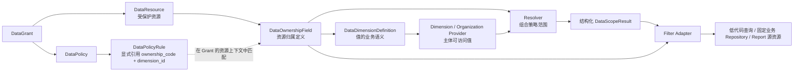

# 数据权限归属定义设计

## 1. 文档目的

本文冻结 Sweet Platform 新一代数据权限模型中的数据归属定义能力，明确
`DataOwnershipField` 在资源、维度、策略、解析器和适配器之间的职责与边界。

本文是正式设计文档，面向后续配置 Service、Resolver 和 Filter Adapter 的实现。
关于数据权限的通用原则，继续遵守
[DataPermissionDesign.md](DataPermissionDesign.md) 中已经明确的规则：

- 功能权限回答“能否访问接口”，数据权限回答“访问后能看到哪些数据”。
- 数据范围使用结构化语义，不保存或接收 SQL。
- 列表、详情、写操作和导出应使用一致的数据权限结果。
- 解析失败、配置缺失或类型不兼容时安全失败，不得默认放开全部数据。

`DataPermissionDesign.md` 同时记录了旧五表运行链路。本文针对 DP-1 已落地的
`DataResource`、`DataOwnershipField`、`DataDimensionDefinition`、
`DataPolicyRule` 和 `DataGrant` 新模型冻结 Ownership 设计，不在本阶段自动映射、
替换或清理旧五表。

## 2. 能力定位

### 2.1 Ownership 的职责

`DataOwnershipField` 描述一条资源数据中的归属值位于哪个受控字段，以及该值属于
哪个平台维度。

例如：

- 运输订单的 `owner_org_id` 表示管理组织归属。
- 库存记录的 `legal_entity_id` 表示法人主体归属。
- 客户记录的 `owner_employee_id` 表示企业人员归属。

Ownership 是平台级数据归属描述能力，不是普通字段 CRUD，也不是用户权限范围。

### 2.2 Ownership 与其他对象的关系



各对象职责如下：

| 对象 | 职责 |
| --- | --- |
| DataResource | 标识需要数据权限保护的业务对象 |
| DataOwnershipField | 描述资源数据的归属值位于哪里、属于什么维度 |
| DataDimensionDefinition | 定义归属值的业务语义、值类型和 Provider |
| DataPolicyRule | 选择具体 Ownership，并声明范围来源、关系和操作符 |
| Provider | 计算当前主体在某个 Dimension 下可访问的值 |
| Resolver | 校验并组合 Resource、Rule、Ownership 和 Provider 结果 |
| Adapter | 将结构化结果转换为目标查询或记录校验的安全条件 |

Ownership 不负责：

- 计算当前用户可访问的组织、法人或人员范围。
- 判断角色、用户或 Casbin 权限。
- 合并 DataGrant 或 DataPolicy。
- 生成 SQL、JOIN、子查询或数据库字段表达式。
- 直接读取业务数据。

## 3. 核心概念

### 3.1 资源归属字段

资源归属字段是业务数据中承载归属标识的受控字段。它可以是低代码元数据字段，也
可以是固定业务模块在服务端注册的字段。

逻辑示例：

| 资源 | 归属字段 | 业务含义 |
| --- | --- | --- |
| transport_order | owner_org_id | 运输订单所属管理组织 |
| inventory | legal_entity_id | 库存所属法人主体 |
| customer | owner_employee_id | 客户所属业务人员 |

以上字段路径用于说明业务语义，不作为客户端可提交的数据库表达式。

### 3.2 ownership_code

`ownership_code` 是一个 DataResource 内部稳定的归属编码，例如：

- `owner_org`
- `legal_entity`
- `owner_employee`

它与 `resource_id` 共同形成活动记录唯一键。编码创建后不可修改。

同一语义在不同资源中应使用一致编码，以便可复用 Policy；同一资源中语义不同的
字段必须使用不同编码。例如采购人员和负责人都属于企业人员维度时，应分别使用
`buyer_employee` 和 `owner_employee`，不能都模糊命名为 `employee`。

### 3.3 dimension_id

`dimension_id` 指向 `DataDimensionDefinition`，决定归属值的业务语义、值类型和
Provider 路由。

当前已初始化的基础维度如下：

| 业务语义 | 稳定维度编码 | 值类型 | Provider |
| --- | --- | --- | --- |
| 法人主体 | `legal_entity` | `bigint` | Organization |
| 管理组织 | `management_org` | `bigint` | Organization |
| 企业人员 | `employee` | `bigint` | Organization |

“management_organization”和“enterprise_employee”可以用于文字描述，但落库和
接口传递必须使用现有稳定编码 `management_org` 和 `employee`，不得创建同义维度。

### 3.4 binding_type

第一阶段只允许：

- `metadata_field`
- `registered_field`

明确禁止 `report_source`。Report 的明细数据范围必须委托到底层 source Resource。

### 3.5 binding_value 的实际存储语义

当前模型没有名为 `binding_value` 的数据库字段。配置 DTO 可以用统一的
`binding_target` 表达绑定目标，但持久化时必须按 `binding_type` 映射到现有字段：

| binding_type | 实际存储字段 | 值语义 |
| --- | --- | --- |
| `metadata_field` | `table_field_id` | 已登记 `sys_table_field` 的内部 ID |
| `registered_field` | `adapter_field_code` | 服务端注册的稳定字段编码 |

两类字段互斥：

- `metadata_field` 必须有 `table_field_id`，且不得有 `adapter_field_code`。
- `registered_field` 必须有非空 `adapter_field_code`，且不得有 `table_field_id`。

不得为了统一命名新增 `binding_value` 字段，也不得将表名、列名或 SQL 片段保存到
现有绑定字段中。

## 4. 绑定类型设计

### 4.1 metadata_field

`metadata_field` 用于已经进入平台低代码元数据体系的字段。

#### 4.1.1 定位方式

1. DataResource 必须是 `low_code_table`。
2. DataResource 通过现有 `table_id` 定位 `sys_table`。
3. Ownership 通过 `table_field_id` 定位 `sys_table_field`。
4. `sys_table_field` 必须属于 DataResource 引用的同一个 `sys_table`。

客户端只提交受控的元数据字段 ID，不提交表名、列名、JOIN 或表达式。

#### 4.1.2 保存校验

配置 Service 至少验证：

- DataResource 存在且状态允许配置。
- `table_field_id` 对应字段存在、未删除并处于可用状态。
- 字段确实属于该资源关联的 `sys_table`。
- 字段可用于受控查询和记录校验。
- 字段类型可以稳定映射为 Ownership 的 `bigint` 或 `string`。
- 字段不是名称、源系统标识、组织树节点标识或其他禁止作为业务归属的字段。

`sys_table_field` 的具体类型映射表需要在 DP-2-T003C 结合现有字段类型体系确认，
标记为“待后续实现确认”。在映射未确认前，不得通过字符串猜测字段类型。

#### 4.1.3 Adapter 责任

metadata_field Adapter 根据已验证的 `table_field_id` 获取服务端元数据字段定义，
再生成参数化的安全过滤条件。Adapter 不接受请求端字段名，也不重新解释 Policy。

### 4.2 registered_field

`registered_field` 用于代码型业务资源，例如 TMS、WMS、SRM 的固定 Service 或
Repository。

#### 4.2.1 稳定注册编码

固定业务模块必须在服务端注册可用于数据权限的字段。Ownership 只保存稳定
`adapter_field_code`，例如：

- `owner_org_id`
- `legal_entity_id`
- `owner_employee_id`

该编码是注册项标识，不是允许客户端直接使用的数据库列名。

服务端应通过 `DataResource.adapter_code + DataOwnershipField.adapter_field_code`
唯一定位注册描述。注册描述至少应声明：

- 字段编码。
- 值类型。
- 支持的操作符。
- 适用的 Adapter。
- 将结构化条件应用到受保护 Repository 的服务端实现。

注册描述的 Go 接口和注册容器形式标记为“待后续实现确认”。第一阶段优先使用
代码注册或现有服务注册能力，不为注册项新增数据库表。

#### 4.2.2 注册主体

注册责任属于资源的业务模块或其受控 Adapter：

- TMS 注册运输订单可用的归属字段。
- WMS 注册库存、仓库任务可用的归属字段。
- SRM 注册供应商、采购单可用的归属字段。

Data Permission 只校验并消费注册能力，不根据数据库结构自动发现固定业务字段。

#### 4.2.3 Adapter 责任

registered_field Adapter 使用服务端注册描述将结构化 Ownership 条件应用到业务
Repository。字段表达式只存在于经过代码评审的服务端实现中，不保存到 Ownership，
也不返回给客户端。

### 4.3 两类绑定的共同安全边界

两类绑定都必须满足：

- 绑定目标由服务端白名单解析。
- 归属值类型必须与 Dimension 值类型一致。
- 不允许任意表名、字段表达式、函数、JOIN 或 SQL。
- 不允许从请求 DTO 覆盖 Adapter 注册信息。
- 绑定缺失、停用或不兼容时安全失败。

## 5. 单资源多归属设计

一个 DataResource 可以定义多个 Ownership。

例如运输订单可以同时定义：

| ownership_code | Dimension | 用途 |
| --- | --- | --- |
| `owner_org` | `management_org` | 按管理组织控制 |
| `legal_entity` | `legal_entity` | 按法人主体控制 |
| `owner_employee` | `employee` | 按业务人员控制 |

多归属不表示运行时自动同时使用全部字段。每条 DataPolicyRule 必须显式指定
`ownership_code` 和 `dimension_id`。

Resolver 禁止：

- 猜测默认 Ownership。
- 根据字段顺序选择 Ownership。
- 自动选择第一条 Ownership。
- 仅按 `dimension_id` 随机选择同维度字段。

Policy 是可复用定义，不直接绑定资源。DataGrant 把 Policy 授予具体 Resource 后，
Resolver 必须在该 Resource 上精确查找与 Rule 的
`ownership_code + dimension_id` 同时匹配的有效 Ownership。

如果 Policy 包含 `owner_employee`，而某个被授权资源只定义了 `buyer_employee`，
两者不匹配，配置预检或运行时必须安全失败，不能因为 Dimension 都是 `employee`
而自动替换。

## 6. 主归属问题

当前 `DataOwnershipField` 没有 `primary`、`default`、`is_primary` 或类似字段。

第一阶段不引入隐式主归属：

1. 每条 DataPolicyRule 必须显式引用 `ownership_code`。
2. Resource 启用前必须校验所有有效 Rule 均能解析到唯一 Ownership。
3. 管理页面不得将列表第一项表现为默认归属。
4. Resolver 不得缓存或推断“常用归属”作为默认值。

如果未来确实需要主归属，必须单独完成业务语义、数据库字段、Migration、兼容和
运行时规则设计，不在当前阶段扩展。

## 7. Dimension 绑定规则

### 7.1 基本规则

1. 每个 Ownership 必须绑定一个 `dimension_id`。
2. `dimension_id` 决定数据值的业务语义，不能仅靠字段名称判断。
3. 同一资源的不同 Ownership 可以绑定不同 Dimension。
4. 同一 Dimension 也可以被一个资源的多个不同语义 Ownership 使用。
5. Ownership 的 `dimension_id` 必须与 DataPolicyRule 的 `dimension_id` 一致。
6. Ownership 的 `value_type` 必须与 Dimension 的 `value_type` 一致。

示例：

| 业务字段 | ownership_code | Dimension |
| --- | --- | --- |
| owner_org_id | `owner_org` | `management_org` |
| legal_entity_id | `legal_entity` | `legal_entity` |
| owner_employee_id | `owner_employee` | `employee` |

数据库字段都是大整数并不表示它们属于同一维度。`org_unit_id`、`legal_entity_id`
和 `employee_id` 即使物理类型相同，也必须绑定各自正确的 Dimension。

### 7.2 Rule 联合校验

DataPolicyRule 保存 `ownership_code + dimension_id`。在具体 Resource 上创建 Grant、
启用 Resource 或执行解析时，必须联合校验：

- Resource 存在同名有效 Ownership。
- Ownership.dimension_id 等于 Rule.dimension_id。
- Rule.scope_source 与 Dimension.ProviderCode 的能力兼容。
- Rule.relation 和 operator 受 Dimension 与 Adapter 支持。
- `specified_values` 的每一项符合 Dimension.value_type。

PolicyRule 与 Ownership 没有直接外键。引用关系通过
`DataGrant.resource_id + DataGrant.policy_id` 建立资源上下文，因此以上属于 Service
和 Resolver 的跨记录约束。

## 8. 字段类型与值语义

### 8.1 第一阶段支持的值形态

当前模型只支持 Ownership 单值标识：

- `bigint`：平台内部 ID，例如 legal_entity_id、org_unit_id、employee_id。
- `string`：稳定业务编码，仅用于 Dimension 明确定义为 string 的场景。

第一阶段不支持一条数据记录的 Ownership 字段保存 ID 集合或多值 JSONB。

DataPolicyRule 的 `specified_values` 使用 JSONB 数组保存“策略允许值集合”，它不是
业务记录的 Ownership 数据值，不能据此推导 Ownership 支持多值字段。

### 8.2 Operator 语义

对于单值 Ownership：

- `eq` 表示资源字段与一个解析值精确匹配。
- `in` 表示资源字段属于 Resolver 给出的值集合。

具体条件由 Adapter 参数化应用。Resolver 和 Ownership 都不生成 SQL。

### 8.3 NULL 与无归属数据

资源记录的 Ownership 值为 NULL 时：

- 不匹配任何具体授权值。
- 不视为公共数据。
- 不视为全部可见。
- 不自动回退到其他 Ownership。

如果业务确实存在“无归属公共数据”需求，必须通过独立 Policy 语义设计，不在
Ownership 中隐式放行。

### 8.4 非法维度值

配置保存阶段应阻止字段类型与 Dimension 不兼容。运行时仍需防御异常数据：

- 值无法转换为 Dimension.value_type 时，Adapter 返回稳定错误。
- Resolver/Adapter 的最终结果必须安全失败，不执行无过滤查询。
- 不把非法值静默丢弃后扩大其余数据范围。

错误码、批量数据中单条非法值的诊断格式标记为“待后续实现确认”，但不得改变安全
失败原则。

### 8.5 已停用或软删除的维度对象

Ownership 只描述资源记录中的维度值，不判断维度对象当前是否有效。

- Organization Provider 只返回当前日期下有效的法人、管理组织和企业人员范围。
- 已停用或软删除的维度对象不进入当前主体的有效值集合，因此默认不匹配。
- `specified_values` 在配置保存、启用预检和运行时应按对应 Provider 或注册维度能力
  校验有效性。

Ownership 不直接查询组织表或业务维度表。

## 9. 配置生命周期

### 9.1 创建

创建 Ownership 时必须一次确定：

- resource_id
- ownership_code
- dimension_id
- binding_type
- binding_target
- value_type
- state

创建不自动生成 Policy、Rule 或 Grant。

### 9.2 修改

依据现有 DTO 字段边界，第一阶段普通配置更新只允许修改 `state`。

以下字段属于身份与语义字段，创建后不通过普通更新接口修改：

- resource_id
- ownership_code
- dimension_id
- binding_type
- binding_target
- value_type

其中 binding_target 在模型中对应 `table_field_id` 或 `adapter_field_code`。

需要纠正身份字段时，应先确认没有任何 PolicyRule/Grant 引用，再通过受审查的停用、
删除和重新创建流程处理。不得在正在生效的配置上原地替换字段语义。

### 9.3 停用

停用前必须检查当前 Resource 上是否存在有效 Grant，其 PolicyRule 正在使用该
`ownership_code + dimension_id`。

- 有有效引用时，第一阶段拒绝停用，先停用或解除相关 Grant。
- Policy 定义可以继续保留，但缺少有效 Ownership 的 Policy 不得在该 Resource 上
  继续启用或执行。
- 如果历史异常导致 Ownership 已停用但 Grant 仍有效，Resolver 必须返回配置失败并
  安全收敛为 none。

### 9.4 删除

- 已被 PolicyRule 通过具体 Resource 的 Grant 上下文引用时，禁止物理删除。
- 未被引用的 Ownership 也应遵循平台软删除规范。
- 不依赖数据库外键异常向管理员表达引用关系。
- 删除后不得自动选择同 Dimension 的其他 Ownership 替代。

### 9.5 引用判定

DataPolicyRule 不直接保存 resource_id，因此引用检查需要沿以下关系完成：

```text
Ownership.resource_id
  -> DataGrant.resource_id
  -> DataGrant.policy_id
  -> DataPolicyRule.policy_id
  -> Rule.ownership_code + Rule.dimension_id
```

该跨记录引用保护属于配置 Service 责任，不新增冗余外键或归属引用表。

## 10. 配置校验分层

### 10.1 数据库约束

数据库负责：

- resource_id、dimension_id 必填和外键完整性。
- 活动记录 `(resource_id, ownership_code)` 唯一。
- binding_type 只允许 `metadata_field`、`registered_field`。
- metadata_field 与 registered_field 的绑定目标互斥。
- value_type 只允许 `bigint`、`string`。

数据库不负责跨 Resource、PolicyRule、Provider 和 Adapter 的业务兼容校验。

### 10.2 Service 约束

DP-2 Ownership Definition Service 必须校验：

1. Resource 存在。
2. Resource 状态允许配置。
3. ownership_code 在资源内唯一且格式合法。
4. dimension_id 存在且启用。
5. binding_type 合法。
6. metadata_field 对应字段存在且属于 Resource。
7. registered_field 注册项存在且属于 Resource 的 Adapter。
8. 字段类型、Ownership.value_type 与 Dimension.value_type 一致。
9. 禁止 report_source。
10. 禁止任意 SQL、表名、JOIN、函数和字段表达式。
11. 被引用时保护所有身份与语义字段。
12. Ownership 与 PolicyRule.dimension_id 一致。
13. Resource 启用前所有 Ownership 均可被目标 Adapter 解析。

### 10.3 Resolver 运行时保护

Resolver 必须再次校验：

- Resource、Operation、Ownership、Dimension、Policy、Rule 和 Grant 当前有效。
- Ownership 唯一且精确匹配。
- dimension_id 一致。
- Provider 能力、relation、operator 和 value_type 兼容。
- Adapter 能消费该 Ownership。

任何配置漂移、缺失或不兼容都返回稳定失败，不得转成 all。

## 11. Provider 边界

Ownership 不直接调用 Organization Provider 或业务 Provider。

Provider 的职责是回答：

> 当前主体在指定日期、指定 Dimension 下，可以使用哪些有效维度值？

Ownership 的职责是回答：

> 该 Resource 的一条数据记录中，哪个受控字段承载这个 Dimension 的值？

示例：

```text
Ownership:
transport_order.owner_org_id
  -> ownership_code = owner_org
  -> dimension = management_org

Organization Provider:
当前用户有效管理组织范围
  -> [orgA, orgB, orgC]

Resolver:
把 PolicyRule 的范围来源、Provider 值和 Ownership 组合为结构化中间结果
```

Data Permission 禁止直接访问 Organization Repository 或组织表。Organization
只提供组织事实，不返回 Policy、Grant 或 SQL。

## 12. Resolver 解释规则

### 12.1 输入

Resolver 的 Ownership 相关输入至少包括：

- Resource
- Operation
- PolicyRule
- OwnershipDefinition
- SubjectContext

SubjectContext 的最终结构随 DP-3 Resolver 实现冻结，标记为“待后续实现确认”，但
其中的 user_id、有效 role_ids 和 as_of_date 必须来自可信服务端上下文。

### 12.2 解释步骤

Resolver 必须：

1. 通过 DataGrant 确定 Resource 与 Policy 上下文。
2. 按 Rule.ownership_code 在当前 Resource 内精确加载 Ownership。
3. 校验 Ownership.dimension_id 等于 PolicyRule.dimension_id。
4. 校验 Ownership、Dimension 和 Rule 状态。
5. 根据 scope_source 调用正确 Provider 或读取受控 specified_values。
6. 校验值类型、relation、operator 和数量上限。
7. 输出与具体数据库、ORM 和 Adapter 无关的结构化中间语义。

Resolver 禁止：

- 解析 table_field_id 为数据库字段表达式。
- 把 adapter_field_code 当作 SQL 列名。
- 直接拼接 SQL。
- 调用业务 Repository 获取数据后在内存中过滤。
- 为缺失 Ownership 猜测替代字段。

## 13. Adapter 边界

Adapter 负责将 Ownership 定义与 Resolver 的结构化结果转换为具体执行条件。

### 13.1 metadata_field Adapter

metadata_field Adapter：

1. 通过 table_field_id 读取服务端元数据。
2. 验证字段仍属于 Resource 对应表。
3. 使用现有低代码查询构建能力参数化应用条件。
4. 对 query 与 total 应用相同条件。
5. 对 detail、update、delete 和写入归属校验复用同一 Ownership 语义。

### 13.2 registered_field Adapter

registered_field Adapter：

1. 通过 adapter_code + adapter_field_code 获取服务端注册描述。
2. 调用受保护 Repository 的受控 Apply 能力。
3. 保证操作符和值类型与注册能力一致。
4. 对不支持的条件安全失败。

### 13.3 共同禁止事项

Adapter 禁止：

- 接受客户端 SQL、表名或字段表达式。
- 从 Ownership 配置读取 SQL 片段。
- 读取或合并 DataGrant、DataPolicy。
- 调用 Organization Provider。
- 自行改变 Resolver 的 all、none、filtered 或失败语义。
- 将过滤失败降级为无条件查询。

## 14. 典型场景

### 14.1 TMS 运输订单按管理组织控制

| 对象 | 配置 |
| --- | --- |
| Resource | `service:tms.transport_order` |
| Ownership | `owner_org` |
| Dimension | `management_org` |
| Binding | registered_field / `owner_org_id` 注册项 |
| PolicyRule | owner_org + management_org + effective_org_units |
| Provider | Organization Provider 返回有效管理组织 ID |
| Resolver | 生成 owner_org 对应的结构化 ID 集合条件 |
| Adapter | TMS 注册 Adapter 将条件应用到运输订单 Repository |

此场景不允许客户端提交 `transport_order.owner_org_id`，也不允许 Data Permission
直接读取组织表。

### 14.2 业务单据按法人主体控制

| 对象 | 配置 |
| --- | --- |
| Resource | 具体业务单据 Resource |
| Ownership | `legal_entity` |
| Dimension | `legal_entity` |
| Binding | metadata_field 或 registered_field，取决于资源类型 |
| PolicyRule | legal_entity + effective_legal_entities |
| Provider | Organization Provider 返回有效法人主体 ID |
| Resolver | 输出法人主体维度的结构化范围 |
| Adapter | 将范围应用到业务单据法人归属字段 |

法人主体与管理组织是不同 Dimension，即使字段类型相同也不能互换。

### 14.3 客户按业务员控制

| 对象 | 配置 |
| --- | --- |
| Resource | `service:crm.customer` |
| Ownership | `owner_employee` |
| Dimension | `employee` |
| Binding | registered_field / `owner_employee_id` 注册项 |
| PolicyRule | owner_employee + employee + current_employee |
| Provider | Organization Provider 将当前账号解析为企业人员 ID |
| Resolver | 输出企业人员维度的结构化范围 |
| Adapter | CRM Adapter 应用客户负责人条件 |

这里使用 employee_id，不使用 user_id 代替企业人员归属。

### 14.4 低代码实体按元数据字段控制

| 对象 | 配置 |
| --- | --- |
| Resource | 一个 low_code_table Resource |
| Ownership | 例如 `owner_org` |
| Dimension | `management_org` |
| Binding | metadata_field / 已登记 sys_table_field ID |
| PolicyRule | 显式引用 owner_org + management_org |
| Provider | Organization Provider 返回组织范围 |
| Resolver | 输出结构化 Ownership 条件 |
| Adapter | 低代码 Adapter 通过元数据字段应用过滤 |

字段进入 `sys_table_field` 不代表自动成为 Ownership。只有经过显式 Ownership 配置
和资源启用预检后，才能用于数据权限。

## 15. 第一阶段明确不支持

第一阶段不支持：

1. 任意 SQL Ownership。
2. 客户端字段表达式。
3. 跨表 JOIN Ownership。
4. 运行时动态选择字段。
5. 自动推断主归属。
6. 一个 Ownership 同时绑定多个 Dimension。
7. 组合字段 Ownership。
8. 基于脚本或函数计算归属。
9. Report 自定义 SQL 直接作为 Ownership。
10. `report_source` 绑定类型。
11. 旧五表自动映射。
12. 多值 JSONB 业务归属字段。
13. 以 structure_node_id、source_id、名称或展示文本作为组织业务归属。

未来扩展必须单独设计、评审和实施，不得通过放宽 binding_value 或 Adapter 白名单
绕过本设计。

## 16. 后续实施拆分

### 16.1 DP-2-T003B：Ownership Definition Service

范围：

- Ownership 创建、查询、停用和软删除。
- Resource、Dimension 和唯一性校验。
- binding_type 与 binding_target 互斥校验。
- 生命周期和引用保护。
- Resource 启用前 Ownership 完整性预检。
- 统一错误、事务、审计和自动化测试。

禁止：

- 实现 Resolver。
- 生成 SQL。
- 绕过元数据或注册字段白名单。

### 16.2 DP-2-T003C：Ownership 注册表与元数据校验适配

范围：

- metadata_field 的资源归属、字段存在性和类型兼容校验。
- registered_field 的服务端注册接口与查找能力。
- Adapter 字段能力描述。
- 配置保存和资源启用时的双重校验。
- 注册缺失、类型漂移和 Adapter 不支持的安全失败测试。

“注册表”优先指服务端代码注册表或现有注册能力，不等同于新增数据库表。若现有
架构可以通过代码注册和 `sys_table_field` 完成，不新增任何表。只有在独立评审证明
确有持久化必要后，才允许另行设计数据库结构。

## 17. 冻结结论

1. Ownership 是资源数据归属描述，不是权限范围，也不是字段 CRUD。
2. 一个 Resource 可以有多个 Ownership，但每条 PolicyRule 必须显式选择一个。
3. 第一阶段没有主归属、默认归属或自动第一项语义。
4. `dimension_id` 决定归属值业务语义，Rule 与 Ownership 必须一致。
5. binding_value 使用现有 `table_field_id` 或 `adapter_field_code` 承载，不新增字段。
6. metadata_field 只信任现有元数据 ID，registered_field 只信任服务端注册编码。
7. Ownership 不调用 Provider；Resolver 调用 Provider 并输出结构化结果。
8. Adapter 只应用结构化结果，不读取 Grant，不重新解释权限。
9. 第一阶段 Ownership 值是 bigint/string 单值，不支持多值 JSONB 和跨表计算。
10. 任何缺失、停用、类型不兼容或注册漂移都必须安全失败。
