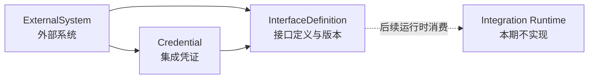

# Sweet Platform 集成配置中心验收报告

## 1. 文档信息

### 1.1 文档目的

本文档基于当前仓库真实代码、自动化测试和可用运行环境，对 Sweet Platform Integration Foundation 一期配置中心进行正式验收。验收对象包括外部系统、接口定义和集成凭证，不包含 HTTP 调用执行、连接测试、执行日志、重试 Worker、同步任务或业务字段转换。

### 1.2 验收信息

| 项目 | 内容 |
| --- | --- |
| 验收日期 | 2026-08-05 |
| 验收基线 Commit | `f380386b97dc65d215592e6ff9d85d06c31a686c` |
| 基线提交信息 | `统一数据权限配置仓储基础能力` |
| 后端环境 | Go 1.26.2，SQLite 自动化测试 |
| 前端环境 | Node.js 24.14.0，Yarn 1.22.x |
| PostgreSQL 环境 | 未提供 `SWEET_TEST_POSTGRES_DSN`，专项测试未执行 |
| 浏览器人工环境 | 本地完整 API 与登录环境未启动，未执行登录态人工验收 |
| 适用范围 | Integration Foundation 配置中心一期 |

本报告提交自身的 Commit 以 Git 历史为准。

## 2. 验收范围与架构

配置中心由三个相互约束的配置对象构成：

- `ExternalSystem` 定义外围系统身份、类型、基础地址、负责人和可用状态。
- `Credential` 隶属于一个外部系统，保存受保护的认证秘密及其生命周期元数据。
- `InterfaceDefinition` 隶属于一个外部系统，可引用同一系统的有效凭证，并以版本保存技术契约。
- Controller 负责请求适配，Service 负责业务校验与事务，Repository 只负责数据访问，Response DTO 建立对外字段白名单。

## 3. 数据模型与数据库验收

### 3.1 数据库对象

| 表 | 稳定业务键 | 主要约束 | 结论 |
| --- | --- | --- | --- |
| `integration_external_system` | `system_code` | 全局唯一；类型、状态、revision 受控 | 通过代码与自动化测试验收 |
| `integration_interface_definition` | `external_system_id + interface_code + version` | 复合唯一；同一系统同一接口最多一个启用版本 | 通过代码与自动化测试验收 |
| `integration_credential` | `external_system_id + credential_code` | 系统内唯一；类型、状态、version、revision 受控 | 通过代码与自动化测试验收 |

三表均复用平台 Basic 审计字段，不提供物理删除业务入口。Migration 在事务中执行，PostgreSQL 使用 CHECK 约束和部分唯一索引保证启用版本唯一。

### 3.2 PostgreSQL 实际状态

本次环境未设置 `SWEET_TEST_POSTGRES_DSN`，因此未实际验证 PostgreSQL CHECK、部分唯一索引、真实行锁及 Migration 重复执行。SQLite 与仓库自动化测试已通过，但不能替代 PostgreSQL 专项验收。

## 4. 生命周期验收

### 4.1 ExternalSystem

- 状态：`draft -> enabled -> disabled -> enabled`。
- `system_code` 创建后不可修改。
- 启用前校验必要字段。
- 停用不级联篡改子接口或凭证的持久状态。
- 系统停用后，所属接口的计算有效状态为不可用，后续运行时不得将其视为可执行配置。

结论：通过自动化场景验收。

### 4.2 InterfaceDefinition

- 状态：`draft -> enabled -> disabled`。
- `interface_code` 和已生成版本号不可覆盖。
- 技术契约修改仅允许在草稿版本进行；启用版本必须创建下一版本。
- 下一版本号由服务端在事务和行锁下生成，旧版本不被覆盖。
- 同一系统、同一接口编码只允许一个启用版本。
- 当前真实切换规则为：创建新草稿版本后，管理员先停用旧启用版本，再启用新版本；系统不会自动停用旧版本。
- 引用凭证必须属于同一系统。草稿编辑可引用未吊销凭证；接口启用时凭证必须处于 `active` 且未过期。

结论：通过自动化场景验收。

### 4.3 Credential

- 持久状态：`draft`、`active`、`disabled`、`revoked`。
- 支持 `draft -> active -> disabled -> active`。
- 支持从 `active` 或 `disabled` 进入 `revoked`。
- `revoked` 为终态，不允许恢复、修改或轮换。
- `expired` 是基于有效期计算的状态，不写入持久状态字段。
- 过期凭证不能用于启用接口，也不能被视为有效执行凭证。
- 轮换不改变 `credential_code`，会增加安全版本、更新指纹摘要与轮换时间。
- 系统不提供历史秘密读取、导出或恢复接口。

结论：通过自动化场景验收。

## 5. 完整配置场景验收

自动化验收建立了以下配置：

1. 创建 `hr_demo` 外部系统，初始状态为 `draft`。
2. 在该系统创建 `hr_api_token` Bearer Token 凭证。
3. 创建 `org_list` 接口版本 1，Method 为 `GET`，相对路径为 `/api/organizations`，引用 `hr_api_token`。
4. 依次启用外部系统、凭证和接口。
5. 创建第二个系统及凭证，验证 `hr_demo` 接口引用跨系统凭证时返回稳定领域错误。
6. 基于版本 1 创建版本 2，验证版本 1 未被覆盖；旧版本仍启用时版本 2 启用失败；停用版本 1 后版本 2 启用成功。
7. 停用 `hr_demo` 后，子对象持久状态保持不变，接口计算有效状态变为不可用。

结论：三对象完整配置链路成立。

## 6. Credential 安全验收

| 检查项 | 结果 | 依据 |
| --- | --- | --- |
| 数据库不保存秘密明文 | 通过 | AES-GCM 密文信封与验收测试 |
| 创建、列表、详情、轮换响应不返回秘密 | 通过 | Response DTO 白名单与 Controller 测试 |
| API 不返回密文、nonce、IV、Tag 或存储引用 | 通过 | Model 安全字段 `json:"-"` 与 DTO 测试 |
| 前端不回填、显示、复制、导出或恢复秘密 | 通过静态与组件验收 | 表单和详情实现、组件测试 |
| 轮换关闭后立即清理秘密输入 | 通过 | Credential 表单组件测试 |
| 日志和审计不记录秘密 | 通过 | 审计摘要实现与验收测试 |
| 错误响应不包含秘密 | 通过 | 稳定领域错误与测试 |
| 跨系统凭证引用拒绝 | 通过 | Service 校验与完整场景测试 |
| 吊销后不能重新启用 | 通过 | 状态机测试 |
| 加密、解密异常安全失败 | 通过 | 安全组件测试，不降级保存或返回明文 |

### 6.1 安全存储实现

当前实现使用服务端 AES-GCM：

- 主密钥来源为服务端 `Session.Secret`，生产配置要求通过 `APP_SESSION_SECRET` 提供不少于 32 字符且非默认值的秘密。
- 使用独立上下文派生 AES 密钥，并为每次写入生成随机 nonce 和安全存储引用。
- 指纹使用 SHA-256，仅向 API 返回截断后的指纹摘要。
- 缺少主密钥、随机数生成失败或密文信封无效时安全失败。

当前未接入 KMS 或独立密钥托管服务，本报告不将现有实现描述为 KMS 集成。

## 7. Repository 基础能力回归

### 7.1 统一能力

- 三个 Integration Repository 均继承 `BasicRepository[T]`，实现组合 `BasicRepositoryImpl[T]`。
- 通用 CRUD、标准 `context.Context`、事务入口、`FindByIdForUpdate`、`UpdateFieldsByRevision` 已由 BasicRepository 提供。
- 列表统一使用 `PaginateAndCountAsync`，rows 与 total 复用同一受控筛选条件。
- Integration Repository 不依赖 `*gin.Context`，只保留复合业务键、版本和领域查询所需的数据访问能力。
- 接口版本复合业务键未被错误简化为单字段 `FindByField`。

### 7.2 事务与并发修复

验收发现 `PaginateAndCountAsync` 可能在事务 DB 上并发执行 rows 和 count。该行为可能并发使用同一事务连接并破坏一致性，已修复为：

- 普通 DB 保持并行分页计数。
- 检测到事务 DB 或带事务连接时，rows 与 count 顺序执行。
- Service 中所有 `FindByIdForUpdate` 调用均位于事务闭包内。
- revision 正确时更新成功，旧 revision 返回稳定冲突，不静默覆盖。

结论：Repository 统一后的分页、行锁和乐观锁行为通过自动化回归；真实 PostgreSQL 行锁仍待专项环境复核。

## 8. 权限与审计验收

### 8.1 权限

- 菜单结构为“集成中心 / 外部系统、接口定义、集成凭证”，顺序为 1、2、3。
- 三个页面按钮均来源于 `sys_menu_button`，分别覆盖查询、详情、新增、编辑、启停，以及版本创建、轮换和吊销等领域动作。
- 后端 API 位于受保护的 admin 路由组，由 Casbin 规则保护。
- 前端使用动态菜单和动态按钮权限，不包含角色名称硬编码。
- 无权限 API 使用平台统一拒绝响应。

### 8.2 审计

- ExternalSystem：创建、修改、启用、停用。
- InterfaceDefinition：创建、修改草稿、创建版本、启用、停用。
- Credential：创建、修改元数据、轮换、启用、停用、吊销。
- 审计主体来自标准 `AuditSubject`。
- 本次补充了标准 Context 中 `request_id`、`trace_id` 的注入与事务审计传递。
- Credential 审计只记录编码、类型、状态和版本摘要，不记录秘密。

结论：权限与审计代码审计及自动化测试通过。

## 9. 页面验收

### 9.1 已验证能力

- 三个页面复用平台 `BaseContent`、`q-table`、AdvancedQuery、FormDialog、详情组件、动态按钮和分页能力。
- 不提供删除、测试连接、立即调用、SQL、脚本或字段映射入口。
- ExternalSystem 详情可导航到当前系统的接口和凭证筛选结果。
- InterfaceDefinition 表单只展示当前外部系统可引用的凭证；详情展示版本及安全凭证摘要。
- Credential 页面不展示秘密，轮换和关闭弹窗后清空秘密输入状态。
- 启停、轮换、吊销均有确认提示，状态文案与后端状态一致。
- 深色模式样式沿用平台公共表格、弹窗和主题变量。

### 9.2 验证边界

前端组件测试、lint、类型检查和生产构建均已通过。由于本次环境未启动完整后端、数据库和登录会话，未进行浏览器登录态人工操作，因此页面视觉和真实权限交互只能判定为自动化通过、人工待复核。

## 10. 列表与筛选验收

- 三个列表均验证 rows 与 total 一致。
- 支持关键词、状态、类型、所属系统等白名单筛选。
- ExternalSystem 负责人查询使用受控 OR 条件。
- Credential 支持基于有效期计算 `expired` 筛选。
- Request DTO 不接收 SQL、表名、字段表达式或客户端自定义查询执行器；Repository 只消费 Service 提供的受控筛选。

结论：通过自动化测试与代码审计。

## 11. 本次缺陷修复

1. 将凭证引用合法性从 Repository 上移到 Service，恢复 Repository 纯数据访问边界。
2. 增加接口与凭证同系统校验，并区分草稿引用和启用时有效性要求。
3. 增加接口 `effective_status`，父系统停用或凭证失效时不再显示为有效可用。
4. 增加接口详情的安全凭证引用摘要，不暴露凭证内部安全字段。
5. 修复事务 DB 上分页与计数并发执行的风险。
6. 补充标准 Context 的 request_id、trace_id 审计传递。
7. 补充外部系统到接口、凭证的受控筛选导航。
8. 补充 Credential 秘密输入清理、跨系统引用、版本切换、Controller DTO 白名单和完整配置链路测试。

## 12. 自动化测试结果

| 测试 | 实际结果 |
| --- | --- |
| `cd backend && go test ./... -count=1` | 通过 |
| `go test -race ./dto/request ./repository/impl ./service ./migrate` | 通过 |
| `go test -race ./controller -run IntegrationConfiguration -count=1` | 通过 |
| Controller 全包 race | 未通过：触发历史 Organization/Gin Context 测试竞争，非 Integration 路径 |
| `cd frontend && yarn test` | 通过，26 个测试文件、102 个测试 |
| `yarn lint` | 通过 |
| `yarn typecheck` | 通过 |
| `yarn build` | 通过；仅有非阻塞 chunk size 与 Node 提示 |
| PostgreSQL 专项 | 未执行，缺少 `SWEET_TEST_POSTGRES_DSN` |
| 浏览器人工验收 | 未执行，完整本地运行环境未启动 |

历史 race 发生在 Organization 员工账号绑定 Controller 测试复用 Gin Context 的路径，不影响 Integration 专项 race 结果。本任务未越界修改 Organization。

## 13. 当前限制

1. PostgreSQL CHECK、部分唯一索引、真实行锁及 Migration 幂等尚未在本次环境实际执行。
2. 三个页面尚需在完整登录态环境完成一次浏览器人工验收。
3. 凭证主密钥当前来自受控环境变量配置，尚未接入 KMS 或独立密钥托管。
4. 接口新版本启用不会自动停用旧版本，管理员必须按“先停用旧版本、再启用新版本”操作。
5. HTTP 执行、连接测试、Token 自动刷新、IntegrationExecution、IntegrationLog、Retry、SyncTask、SyncBatch 均不属于本期配置中心。
6. 仓库仍存在与本模块无关的历史 Organization/Gin Context race 测试问题。

## 14. 验收结论

**结论：有条件通过。**

ExternalSystem、InterfaceDefinition、Credential 的模型、Service、Repository、DTO、权限、审计和前端管理链路已成立；完整配置、跨系统拒绝、版本切换、Credential 生命周期、安全存储、乐观锁和列表筛选均有当前代码及自动化测试依据。验收发现的配置中心缺陷已修复，未引入运行时执行能力。

### 14.1 阻塞“无条件通过”的项目

1. 在提供 `SWEET_TEST_POSTGRES_DSN` 的环境执行 PostgreSQL 真实约束、行锁和 Migration 幂等测试。
2. 启动完整后端、数据库与前端，在登录态完成三个页面的浏览器人工验收。

以上项目不阻塞配置中心代码合并，但在对外宣告“完整生产环境验收通过”前必须完成。

### 14.2 非阻塞后续项

1. 将凭证主密钥接入 KMS 或企业密钥托管能力。
2. 单独治理历史 Organization/Gin Context race 测试问题。
3. 按 Integration Foundation 后续任务开发运行时执行、日志、重试和同步能力，不在配置中心任务中提前实现。
