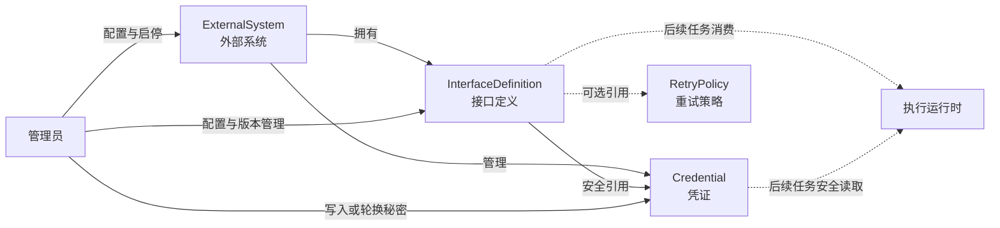
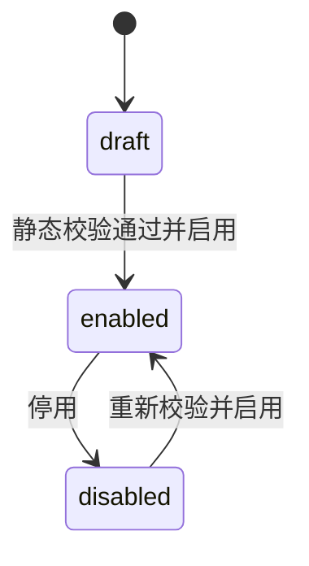
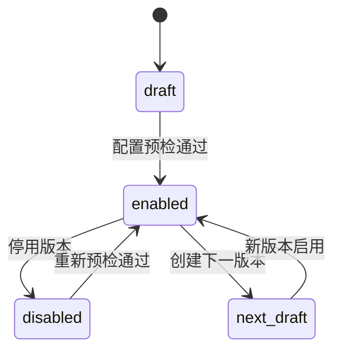
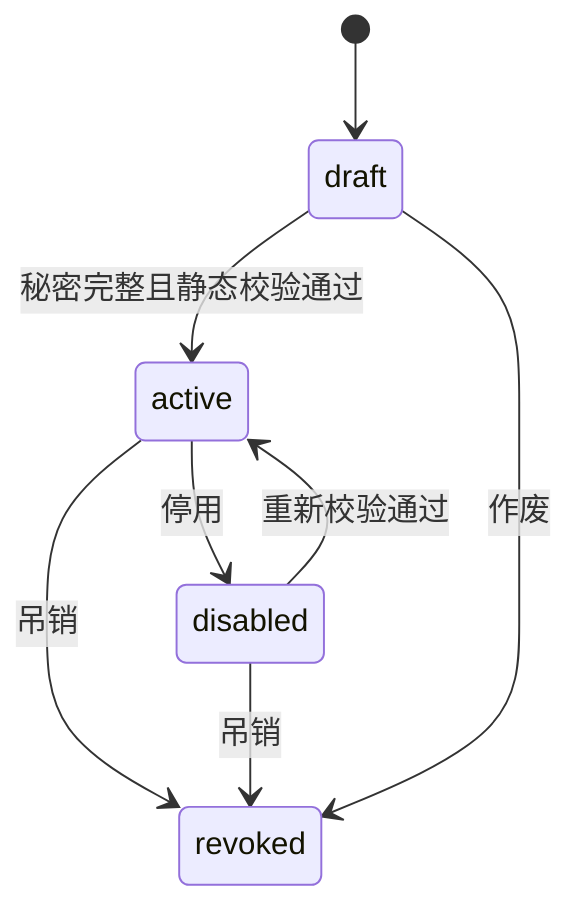

# Sweet Platform 集成配置中心详细设计

## 文档信息

| 项目 | 内容 |
| --- | --- |
| 文档定位 | Integration Foundation 一期配置中心正式设计 |
| 设计对象 | `ExternalSystem`、`InterfaceDefinition`、`Credential` |
| 上位设计 | [IntegrationFoundationDesign.md](IntegrationFoundationDesign.md) |
| 适用角色 | 平台架构师、后端开发、前端开发、实施与系统管理员 |
| 当前范围 | 配置管理、静态校验、状态管理、权限与审计设计 |
| 不在范围 | HTTP 执行、Worker、自动重试、业务同步规则、字段转换 |

本文细化 Integration Foundation 中外部系统、接口定义和凭证三个配置对象，不修改已冻结的领域边界，不承诺数据库表结构，也不涉及 Migration。后续实现必须继续遵守平台的标准 Context、事务、错误、DTO、测试、Casbin 和 Data Permission 规范。

## 设计原则

1. 配置身份稳定：业务编码创建后不可修改，引用通过稳定身份建立。
2. 配置与执行分离：配置中心描述可用能力，不负责发起 HTTP 调用、调度 Worker 或执行重试。
3. 技术契约与业务规则分离：接口定义不保存 HR 字段转换、组织同步映射或其他业务编排规则。
4. 秘密只写不可读：凭证秘密只允许在创建和轮换时写入，列表、详情、日志与审计均不得返回明文。
5. 客户端输入受控：不接受 SQL、脚本、任意表达式、数据库对象或执行时完整 URL。
6. 状态变化受审计：创建、修改、启停和凭证轮换等关键操作必须使用稳定命令并记录审计事实。
7. 不跨领域取数：Integration 不直接访问组织表，不修改 Organization、Data Permission 及其冻结模型。



图中的 RetryPolicy 仅作为已冻结对象被接口引用，本任务不设计其配置中心；执行运行时也不属于 INT-002A。

## 1. ExternalSystem 设计

### 1.1 职责

`ExternalSystem` 表示 Sweet Platform 管理的一个外围系统实例，例如 HR、ERP、TMS 或 WMS。它负责提供接口和凭证的归属边界，以及后续运行时组合目标地址所需的受信任基础地址。

ExternalSystem 不承担以下职责：

- 不保存账号密码、Token、证书私钥等敏感连接信息。
- 不根据系统类型自动执行业务同步或访问 Organization。
- 不保存 HR 字段转换、脚本、SQL 或业务编排规则。
- 不因负责人字段自动授予配置或数据访问权限。

### 1.2 配置字段

| 字段 | 含义 | 创建后规则 | 列表与详情边界 |
| --- | --- | --- | --- |
| 系统编码 | 全局稳定业务编码 | 创建后不可修改 | 列表、详情均返回 |
| 系统名称 | 管理员可读名称 | 允许修改 | 列表、详情均返回 |
| 系统类型 | HR、ERP、TMS、WMS 等受控字典值 | 被接口引用后禁止直接修改 | 列表、详情均返回 |
| 基础地址 | 服务端维护的受信任 Endpoint | 通过受控配置命令修改 | 列表显示主机摘要，详情显示规范化地址 |
| 负责人 | 运维责任人标识与展示摘要 | 允许修改 | 不产生隐式权限 |
| 状态 | `draft`、`enabled`、`disabled` | 通过启停命令修改 | 列表、详情均返回 |
| 描述 | 非敏感用途说明 | 允许修改 | 详情返回，列表按需摘要 |
| 版本信息 | 并发更新用修订号和更新时间 | 服务端维护 | 不暴露数据库控制字段 |

基础地址由配置管理员通过受控 API 维护，不等于允许调用方在执行时提交完整 URL。后续执行运行时只能使用“已启用系统的基础地址 + 已启用接口的相对路径”组合目标地址。

基础地址至少应执行以下静态校验：

- 协议、主机和端口必须明确，生产环境默认要求 HTTPS。
- 禁止 `userinfo`、查询参数和片段承载秘密。
- 禁止回环地址、链路本地地址和平台安全策略禁止的网段；具体网络白名单待运行时安全设计确认。
- 规范化后再保存和比较，避免等价地址重复或路径绕过。

### 1.3 稳定编码与引用保护

- 系统编码采用平台统一稳定编码格式，建议使用小写字母、数字和下划线，不使用中文、空格、URL 或数据库表名。
- 系统编码创建后不可修改；名称变化不能改变系统身份。
- 系统已被 InterfaceDefinition、Credential、SyncTask 或历史执行引用时，禁止物理删除。
- 一期不提供物理删除 API。草稿误建数据的清理规则在数据库详细设计阶段另行确认，不得绕过引用检查。
- 停用系统不会级联改写子对象状态，但该系统下接口和凭证的“有效可用状态”随系统停用而失效。

### 1.4 生命周期



启用前必须检查系统名称、类型、基础地址和负责人等必需配置。停用允许执行，但后续运行时不得再为该系统创建新执行；历史配置和审计记录继续保留。

## 2. InterfaceDefinition 设计

### 2.1 职责与稳定身份

`InterfaceDefinition` 描述一个外部接口的受控技术契约，包括所属系统、接口编码、版本、协议、HTTP Method、相对路径、认证引用、超时、响应限制及 RetryPolicy 引用。

接口稳定身份采用：

```text
ExternalSystem + interface_code + version
```

同一系统内 `interface_code` 稳定且不可复用。版本由服务端按既定顺序创建，客户端不得伪造或覆盖历史版本。已启用版本的技术契约不原地改变；Method、路径、认证引用、超时、响应限制等语义变化应创建新草稿版本。

### 2.2 配置字段

| 字段 | 规则 |
| --- | --- |
| 所属系统 | 创建后不可跨系统迁移；目标系统必须存在 |
| 接口编码 | 系统内稳定唯一，创建后不可修改 |
| 接口名称 | 可修改的管理员展示名称 |
| 版本 | 服务端生成并保持历史稳定 |
| 协议 | 一期受控为 HTTP/HTTPS 语义，不接受任意协议字符串 |
| HTTP Method | 使用受控枚举；具体一期白名单在实现任务冻结 |
| 相对路径 | 必须以受控相对路径表达，不接受协议、主机或完整 URL |
| Credential 引用 | 可选；必须引用同一 ExternalSystem 下有效且类型兼容的凭证 |
| 超时 | 1 至 120 秒，默认 30 秒；与 Runtime Transport 硬边界一致 |
| 响应限制 | 1 KiB 至 64 MiB，默认 10 MiB；Transport 不静默截断 |
| RetryPolicy 引用 | 可选引用已存在策略；本任务不管理重试策略本身 |
| 状态 | `draft`、`enabled`、`disabled` |
| 描述 | 非敏感用途说明，不保存脚本和业务转换规则 |

### 2.3 契约安全边界

InterfaceDefinition 允许描述受控请求和响应契约，但不得保存或接受：

- SQL、数据库表名、JOIN、数据库字段表达式。
- JavaScript、Go 模板、Shell 或其他可执行脚本。
- 任意表达式语言、动态函数或反射调用。
- HR 字段转换、组织映射、业务校验和领域写入规则。
- 含协议和主机的完整 URL；相对路径不能通过 `..`、编码变体或重定向语义越过基础地址边界。
- 密码、Token、API Key 或证书材料。

一期可以保存结构化的参数名称、位置、必填性和基础数据类型等契约摘要，但不会提供可执行映射语言。无法通过受控结构表达的业务转换由后续已注册领域处理端口承担。

### 2.4 启用预检与引用规则

启用接口前至少检查：

1. 所属 ExternalSystem 存在且状态为 `enabled`。
2. 接口编码、版本、协议、Method 和相对路径合法。
3. 超时和响应大小位于平台限制内。
4. 引用 Credential 时，凭证属于同一系统且有效。
5. 引用 RetryPolicy 时，策略存在且状态允许引用；不执行真实重试。
6. 当前系统内稳定身份不重复。
7. 配置不含完整 URL、SQL、脚本或任意表达式。

Credential 后续被停用、吊销或过期时，不自动替换接口引用，也不静默回退匿名认证；接口在运行时预检中应判定为不可执行。系统管理员需要显式更换凭证或恢复有效状态。

上述运行边界在草稿创建/编辑和启用时均校验。历史启用版本若因平台硬边界收紧而不再兼容，应安全停用并保留原技术契约，不得原地覆盖；后续通过新草稿版本调整后重新启用。

### 2.5 生命周期与版本



- `draft` 允许修改技术契约。
- `enabled` 版本只允许修改不改变执行语义的展示信息；技术契约变化必须创建下一版本。
- `disabled` 不再允许创建新执行，但历史引用和审计必须保留。
- 一期不提供物理删除 API，不覆盖或复用历史版本号。
- 同一接口是否允许多个版本同时启用，需在后续数据库与 Service 详细设计中冻结；默认建议同一环境只允许一个当前启用版本。

## 3. Credential 设计

### 3.1 职责

`Credential` 管理外部系统机器身份的认证材料生命周期。配置对象保存凭证类型、适用系统、状态、有效期、轮换信息和安全存储引用；秘密值必须加密保存或交由受信任 Secret Provider 托管。

一期支持：

| 类型 | 管理输入 | 查询输出 |
| --- | --- | --- |
| Basic | 用户名、密码 | 用户名脱敏摘要、秘密指纹、轮换时间 |
| API Key | Key 名称、放置方式、秘密值 | Key 名称、受控放置方式、秘密指纹 |
| Bearer Token | Token、有效期 | 指纹、有效期、轮换时间 |
| OAuth Client | Token Endpoint、Client ID、Client Secret、受控 Scope | Endpoint 摘要、Client ID 摘要、Scope、秘密指纹 |

API Key 一期优先支持受控 Header 放置方式，不允许管理员自由配置任意 URL 注入表达式。OAuth Client 的 Token Endpoint 同样属于受控 Endpoint，不能由执行请求覆盖。

### 3.2 秘密存储与 DTO 边界

- 数据库不得保存密码、Token、API Key、Client Secret 或私钥明文。
- 实现阶段只能保存密文、安全存储引用、密钥版本、不可逆指纹和必要的加密元数据。
- 创建请求和轮换请求中的秘密字段为**只写字段**，不得出现在 Response DTO。
- 列表与详情不得返回秘密、密文、初始化向量、解密错误细节或可复原认证材料。
- 编辑表单不得回填秘密；留空表示“不修改”，轮换必须使用独立命令和确认流程。
- 审计日志只记录凭证编码、操作类型、轮换版本摘要和结果，不记录秘密前后值。
- Controller、日志和错误响应不得打印请求 DTO 中的秘密字段。

具体加密算法、KMS 或 Secret Provider 选型属于后续安全实施设计。任何选型都不得以“暂时明文落库”作为过渡方案。

### 3.3 稳定字段和修改边界

| 字段类别 | 字段 | 规则 |
| --- | --- | --- |
| 身份字段 | 所属系统、凭证编码、凭证类型 | 创建后不可修改 |
| 展示字段 | 名称、描述、负责人摘要 | 允许修改 |
| 生命周期字段 | 状态、有效期 | 通过受控命令修改 |
| 秘密字段 | 密码、Token、API Key、Client Secret | 只能创建或独立轮换时写入 |
| 服务端字段 | 指纹、轮换时间、密钥版本、修订号 | 服务端维护 |

凭证编码在所属系统内唯一。凭证不得跨系统引用，客户端不能通过修改系统 ID 或凭证类型复用既有秘密。

### 3.4 生命周期

Credential 使用以下持久状态：

- `draft`：元数据已创建但秘密或校验条件尚不完整。
- `active`：静态校验通过，允许被已启用接口引用。
- `disabled`：管理员临时停用，可在重新校验后恢复。
- `revoked`：已吊销，属于终态，不得恢复或再次用于执行。

`expired` 是根据有效期计算的有效状态，不作为管理员可随意设置的持久状态。



轮换会生成新的安全版本摘要，但不改变凭证稳定编码。被接口引用的凭证允许轮换、停用或吊销；这些操作不改写接口定义，但会影响其后续可执行性。禁止自动切换到历史秘密。

## 4. 状态设计

### 4.1 状态与有效状态分离

配置对象自身状态与跨对象计算后的有效状态必须区分：

| 对象 | 自身状态 | 有效状态补充规则 |
| --- | --- | --- |
| ExternalSystem | `draft` / `enabled` / `disabled` | 只有 `enabled` 才允许子对象进入可执行预检 |
| InterfaceDefinition | `draft` / `enabled` / `disabled` | 系统停用、凭证无效或策略无效时即使自身启用也不可执行 |
| Credential | `draft` / `active` / `disabled` / `revoked` | 超过有效期后计算为 `expired`，不得继续使用 |

状态变化必须使用独立命令，不允许通用更新接口直接覆盖状态字段。启用和恢复必须重新执行静态预检；停用允许，但不得删除历史引用。吊销凭证不可逆。

### 4.2 并发与幂等

- 状态命令应支持幂等：重复启用已启用对象或重复停用已停用对象返回稳定结果。
- 修改和状态变化使用服务端修订号或等价的乐观锁，冲突时返回稳定错误，不覆盖他人配置。
- 本设计不规定物理字段；具体修订号、索引和唯一约束由后续 Migration 任务冻结。

## 5. 权限设计

### 5.1 功能权限

菜单建议位于“集成中心”下：

```text
集成中心
├── 外部系统
├── 接口定义
└── 集成凭证
```

菜单、页面按钮和 API 权限使用平台现有 `sys_menu`、`sys_menu_button` 与 Casbin。不得在前端或 Controller 中按角色名称硬编码权限。

建议按钮权限：

| 页面 | 按钮 |
| --- | --- |
| 外部系统 | 查询、详情、新增、编辑、启用、停用 |
| 接口定义 | 查询、详情、新增、编辑、创建新版本、启用、停用 |
| 集成凭证 | 查询、详情、新增、编辑元数据、轮换、启用、停用、吊销 |

凭证详情权限不等于秘密读取权限。平台不存在“查看凭证明文”按钮。

### 5.2 数据权限

- ExternalSystem、InterfaceDefinition 和 Credential 的配置访问首先受功能权限控制；负责人字段不自动产生数据范围。
- IntegrationExecution、IntegrationLog、SyncTask 和 SyncBatch 等运行数据在后续实现时，可按资源接入现有 Data Permission。
- 集成模块不得修改 Resolver、DataScopeResult、Adapter 或 Data Permission 核心模型，也不得自行实现 SQL 数据范围。
- 本任务不创建 Data Permission Resource、Ownership、Policy 或 Grant，仅冻结未来接入边界。

## 6. API 设计

### 6.1 通用规则

- API 遵循现有后台 `/admin` 规范，Controller 只做请求适配，Service 负责业务校验和状态编排。
- 请求使用 Request DTO 白名单，响应使用列表或详情 Response DTO，不直接返回 Model。
- 查询支持 `key`、分页和受控状态、类型、所属系统筛选；高级查询不得接受 SQL、表名或任意表达式。
- 所有修改命令使用稳定错误码，禁止暴露数据库错误、索引名称、加密细节和秘密材料。
- 创建、修改、状态变化和轮换写入标准 AuditSubject、`request_id` 与 `trace_id`。

### 6.2 ExternalSystem API

| 方法 | 路径 | 用途 |
| --- | --- | --- |
| POST | `/admin/integration/systems/query` | 分页和受控筛选 |
| GET | `/admin/integration/systems/:id` | 查询详情 |
| POST | `/admin/integration/systems` | 创建草稿系统 |
| PUT | `/admin/integration/systems/:id` | 修改允许字段 |
| POST | `/admin/integration/systems/:id/enable` | 预检并启用 |
| POST | `/admin/integration/systems/:id/disable` | 停用 |

### 6.3 InterfaceDefinition API

| 方法 | 路径 | 用途 |
| --- | --- | --- |
| POST | `/admin/integration/interfaces/query` | 分页和受控筛选 |
| GET | `/admin/integration/interfaces/:id` | 查询详情和引用摘要 |
| POST | `/admin/integration/interfaces` | 创建首个草稿版本 |
| PUT | `/admin/integration/interfaces/:id` | 修改草稿或允许的展示字段 |
| POST | `/admin/integration/interfaces/:id/versions` | 基于当前版本创建下一草稿版本 |
| POST | `/admin/integration/interfaces/:id/enable` | 静态预检并启用版本 |
| POST | `/admin/integration/interfaces/:id/disable` | 停用版本 |

创建新版本只复制受控技术配置，不复制运行历史，也不会发起外部调用。本任务不设计“测试连接”或“立即执行”API。

### 6.4 Credential API

| 方法 | 路径 | 用途 |
| --- | --- | --- |
| POST | `/admin/integration/credentials/query` | 分页和受控筛选，不返回秘密 |
| GET | `/admin/integration/credentials/:id` | 查询脱敏详情 |
| POST | `/admin/integration/credentials` | 创建并只写秘密 |
| PUT | `/admin/integration/credentials/:id` | 修改元数据，不修改秘密 |
| POST | `/admin/integration/credentials/:id/rotate` | 独立轮换秘密 |
| POST | `/admin/integration/credentials/:id/enable` | 静态预检并启用 |
| POST | `/admin/integration/credentials/:id/disable` | 临时停用 |
| POST | `/admin/integration/credentials/:id/revoke` | 永久吊销 |

Credential 不提供秘密读取、导出、复制或恢复历史秘密的 API。

### 6.5 稳定错误边界

API 至少需要区分：对象不存在、编码重复、编码非法、状态不允许、不可变字段修改、并发版本冲突、基础地址非法、相对路径非法、引用对象不匹配、Credential 无效或已过期、凭证类型不支持、秘密材料缺失。外部响应只返回安全消息，详细原因写入受控内部日志。

## 7. 页面设计

### 7.1 通用交互规范

三个页面复用平台现有 `BaseContent`、`q-table`、分页、`AdvancedQuery`、动态按钮权限、`RecordDetail` 和 `FormDialog` 体系，不新建表格框架或自定义权限判断。列表、详情和编辑应支持平台主题色、深色模式和现有响应式布局。

### 7.2 外部系统页面

- 列表展示：系统编码、名称、类型、基础地址主机摘要、负责人、状态、更新时间。
- 查询：关键词 `key`，高级查询提供类型、状态和负责人等受控条件。
- 详情：基础信息、规范化地址、状态记录、接口数量和凭证数量摘要。
- 操作：新增、编辑、启用、停用；不提供物理删除。
- 系统详情可导航到按当前系统筛选的接口和凭证列表，但不重复实现另一套子页面组件。

### 7.3 接口定义页面

- 列表展示：所属系统、接口编码、名称、版本、协议、Method、相对路径、认证摘要、超时、响应限制、状态。
- 详情展示：技术契约、Credential 与 RetryPolicy 引用摘要、版本记录和状态记录。
- 编辑仅开放当前状态允许的字段；启用版本的技术字段不可直接编辑。
- 创建新版本时明确显示来源版本和将被复制的受控配置。
- 页面不提供 SQL、脚本或业务字段转换编辑器，也不提供真实调用按钮。

### 7.4 凭证页面

- 列表展示：所属系统、凭证编码、名称、类型、状态、有效期、轮换时间和脱敏指纹。
- 详情只展示元数据、引用摘要和轮换记录，不显示秘密、密文或安全存储内部信息。
- 创建和轮换表单中的秘密输入不得回填；提交成功后立即清空本地表单状态。
- 轮换、吊销和停用使用独立确认命令，明确说明对已引用接口的影响。
- 不提供“显示密码”“复制 Token”“下载秘密”等功能。

## 8. 审计设计

以下操作必须进入平台审计：

| 对象 | 审计操作 | 可记录摘要 | 禁止记录 |
| --- | --- | --- | --- |
| ExternalSystem | 创建、修改、启用、停用 | 编码、状态、类型、规范化地址摘要 | URL 中的秘密、认证材料 |
| InterfaceDefinition | 创建、修改、创建版本、启用、停用 | 系统、接口编码、版本、Method、路径摘要、引用编码 | SQL、Payload、秘密 |
| Credential | 创建、元数据修改、轮换、启用、停用、吊销 | 编码、类型、状态、指纹、密钥版本摘要 | 明文、密文、Token、Client Secret |

审计主体来自标准 AuditSubject Context，并记录 `request_id`、`trace_id`、时间、结果和稳定错误码。凭证轮换只记录“发生轮换”和新安全版本摘要，不记录秘密差异。

## 9. 安全边界

1. 配置 API 可以受控维护 ExternalSystem 基础地址，但执行调用方不能提交完整 URL 覆盖系统和接口配置。
2. InterfaceDefinition 只保存相对路径；协议和主机来自服务端受信任配置。
3. 客户端不能读取 Credential 秘密，也不能读取密文、密钥版本内部材料或历史秘密。
4. 客户端不能通过普通更新接口修改凭证秘密，秘密只能走独立创建或轮换命令。
5. 客户端不能提交 SQL、脚本、JOIN、数据库字段或任意表达式作为接口契约。
6. 客户端不能覆盖系统、接口、Credential 或 RetryPolicy 的稳定身份与跨对象归属。
7. Credential、基础地址和接口路径不得把秘密写入 URL、日志、审计或错误响应。
8. 状态失效、引用不匹配、静态校验失败和加密异常必须安全失败，不得匿名调用或回退历史凭证。
9. Integration 不直接访问组织表；需要组织事实的后续业务处理必须经 Organization Provider。
10. Integration 不绕过 sys_menu、sys_menu_button、Casbin 或 Data Permission，也不修改其冻结实现。

## 10. 一期范围

### 10.1 INT-002A 后续实现范围

- ExternalSystem、InterfaceDefinition、Credential 的列表、详情、创建、受控修改和启停。
- InterfaceDefinition 的静态契约校验和版本管理。
- Credential 的加密存储接入、只写秘密、轮换、停用和吊销。
- 三个页面的功能权限、按钮权限和 Casbin 接入。
- 状态变化、配置修改和凭证轮换审计。
- DTO 白名单、稳定错误、引用保护、并发控制和自动化测试。

### 10.2 一期明确不实现

- HTTP 调用执行、连接测试、Worker、队列和调度。
- 自动重试、退避计算和 RetryPolicy 配置中心。
- IntegrationExecution、IntegrationLog 的运行时创建与查询页面。
- SyncTask、SyncBatch 的执行编排。
- HR 字段转换、组织同步规则、业务对象映射和领域写入。
- 任意脚本、SQL、表达式或低代码集成编排器。
- 直接访问 Organization 表或修改 Organization Provider。
- 修改 Data Permission 的 Resource、Resolver、DataScopeResult 或 Adapter。

后续运行时任务只能消费本设计产生的已启用、已校验配置，不能通过执行请求绕过配置中心或重新解释其安全边界。

## 设计结论

Integration 配置中心采用“稳定配置身份、受控状态机、接口版本演进、秘密只写不可读”的一期模型。ExternalSystem 提供外围系统边界，InterfaceDefinition 提供受控技术契约，Credential 提供独立且可轮换的认证材料。三个配置对象只描述后续运行时可以消费的安全配置，不执行 HTTP、不承担业务同步，也不进入 Organization 和 Data Permission 的内部实现。
