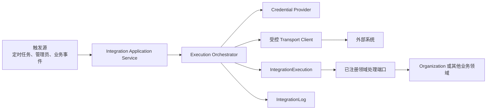
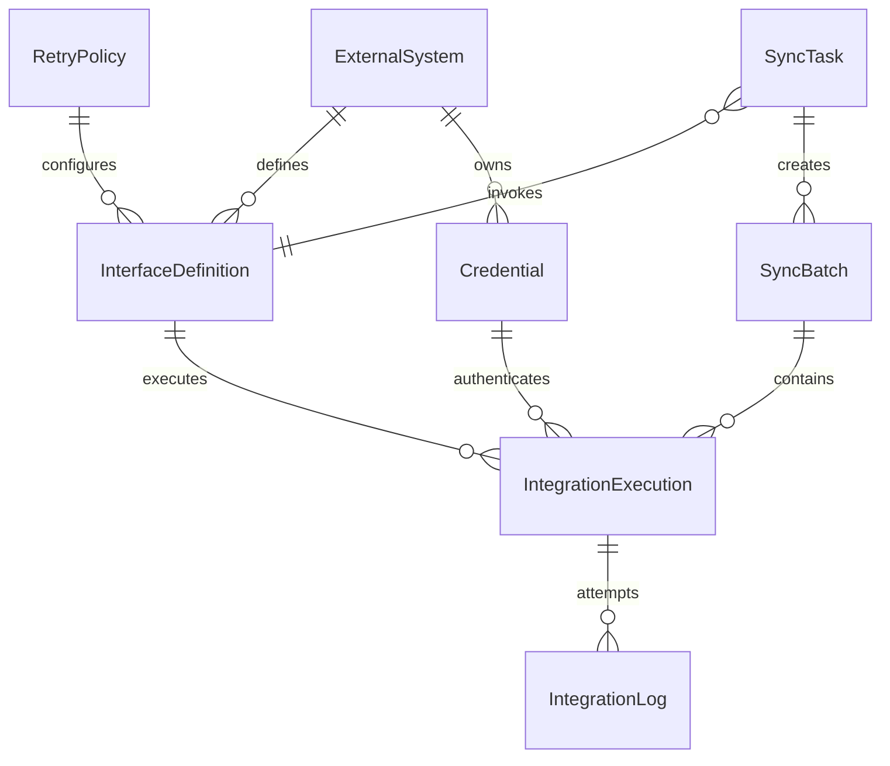
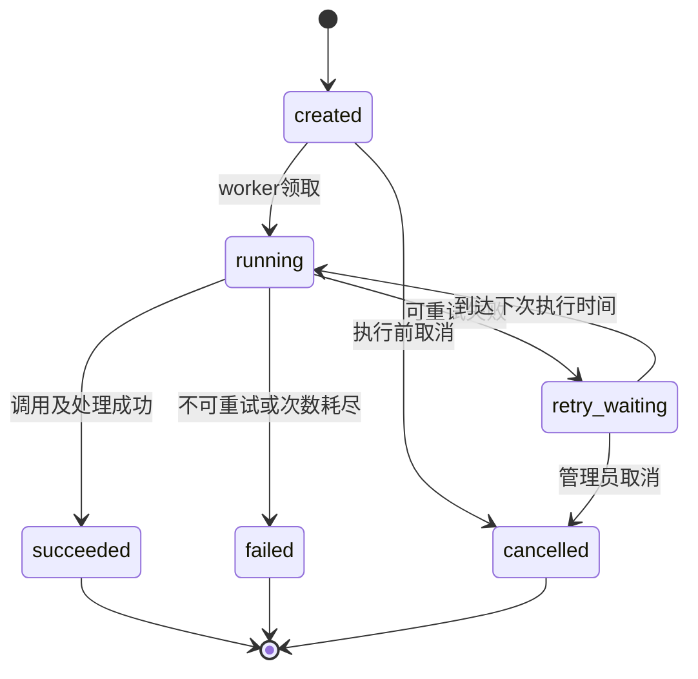

# Sweet Platform 集成基础架构设计

## 文档信息

| 项目 | 内容 |
| --- | --- |
| 文档目的 | 冻结 Sweet Platform 通用集成基础能力的职责、核心对象、运行边界与分阶段范围 |
| 设计范围 | 外部系统、接口、凭证、调用执行、日志、重试、同步任务、同步批次与业务关联 |
| 设计日期 | 2026-08-04 |
| 前置基线 | Organization、Data Permission V1、Platform Stabilization 已冻结 |
| 文档性质 | 正式架构设计，不是数据库设计、Migration 方案或业务系统接入说明 |
| 实施状态 | 本文仅冻结设计，尚未创建代码和数据库对象 |

本设计遵守 [PlatformStabilizationReview.md](PlatformStabilizationReview.md) 的平台准入结论，以及 [TransactionUsageStandard.md](TransactionUsageStandard.md)、[ErrorHandlingStandard.md](ErrorHandlingStandard.md)、[TestInfrastructureStandard.md](TestInfrastructureStandard.md) 的工程规范。文中对象均为领域概念，不代表已经确定数据表、字段类型或物理存储结构。

## 1. 集成中心定位

Integration Foundation 是 Sweet Platform 连接企业外围系统的通用基础设施。它解决以下平台级问题：

- 统一登记 HR、ERP、TMS、WMS 等外部系统及其接口。
- 统一管理接口认证、超时、重试、幂等和执行状态。
- 记录一次逻辑调用及其每次实际尝试，支持追踪、排障和审计。
- 为定时同步、手工触发和业务事件触发提供一致的执行入口。
- 将技术调用结果与组织、订单、库存等领域处理结果建立受控关联。

Integration Foundation **不是** HR、ERP、TMS 或 WMS，也不负责定义这些系统的业务规则。它不判断法人、组织、人员、订单或库存如何落库，不维护业务主数据，不把外部协议细节扩散到业务 Controller。

平台内的职责划分为：



Controller 只适配请求、校验静态参数并调用 Service。执行编排、事务、重试、凭证解析和领域结果处理均不在 Controller 中实现。

## 2. 核心对象设计

### 2.1 对象关系



该关系图表达领域关系，不承诺物理外键。Credential 与执行记录之间只保存安全引用和版本摘要，不复制凭证明文。

### 2.2 核心对象职责

| 对象 | 职责 | 稳定身份 | 生命周期重点 |
| --- | --- | --- | --- |
| `ExternalSystem` | 描述一个受管外围系统及其连接边界 | 全局唯一 `system_code` | 创建、启用、停用；被接口或任务引用后禁止直接删除 |
| `InterfaceDefinition` | 描述一个可调用接口的协议契约与执行策略 | 系统内唯一 `interface_code` | 配置、校验、发布、停用、版本化 |
| `Credential` | 保存或引用外部系统认证材料 | 系统内唯一凭证编码 | 创建、轮换、过期、停用、吊销 |
| `IntegrationExecution` | 表示一次逻辑调用，不因自动重试创建多个逻辑执行 | 全局唯一 `execution_no` | 创建、领取、执行、等待重试、成功、失败、取消 |
| `IntegrationLog` | 记录一次实际调用尝试的技术事实 | `execution_no + attempt_no` | 追加写入，不覆盖历史尝试 |
| `SyncTask` | 定义可重复触发的同步任务及其处理端口 | 全局唯一 `task_code` | 草稿、启用、停用；调度变更受审计 |
| `SyncBatch` | 表示一次同步任务运行及其整体进度 | 全局唯一 `batch_no` | 待执行、运行、部分成功、成功、失败、取消 |
| `RetryPolicy` | 定义可重试错误、次数、退避和抖动策略 | 全局唯一 `policy_code` | 创建、修改、停用；执行时使用受控快照 |

### 2.3 聚合与一致性边界

- `ExternalSystem` 管理系统基本信息，但不在同一个长事务中级联修改所有接口、凭证和任务。
- `InterfaceDefinition` 发布后形成版本。运行中的执行引用确定版本，后续修改不能改变历史执行语义。
- `IntegrationExecution` 是重试和状态流转的聚合根；`IntegrationLog` 是其追加型尝试记录。
- `SyncBatch` 聚合同一次同步运行中的多个逻辑执行，但不替代业务领域自己的处理批次。
- `RetryPolicy` 被执行时形成策略摘要，避免执行过程中修改策略导致最大次数和退避规则漂移。

## 3. 外部系统模型

### 3.1 业务含义

`ExternalSystem` 表示一个受 Sweet Platform 管理的外围系统实例，例如：

- HR：组织、人事、岗位和任职的权威来源。
- ERP：财务、法人核算、采购或销售信息来源。
- TMS：运输计划、运单和轨迹系统。
- WMS：仓库、库存和出入库系统。

系统类型用于分类、查询和能力提示，不决定具体业务逻辑。不能因为类型为 HR 就自动访问 Organization Repository，也不能因为类型为 ERP 就自动获得财务数据权限。

### 3.2 概念属性

| 属性 | 说明 |
| --- | --- |
| 系统编码 | 稳定业务编码，创建后原则上不可修改 |
| 系统名称 | 面向管理员的可读名称 |
| 系统类型 | HR、ERP、TMS、WMS 或受控扩展类型 |
| 状态 | 草稿、启用、停用等受控状态 |
| 负责人 | 平台内责任人标识及展示摘要，用于运维归责，不自动产生权限 |
| 基础地址 | 服务端维护的受信任 Endpoint，客户端执行时不可覆盖 |
| 网络与环境摘要 | 环境、时区、连接限制等非敏感配置 |
| 备注 | 受控业务说明，不保存凭证或敏感连接信息 |

ExternalSystem 停用后不得创建新执行；已存在的日志、批次和历史执行继续可审计。存在有效 Interface、Credential 或 SyncTask 时禁止物理删除。

## 4. 接口模型

### 4.1 InterfaceDefinition 职责

`InterfaceDefinition` 描述“调用哪个外部能力、如何构造受控请求、如何解释技术响应”，至少包含以下概念：

- 所属外部系统与接口稳定编码。
- 调用方向、协议、HTTP Method 和相对路径。
- 请求参数、Header、Body 与响应结构的受控契约。
- Credential 引用，不包含凭证明文。
- 超时上限、响应大小上限和 RetryPolicy 引用。
- 幂等键策略、分页策略和处理器注册编码。
- 状态、版本和发布信息。

第一阶段的绝对目标地址由 `ExternalSystem` 的服务端基础地址与接口相对路径组合。客户端不得提交完整 URL 覆盖配置，也不得通过参数注入 Host、协议或任意代理地址。

### 4.2 请求与响应契约

接口定义可以描述受控的 Path、Query、Header 和 JSON Body 映射，但必须遵守：

1. 凭证占位由 Credential Provider 在服务端填充，管理员和客户端不能读取解析后的秘密。
2. 映射只允许引用批准的输入字段和服务端注册变量，不允许脚本、SQL、模板执行代码或任意表达式。
3. 响应先通过状态码、大小和 Content-Type 校验，再交给已注册领域处理端口。
4. 业务响应解析失败属于稳定错误，不得把未验证 Payload 直接写入领域模型。
5. 发布后的接口版本不可原地改变历史执行含义；重大契约变更必须形成新版本。

### 4.3 Interface 与业务处理分离

InterfaceDefinition 只描述技术契约。诸如“HR 人员如何转换为企业人员”“ERP 单据如何映射法人”等规则由对应领域的已注册处理端口负责。Integration 不保存业务表名，不直接调用业务 Repository，也不提供任意代码脚本执行能力。

## 5. 集成认证

### 5.1 Credential 模型

Credential 支持以下认证类型的统一生命周期：

- 用户名与密码或 HTTP Basic。
- API Key、静态 Token 或 Bearer Token。
- OAuth 2.0 Client Credentials 等机器身份模式。
- 客户端证书及私钥引用。

Credential 记录认证类型、适用系统、状态、有效期、轮换时间、密钥版本和安全存储引用。秘密值必须加密存储或交由受信任 Secret Provider 托管；数据库、日志、DTO、缓存键和错误消息不得出现明文密码、Token、私钥或完整证书材料。

### 5.2 访问与轮换

- 只有 Credential Provider 可以读取解密后的秘密，并且只在执行期短暂使用。
- 管理 API 只返回编码、类型、状态、过期时间和脱敏指纹。
- Credential 轮换不修改历史日志；执行记录只保存凭证编码和安全版本摘要。
- Credential 过期、停用或解密失败时安全失败，不得回退到旧凭证或匿名调用。
- OAuth 访问 Token 的刷新由 Credential Provider 管理，不由 Controller 或业务处理器实现。

具体加密实现、密钥托管产品和证书存储方式属于实施阶段安全设计，必须在开发前单独确认；任何实现都不得以明文落库作为临时方案。

## 6. 调用执行模型

### 6.1 一次调用生命周期

`IntegrationExecution` 表示一次逻辑调用，自动重试仍属于同一个 Execution；每次实际网络调用生成一条 `IntegrationLog`。



状态变化必须使用受控命令和并发保护。Worker 领取执行时需要租约或等价的原子领取机制，防止多个实例同时执行同一 Attempt。平台承诺的是**至少一次执行配合幂等控制**，不宣称网络调用具备不现实的“绝对恰好一次”。

### 6.2 执行上下文

执行上下文至少保留：

- `request_id`、`trace_id`。
- 外部系统、接口编码和定义版本。
- 触发来源：手工、定时任务或已注册业务事件。
- 执行主体摘要：用户触发保留可信用户标识，系统触发使用受控系统执行身份。
- SyncTask、SyncBatch 和业务关联摘要。
- 幂等键、当前 Attempt、下一次执行时间和状态。
- 开始、结束、耗时及稳定错误分类。

客户端不能覆盖服务端确定的 `system_code`、`interface_code`、Credential、RetryPolicy 或系统执行身份。

### 6.3 事务边界

一次执行分为三个短边界：

1. 短事务创建或领取 Execution，并固化接口、凭证版本和重试策略摘要。
2. 在数据库事务外执行 HTTP、OAuth、证书握手、文件读取等外部操作。
3. 短事务追加 IntegrationLog，并原子更新 Execution 状态、计数和下一次执行时间。

禁止使用数据库长事务包住网络调用。领域数据处理如果需要事务，由领域 Service 定义；技术执行状态与业务写入无法使用同一数据库事务时，必须通过幂等键、可恢复状态和必要的 Outbox/可靠事件机制实现最终一致，不得伪造跨系统原子事务。

### 6.4 手工重试与重放

自动重试在原 Execution 内增加 Attempt。已终态执行的管理员手工重放创建新的 Execution，并引用原执行编号；这样可以保留原始结论，不篡改历史日志。手工重放必须走独立的菜单按钮、API 权限、Casbin 和审计记录。

## 7. 集成日志模型

### 7.1 IntegrationLog 记录范围

每条日志表示一次实际调用尝试，至少记录：

- `request_id`、`trace_id`。
- 外部系统、接口、执行编号和 Attempt 序号。
- 开始时间、结束时间和耗时。
- 技术状态、HTTP 状态摘要和响应大小。
- 错误分类、稳定错误码、远端安全错误摘要。
- Credential 安全版本摘要，不包含秘密。
- 请求与响应的结构摘要、大小和不可逆 Hash（确有排障需要时）。

### 7.2 禁止记录

默认日志禁止保存：

- 密码、API Key、Token、Cookie、Authorization Header、私钥。
- 完整请求或响应 Payload。
- 身份证号、手机号、银行卡等未脱敏敏感字段。
- SQL、数据库连接信息、内部堆栈和底层密钥错误详情。

一期不提供“打开开关就永久保存完整 Payload”的能力。未来如需短期诊断采样，必须单独设计字段级脱敏、加密存储、严格权限、过期清理和审计，不能复用普通日志字段。

### 7.3 IntegrationLog、Audit 与业务日志

- IntegrationLog 记录技术调用尝试。
- Audit 记录管理员创建系统、修改接口、轮换凭证、手工触发或重放等管理动作。
- Organization 的同步批次和同步记录描述法人、组织、人员、岗位、任职的业务处理结果。

三类记录通过 `trace_id`、Execution 编号或受控关联标识串联，但不能互相替代。

## 8. 重试机制

### 8.1 RetryPolicy

RetryPolicy 至少定义：

- 最大 Attempt 数。
- 初始等待、最大等待、指数或固定退避方式。
- 抖动范围，避免多个任务同时重试。
- 可重试错误分类和受控 HTTP 状态集合。
- 单次超时与整个执行的截止时间。
- 是否允许管理员重放。

必须设置平台统一上限，接口配置只能在上限内收紧或选择策略，不能声明无限重试。

### 8.2 可重试错误

默认可重试候选包括：

- DNS、连接中断等临时网络错误。
- 连接或读取超时。
- HTTP 429，且遵守安全的 `Retry-After` 上限。
- 明确表示临时故障的 HTTP 5xx。
- 外部系统返回的、已登记为临时失败的稳定错误码。

### 8.3 不可重试错误

默认不可自动重试：

- 请求参数、Schema 或业务校验失败。
- HTTP 400、404、409 等明确业务失败，除非接口契约单独登记为临时状态。
- Credential 无效、权限不足或证书不受信任。
- 响应类型不兼容、数据映射失败或领域约束失败。
- 配置缺失、接口停用、系统停用或安全校验失败。

401/403 不得通过无限刷新凭证反复调用。OAuth Provider 最多按受控流程刷新一次；仍失败则终止并归类为认证或授权错误。

### 8.4 重试安全

- 写操作必须配置幂等键或由外部接口提供幂等能力；无法证明幂等时禁止自动重试。
- 重试调度由 Worker/Retry Scheduler 执行，不使用 Controller 内 `sleep` 或 goroutine。
- 每次 Attempt 都追加独立日志，不覆盖首次失败原因。
- 达到最大次数后进入终态失败，不再静默执行。

## 9. 同步任务与同步批次

### 9.1 SyncTask

SyncTask 定义“何时、用哪个接口、按什么范围触发哪个领域处理端口”，主要包含：

- 任务编码、名称、状态和负责人。
- ExternalSystem 与 InterfaceDefinition 引用。
- 触发方式：定时、手工或受控业务事件。
- 全量/增量模式、对象范围和 Checkpoint 策略。
- RetryPolicy、并发限制和超时。
- 服务端注册的业务处理器编码。

任务不得保存可执行脚本、业务 SQL 或组织表名。定时任务使用平台调度能力触发 Integration Service，不直接调用 Repository。

### 9.2 SyncBatch

每次任务触发创建一个 SyncBatch，用于汇总：

- 任务与触发来源。
- 开始、结束、状态和 Checkpoint。
- 计划执行数、成功数、失败数和跳过数。
- 关联的 IntegrationExecution 集合。
- 批次级稳定错误摘要。

一次批次可因分页、对象分组或分片产生多个 Execution；每个 Execution 又可包含多个 Attempt 日志。

### 9.3 与 Organization 同步的关系

现有 Organization 同步边界保持不变：

```text
SyncTask / SyncBatch
    ↓ 触发并汇总技术调用
IntegrationExecution
    ↓ 提供已校验的外部响应
Organization Service
    ↓ 处理领域规则
OrgSyncBatch / OrgSyncRecord
```

`OrgSyncBatch` 和 `OrgSyncRecord` 继续记录组织领域业务结果；`IntegrationExecution` 和 `IntegrationLog` 记录 HTTP、超时、认证和重试过程。Organization 已有的 `execution_id` 可作为两类记录的关联入口，具体持久化映射在实施任务中确认，不在本文新增或修改组织表。

## 10. 业务关联设计

Integration 需要能够回答“这次调用服务于哪个业务对象”，但不能因此依赖业务表或创建跨领域强外键。

一期采用受控 `BusinessReference` 值对象表达关联，建议包含：

- 领域编码，例如 `organization`、`report` 或未来业务模块编码。
- 对象类型，例如 `org_sync_batch`、`transport_order`。
- 稳定业务键或批次号。
- 关联用途，例如 `source`、`target`、`result`。

BusinessReference 由服务端注册处理器产生，客户端不能提交表名、任意资源类型或数据库 ID 表达式。它不是一期独立核心聚合，也不代表新增数据库表。

外部对象与本地对象的长期映射、冲突处理和主数据匹配属于具体领域能力。Integration 一期只保留可追踪关联，不建立通用“万能业务映射表”。

## 11. 与现有平台的关系

### 11.1 Organization

- Integration 不直接访问 `org_*` Repository 或组织表。
- 需要法人、管理组织、人员等组织事实时，必须调用 Organization Provider 或已注册 Organization Service 端口。
- Organization 负责领域校验、镜像处理和业务同步记录；Integration 负责技术调用与重试。

### 11.2 Data Permission

- 管理页面和后台 API 继续使用 `sys_menu`、`sys_menu_button` 与 Casbin 功能权限。
- 查询 IntegrationExecution、IntegrationLog、SyncTask、SyncBatch 等数据时，如资源启用数据权限，必须走现有 Resolver、DataScopeResult 和 Adapter 链路。
- Integration 不修改 Resolver、DataScopeResult、MetadataFieldAdapter 或 RegisteredFieldAdapter，也不在 Repository 中复制 Grant/Policy 解析。
- 定时系统任务不能伪装成管理员用户。若任务需要读取平台业务数据，业务模块必须提供明确注册端口和授权边界；INT-001 不扩展 Data Permission 主体模型。

### 11.3 Audit

系统配置、凭证轮换、任务启停、手工执行、取消和重放属于管理审计事件。AuditSubject 通过标准 Context 传递，不把 `*gin.Context` 传给 Service、Worker 或异步任务。

### 11.4 File

大文件导入、导出或诊断附件通过 File Service 的受控能力处理。预览与下载使用各自用途签名；Integration 不把文件内容或签名 Token 写入普通执行日志。

## 12. 安全设计

### 12.1 功能与数据权限

- 外部系统、接口、凭证、任务、执行、日志和重放分别定义菜单/API 按钮权限。
- Controller 不使用角色名称或 `if admin` 硬编码权限。
- 数据查询遵循 Data Permission；功能授权不能替代数据范围控制。
- Credential 明文读取不作为普通管理 API 能力开放。

### 12.2 出站访问安全

- 目标 Host、协议和端口来自服务端批准配置，执行请求不能由客户端覆盖。
- 实施阶段必须提供 Endpoint Allowlist、DNS 解析校验、代理策略和响应大小限制，防止 SSRF、DNS Rebinding 和资源耗尽。
- 生产环境默认要求 HTTPS；必须使用内网 HTTP 的场景需要实施级显式批准和风险记录。
- 重定向默认关闭或严格限制在同一受信任系统范围。

### 12.3 脱敏与最小化

- DTO 使用字段白名单，Credential 只返回脱敏摘要。
- 日志 Header 和 Payload 先按接口脱敏策略处理，再允许保存摘要。
- 结构化日志记录 `request_id`、`trace_id`、系统、接口、状态、耗时和错误分类，不记录完整敏感值集合。
- 数据保留期、归档和清理按日志类型分别配置，不能无限期保留技术明细。

### 12.4 错误与安全失败

Integration 使用稳定错误分类：配置错误、凭证错误、认证失败、网络错误、超时、远端限流、远端服务错误、远端业务错误、请求映射错误、响应映射错误、内部错误和取消。

Repository 返回技术错误，Service 转换稳定领域错误，Controller/Middleware 映射安全响应。外部响应不得包含远端敏感 Payload、Token、SQL、内部堆栈或 SDK 原始错误。配置、认证、权限、响应校验和领域处理任一失败均不得默认成功或绕过后续校验。

## 13. 组件职责边界

| 组件 | 允许职责 | 禁止职责 |
| --- | --- | --- |
| Controller | 请求解析、静态校验、调用 Service、返回 DTO | 编排、事务、重试、凭证解密、直接远程调用 |
| Integration Application Service | 配置命令、执行命令、权限后业务编排 | 保存 HTTP 框架对象、拼接业务 SQL |
| Execution Orchestrator | 状态机、Attempt、超时、重试决策、调用领域端口 | 解释 Organization 领域规则、绕过权限 |
| Credential Provider | 凭证解析、解密、轮换、OAuth Token 管理 | 向客户端返回明文、写普通日志 |
| Transport Client | 受控构造请求、网络调用、技术响应限制 | 业务数据落库、决定业务成功 |
| Retry Scheduler/Worker | 领取任务、租约、到期重试、并发控制 | Controller 内等待、无限重试 |
| Domain Handler Port | 校验和处理已验证响应，写入所属领域 | 读取凭证明文、改变 Integration 状态机 |
| Repository | 持久化与受控查询 | 开启业务事务、调用远端系统、实现重试 |

## 14. 第一期范围

第一期建设最小、可验收的通用出站集成底座：

1. ExternalSystem、InterfaceDefinition、Credential 和 RetryPolicy 的后台配置能力。
2. HTTPS + JSON 出站调用，支持受控 GET/POST/PUT/PATCH/DELETE 方法。
3. Basic、API Key、静态 Bearer Token 和 OAuth 2.0 Client Credentials；证书认证先冻结契约，是否首批实现由实施评审确认。
4. IntegrationExecution 状态机、IntegrationLog Attempt 日志、超时和有限重试。
5. 手工触发与定时 SyncTask，生成 SyncBatch 并关联多个 Execution。
6. 服务端注册的请求映射和领域处理端口，不开放脚本、SQL 或任意表达式。
7. `request_id`、`trace_id`、结构化日志、稳定错误、审计和凭证脱敏。
8. 管理页面/API 的 sys_menu_button、Casbin 与必要 Data Permission 接入。
9. 以 Organization HR 主动拉取作为首个验收场景，但不把 HR 规则写入 Integration 核心。
10. 单元、Repository、Service、Migration、PostgreSQL 专项及 Worker race 测试基线。

一期明确不做：

- 入站 Webhook 平台和公网回调网关。
- 消息队列、Kafka、SFTP、EDI 等多协议连接器。
- 可视化自由编排、脚本执行和低代码映射设计器。
- 分布式工作流补偿平台或跨系统事务引擎。
- TMS、WMS、ERP 的具体业务同步规则。
- 修改 Organization、Data Permission、Resolver、DataScopeResult 或 Adapter。

## 15. 第二期方向

第二期候选能力包括：

- 受控入站 Webhook、签名验证、防重放和限流。
- 消息队列、SFTP、证书自动轮换等连接器。
- 多环境 Endpoint、灰度切换和更完整的 Secret Provider 集成。
- 失败队列、人工处置、批量重放和运行监控告警。
- 经安全评审的字段映射工具与 Schema 演进支持。
- 大规模任务分片、分布式调度和容量治理。
- 外部对象与本地对象的领域化映射能力。

上述能力必须分别评审，不能通过扩展一期字段或在 Controller 中增加分支的方式隐式实现。

## 16. 测试与验收基线

后续实施至少需要覆盖：

- 配置对象稳定编码、状态、引用保护和 DTO 白名单。
- Credential 加密、轮换、过期、无明文响应与并发读取。
- Execution 合法状态流转、租约、重复领取和崩溃恢复。
- 超时、429、5xx、业务失败、次数耗尽及退避抖动。
- 幂等键重复提交、写接口禁止无幂等重试。
- 单个 Execution 多 Attempt 日志及日志脱敏。
- SyncTask 手工/定时触发、SyncBatch 汇总和 Organization 领域结果关联。
- Controller 无事务和重试、外部调用不占用数据库长事务。
- Casbin 按钮/API 权限、Data Permission 查询边界和无权详情不泄露。
- PostgreSQL 真实约束、Worker 并发 race、标准 Context 和测试隔离。

验收不得只验证“HTTP 调通”。必须同时证明失败安全、状态可恢复、凭证无泄露、重试受控、业务结果与技术日志边界清晰。

## 17. 设计结论

Integration Foundation 采用“配置定义、逻辑执行、尝试日志、同步批次、领域处理”分层架构：

```text
ExternalSystem + InterfaceDefinition + Credential + RetryPolicy
    ↓
SyncTask / 手工命令 / 已注册业务事件
    ↓
IntegrationExecution
    ↓ 0..N 次尝试
IntegrationLog
    ↓ 成功响应
已注册领域处理端口
    ↓
Organization 或其他业务领域结果
```

核心冻结结论：

1. Integration 只提供外围系统连接基础设施，不成为业务系统或万能映射平台。
2. 远程调用不进入数据库长事务；状态、重试和日志通过短事务与幂等机制保证可恢复性。
3. Credential 明文、完整敏感 Payload、任意 URL、SQL 和脚本均不能成为普通配置能力。
4. Organization 事实只通过 Organization Provider/注册领域端口获取，Integration 不直接访问组织表。
5. 功能权限、Casbin 和 Data Permission 必须完整接入，不修改 Resolver、DataScopeResult 或 Adapter。
6. Controller 不承担编排、事务、重试和凭证处理；新增实现必须遵守平台冻结规范。
7. Organization 同步业务记录与 Integration 技术执行记录分层，通过 Execution 标识关联。

具体数据库模型、Migration、API 和页面将在后续实施任务中单独设计和评审，不由本文提前锁定。
