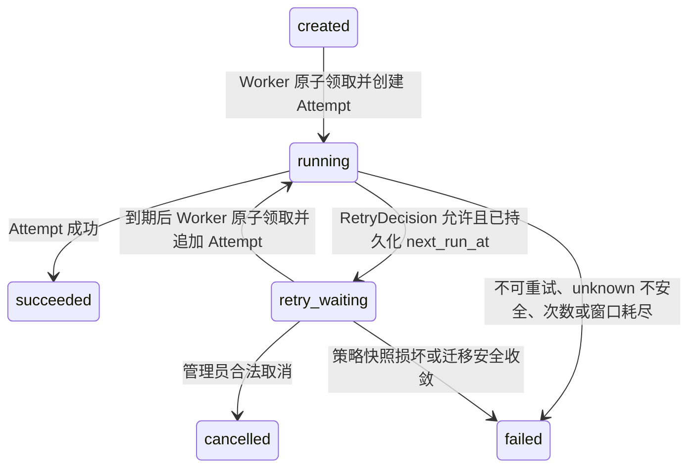

# Sweet Platform Integration Retry 详细设计

## 文档信息

| 项目 | 内容 |
| --- | --- |
| Task | INT-004A |
| 文档状态 | 正式设计 |
| 设计日期 | 2026-08-07 |
| 审计基线 | `1478ce1dbdf8046461cc6f5696c7f0891f04cadf` |
| 前置设计 | [IntegrationFoundationDesign.md](IntegrationFoundationDesign.md)、[IntegrationConfigurationDesign.md](IntegrationConfigurationDesign.md)、[IntegrationRuntimeDesign.md](IntegrationRuntimeDesign.md) |
| 冻结依据 | [IntegrationRuntimeAcceptanceReport.md](IntegrationRuntimeAcceptanceReport.md)、[IntegrationRuntimeFreezeReview.md](IntegrationRuntimeFreezeReview.md) |

## 1. 定位与目标

Integration Retry 是 Integration Runtime 的受控调度扩展。它解决临时故障后的有限、可追溯、安全重试，不建立第二套执行系统。

自动重试始终遵循同一条冻结链路：

```text
Application Service
  -> IntegrationExecution
  -> IntegrationWorkerRunner
  -> IntegrationExecutionEngine
  -> IntegrationLog / Attempt
  -> ExecutionInputSnapshot 校验与请求重建
  -> CredentialProvider
  -> TransportClient
  -> Attempt 与 Execution 原子收敛
```

本设计允许 `retry_waiting` Execution 在服务端计算的 `next_run_at` 到达后重新被领取，并在原 Execution 下追加 Attempt。它不覆盖历史 Attempt，不创建 RetryExecution，也不通过 Controller、进程内休眠或数据库长事务等待重试。

## 2. 冻结边界

### 2.1 必须复用的核心对象

- `IntegrationExecution`：唯一逻辑调用聚合根。
- `IntegrationLog / Attempt`：每次真实远程调用的追加型技术事实。
- `ExecutionInputSnapshot`：所有 Attempt 共用的受控输入快照。
- `IntegrationRuntimeLimits`：请求时限、响应上限和租约的唯一平台契约。
- `CredentialProvider`：每次 Attempt 重新解析当前有效凭证。
- `TransportClient`：唯一 HTTP/HTTPS 传输边界。
- `IntegrationExecutionEngine`：请求重建、调用和状态收敛的唯一编排入口。
- `IntegrationWorkerRunner`：常驻轮询、实例并发、恢复和优雅关闭入口。

### 2.2 禁止形成的旁路

- 不新建 RetryExecution 表或第二套 Execution 状态机。
- 不把每次自动重试创建为新 Execution。
- 不复制 Engine、CredentialProvider 或 TransportClient。
- 不恢复管理员 `start`、`complete`、`fail` API。
- 不在 Controller 中调用 HTTP、创建 goroutine 或修改 `next_run_at`。
- 不在事务中执行 HTTP、等待退避或持有数据库连接。
- 不从快照、Context、日志或 DTO 读取、保存 Credential 秘密。
- 不把本平台幂等键等同于远端幂等保证。

## 3. 术语与语义

| 术语 | 冻结语义 |
| --- | --- |
| 自动重试 | 同一 Execution 在到期后追加 Attempt，继续原逻辑调用 |
| `retry_waiting` 继续执行 | 自动重试的一部分，不是人工重放 |
| 人工重放 | 基于终态 Execution 创建新 Execution，并记录来源；V1 暂不提供 |
| confirmed failure | 已确认远端未成功或已明确返回失败，可继续评估策略 |
| unknown | 无法确认远端是否已经处理，不能当作普通失败 |
| 本地幂等 | Sweet Platform 对 Execution 创建请求的幂等约束 |
| 远端幂等 | 外部接口能对重复 HTTP 请求提供等价结果或去重保证 |
| `max_attempts` | 包含第一次调用的总 Attempt 上限；值为 1 表示不自动重试 |

## 4. RetryPolicy 领域对象

### 4.1 模型定位

`RetryPolicy` 是版本化的配置对象，描述最大次数、退避、抖动、重试窗口以及允许重试的错误事实。它只提供策略，不执行调度，也不判断 Credential、输入契约或 Transport 安全。

建议表名为 `integration_retry_policy`。一个逻辑策略由稳定 `policy_code` 标识，每个技术版本是一条独立记录；`policy_code + version` 唯一。`InterfaceDefinition.retry_policy_id` 引用明确版本记录。

### 4.2 字段设计

| 字段 | 约束与语义 |
| --- | --- |
| `id` | 平台 ID |
| `policy_code` | 1-64 字符，稳定逻辑编码，创建后不可修改 |
| `policy_name` | 1-128 字符 |
| `version` | 正整数，由 Service 在同编码下顺序生成 |
| `description` | 最多 512 字符，不保存表达式或脚本 |
| `status` | `draft`、`enabled`、`disabled` |
| `max_attempts` | 1-10，默认 3，包含首次 Attempt |
| `initial_delay_ms` | 1,000-3,600,000，默认 5,000 |
| `max_delay_ms` | 1,000-86,400,000，默认 300,000，且不小于初始延迟 |
| `backoff_type` | V1 仅 `fixed`、`exponential` |
| `backoff_multiplier` | fixed 必须为 1；exponential 为 1.1-4.0，默认 2.0 |
| `jitter_type` | V1 仅 `none`、`full` |
| `jitter_ratio` | none 必须为 0；full 必须为 1；预留后续受控扩展 |
| `retry_window_ms` | 60,000-604,800,000，默认 86,400,000 |
| `retryable_error_categories` | 受控数组，V1 仅允许 `network`、`timeout`、`remote` 的子集 |
| `retryable_http_statuses` | 受控数组，V1 只能从 429、502、503、504 中选择 |
| `respect_retry_after` | 是否接受合法 `Retry-After`，默认 true |
| `revision` | 乐观锁版本，初始为 1 |
| Basic 审计字段 | 使用平台 `Basic` 和标准 `AuditSubject` |

所有时间配置在 API、DTO、数据库列名中使用明确的毫秒单位，页面可以换算为秒或分钟展示，不使用含义不明的数值字段。

### 4.3 状态与版本规则

```text
draft -> enabled
enabled -> disabled
disabled -> enabled
```

- draft 可修改；启用后技术字段永久不可原地修改。
- 修改已启用策略必须“创建新版本”，由服务端生成下一版本号。
- 不同版本可在切换期同时保持 enabled，因为不同 InterfaceDefinition 版本必须继续引用明确策略版本；不存在“最新版本自动替换旧引用”。
- 禁用策略前必须检查是否仍被 enabled InterfaceDefinition 引用；存在引用时拒绝禁用。
- draft 或 disabled 被引用时，InterfaceDefinition 不得启用。
- V1 不提供物理删除。未引用 draft 如未来需要清理，只允许软删除并保留审计；不作为本期页面能力。
- `policy_code` 不因创建版本改变，`policy_code + version` 是技术唯一键。

## 5. InterfaceDefinition 引用与幂等声明

### 5.1 RetryPolicy 引用

现有 `InterfaceDefinition.retry_policy_id` 继续保留，改为外键引用明确 RetryPolicy 版本。创建、编辑草稿、创建接口新版本和启用时都必须校验：

1. RetryPolicy 存在、未删除且状态为 enabled。
2. 策略字段通过平台上限校验。
3. InterfaceDefinition 已启用后不得原地替换策略。
4. 技术契约或策略变化必须创建新的 InterfaceDefinition 版本。

不引用 RetryPolicy 表示该接口不自动重试。一次失败将直接收敛 `failed`，但仍保留 Attempt 技术事实。

### 5.2 远端幂等声明

为避免把本地 `idempotency_key` 误认为远端幂等，InterfaceDefinition 需要增加受控幂等契约：

| 字段 | V1 取值与语义 |
| --- | --- |
| `idempotency_mode` | `none`、`safe_method`、`idempotent_method`、`remote_key_header` |
| `remote_idempotency_header` | V1 仅允许固定名称 `Idempotency-Key`；仅 remote_key_header 使用 |

- GET 自动归类为 `safe_method`；V1 不扩大 Method 集合，也不新增 HEAD。
- PUT、DELETE 只有在管理员明确声明远端语义幂等时使用 `idempotent_method`。
- POST、PATCH 的 unknown 自动重试必须使用 `remote_key_header`。
- 远端幂等键由服务端在 Execution 创建时生成并冻结，建议基于不可猜测的 Execution 稳定标识；所有 Attempt 使用同一值。
- 该 Header 不允许客户端通过 ExecutionInputSnapshot 提交或覆盖。
- 请求重建顺序为：普通快照 Header、服务端远端幂等 Header、CredentialProvider 认证注入。认证仍是最后的受控注入。
- 本地 `idempotency_scope + idempotency_key` 只控制 Execution 创建，不自动授予远端重试资格。

## 6. Execution 策略冻结

### 6.1 冻结时点

Application Service 创建 Execution 时，在同一创建事务内：

1. 锁定并加载明确 InterfaceDefinition 版本。
2. 校验其 RetryPolicy 引用状态与字段约束。
3. 生成最小 `RetryPolicySnapshot`。
4. 与 ExecutionInputSnapshot、接口版本和远端幂等声明一起保存。
5. 不允许客户端提交或覆盖策略快照。

### 6.2 快照结构

建议在 `integration_execution` 增加 JSONB 字段 `retry_policy_snapshot` 和整数 `retry_policy_snapshot_version`。无策略时保存明确的“无自动重试”状态，不伪造默认策略。

快照版本 1 至少包含：

```json
{
  "version": 1,
  "policy_code": "transient_default",
  "policy_version": 1,
  "max_attempts": 3,
  "initial_delay_ms": 5000,
  "max_delay_ms": 300000,
  "backoff_type": "exponential",
  "backoff_multiplier": "2.0",
  "jitter_type": "full",
  "jitter_ratio": "1.0",
  "retry_window_ms": 86400000,
  "retryable_error_categories": ["network", "timeout", "remote"],
  "retryable_http_statuses": [429, 502, 503, 504],
  "respect_retry_after": true,
  "idempotency_mode": "safe_method",
  "remote_idempotency_header": ""
}
```

采用 Execution 内单一结构化快照，不新增策略快照明细表。快照不含秘密、Payload、Credential 引用或可执行表达式。

### 6.3 漂移控制

- Policy 修改、禁用或新增版本不影响已创建 Execution。
- 已有 Execution 重试时不再次读取最新 RetryPolicy。
- RetryPolicy 源记录被禁用不终止已有有效快照；快照本身损坏或版本不支持时安全失败且不发 HTTP。
- 运行期只校验快照结构、平台绝对上限和 Execution 不可变事实。

## 7. RetryDecision 统一判定

### 7.1 端口职责

新增纯领域组件 `RetryDecisionService` 或等价端口。它不访问 Gin、不执行 HTTP、不持久化、不读取 Credential。

输入 `RetryDecisionInput` 至少包含：

- HTTP Method 与 InterfaceDefinition 幂等声明。
- Execution 远端幂等键是否已冻结。
- 当前 Attempt 序号。
- 错误分类、稳定 reason_code 和 HTTP 状态。
- 结果确定性 `confirmed / unknown`。
- 请求进度事实：`not_sent`、`sent_unknown`、`response_received`。
- 受控解析后的 Retry-After。
- RetryPolicySnapshot。
- 数据库当前时间、首次 Attempt 时间。
- Execution 当前状态和取消事实。

输出 `RetryDecision` 至少包含：

- `retryable`。
- `reason_code`。
- `next_retry_at`。
- `retry_delay_ms`。
- `attempts_remaining`。
- `retry_after_source`。
- `final_state`，只能为 `retry_waiting` 或 `failed`。

Transport 只提供技术事实，不决定最终重试；Engine 只调用统一 RetryDecision，不再保留一套并行的 `RetryEligible` 业务规则。

### 7.2 判定顺序

1. Execution 必须仍为 running，未被取消，当前 Attempt 和租约有效。
2. 快照版本和字段必须有效。
3. 当前 Attempt 未达到 `max_attempts`。
4. 当前时间和候选调度时间不能超过 retry window。
5. 错误分类和 HTTP 状态必须被策略显式允许。
6. 结果确定性与远端幂等条件必须通过安全门槛。
7. 计算本地 backoff、jitter 和 Retry-After。
8. 形成唯一决定并持久化到当前 Attempt 与 Execution。

任一前置条件失败时返回明确 reason_code，并将 Execution 收敛为 `failed`；不得留下无 `next_run_at` 的 `retry_waiting`。

## 8. 重试资格规则

### 8.1 默认不可自动重试

- `invalid_config`、运行契约不兼容、SSRF、URL 或 Header 安全拒绝。
- `credential_*`、Credential 不存在、停用、吊销、过期、解密失败或类型不支持。
- 输入快照缺失、版本错误、契约不匹配、semantic size 或 Hash 不一致。
- HTTP 401、403 及其他未列入策略的 4xx。
- 响应过大、不支持 Content-Type、协议或结构错误。
- 业务校验失败。
- Execution 已取消、策略快照损坏、次数耗尽或窗口过期。
- unknown 且无法证明远端幂等的写请求。

### 8.2 V1 候选可重试事实

- 请求发送前发生且被 Transport 确认为 `not_sent` 的临时网络错误。
- 策略允许的 timeout，但仍需结合请求进度、Method 和幂等声明。
- HTTP 429、502、503、504，且状态在策略快照白名单中。
- 合法、受控的 Retry-After 只影响调度时间，不自行创建重试资格。

不得把全部 `network_error`、`timeout` 或 5xx 一概标记为可重试。Transport 需要返回受控的请求进度摘要，不能通过原始 `net/http` 错误字符串推断。

## 9. 幂等与 unknown

| 场景 | confirmed failure | unknown |
| --- | --- | --- |
| GET 安全读取 | 可按策略重试 | 可按策略重试 |
| PUT/DELETE 且明确声明幂等 | 可按策略重试 | 可按策略重试 |
| POST/PATCH 且注入远端幂等键 | 可按策略重试 | 可按策略重试 |
| 无远端幂等保证的写请求 | 可按明确远端失败事实评估 | 最终 failed，人工处理 |

补充规则：

- 收到明确 HTTP 响应属于 `response_received`，但只有白名单状态才是候选。
- 请求发送前失败可以确认未到达远端，仍受策略次数和窗口限制。
- 请求发送后超时、连接重置或进程关闭通常是 unknown。
- 平台 Execution 幂等键不能证明远端去重。
- 租约过期恢复继续收敛 `failed + unknown`，不自动转回 `retry_waiting`。

## 10. Backoff 与 Jitter

### 10.1 V1 算法集合

V1 支持：

- Backoff：`fixed`、`exponential`。
- Jitter：`none`、`full`。

linear 和 equal jitter 延后。V1 保留两个常用 backoff 以覆盖固定轮询窗口与外部服务拥塞场景；full jitter 用于避免多实例同刻重试，none 用于远端要求固定节奏和可重复验收。

### 10.2 计算公式

当前完成的是 Attempt `k`，其中第一次真实调用 `k = 1`：

```text
fixed_base(k) = initial_delay

exponential_base(k) =
  min(max_delay, initial_delay * multiplier^(k - 1))
```

- 使用整数毫秒计算，并在乘法前检查溢出。
- 小数 multiplier 使用十进制定点表达，不使用平台相关浮点序列化。
- 中间结果向上取整到毫秒，避免比策略更早执行。
- `none`：最终本地延迟等于 base。
- `full`：使用可注入安全随机源，在 `[0, base]` 取整数毫秒，然后应用 1 秒平台最小间隔；禁止零间隔重试。
- 计算结果和随机结果必须持久化到 Attempt，Worker 重启后不得重新抽取。

## 11. Retry-After

### 11.1 解析

Transport 只提取响应中的单个 `Retry-After`，解析为受控元数据，不把完整响应 Header 暴露给 Engine、日志或 DTO。

支持：

- 非负十进制秒数。
- RFC 兼容 HTTP 日期。

空值表示未提供；多值、负数、溢出或非法日期视为 invalid。HTTP 日期按 UTC 解析，调度基准使用数据库时间。

### 11.2 优先级

当 `respect_retry_after = true` 且值合法时：

```text
candidate_delay = max(local_backoff_after_jitter, retry_after_delay)
```

- Retry-After 大于 `max_delay` 时不得截断后提前重试，直接停止自动重试并记录 `retry_schedule_invalid`。
- 候选时间超过 retry window 时收敛 failed，reason 为 `retry_window_expired`。
- `respect_retry_after = false` 时忽略该值并记录 source=`ignored`。
- 非法 Retry-After 不扩大重试权限；若其他规则允许重试，使用本地退避并记录 source=`invalid_fallback`，诊断码为 `retry_after_invalid`。
- 最终 `next_run_at` 只保存服务端计算结果，客户端不能提交或修改。

## 12. Execution 与 Attempt 字段调整

### 12.1 IntegrationExecution

| 字段 | 处理 |
| --- | --- |
| `retry_policy_snapshot` | 新增 JSONB，保存最小版本化策略快照 |
| `retry_policy_snapshot_version` | 新增，0 表示无策略，1 表示 V1 |
| `next_run_at` | 复用现有字段，正式定义为下一次自动重试的数据库 UTC 时间 |
| `started_at` | 复用为首次 Attempt 开始时间；重试领取不得覆盖 |
| `current_attempt` | 复用为已创建 Attempt 总数，不新增重复 `attempt_count` |
| `last_attempt_at` | 新增，便于列表与诊断，记录最近 Attempt 完成时间 |
| `retry_reason_code` | 新增，保存当前等待或最终耗尽原因摘要 |
| `completed_at` | 仅终态设置；进入 retry_waiting 时必须保持 NULL |
| `retry_exhausted_at` | 不新增；可由 completed_at + retry_reason_code 稳定表达 |

### 12.2 IntegrationLog / Attempt

以下字段用于追溯“为什么安排或不再安排下一次重试”，不能由后续策略变化稳定推导，因此需要持久化：

- `retryable`。
- `retry_reason_code`。
- `retry_delay_ms`。
- `retry_scheduled_at`。
- `retry_after_source`：`none`、`local`、`http_delta`、`http_date`、`ignored`、`invalid_fallback`。

Attempt 仍只追加。完成当前 Attempt 时一次写入结果和重试决定，不回写历史 Attempt，不保存完整请求、响应、Header 或秘密。

## 13. Retry Worker 与既有 Runtime 复用

### 13.1 Runner 选择

V1 复用现有 `IntegrationWorkerRunner`，不创建独立 Retry Runner。Runner 使用同一个实例并发上限、ConcurrencyGuard、优雅关闭、panic 恢复和 WorkerStatus。

Repository 增加领域原语 `ClaimReadyExecutions`，在一个 PostgreSQL 短事务中领取：

```text
status = created
OR
status = retry_waiting
AND next_run_at IS NOT NULL
AND next_run_at <= CURRENT_TIMESTAMP
```

同时要求输入快照、策略快照和运行契约满足对应领取条件。使用 `FOR UPDATE SKIP LOCKED`、状态和 revision 条件更新；领取成功后在同一事务创建新的 running Attempt。

### 13.2 调度顺序与限额

- 排序使用数据库时间语义：`COALESCE(next_run_at, gmt_create), id`。
- 单轮总领取数仍受现有 `claim_batch_size` 限制。
- created 与到期 retry_waiting 共享 Runner 并发配额，不允许重试任务绕过平台、系统或接口 ConcurrencyGuard。
- 如后续出现饥饿证据，可在不改变执行链的前提下增加受控 lane 配额；V1 不先引入动态限流系统。
- `retry_waiting` 且未到 `next_run_at` 的记录不可领取。

### 13.3 领取事务

领取 `retry_waiting` 时必须原子完成：

1. 行锁确认状态、revision、`next_run_at <= database_now`。
2. 校验 `current_attempt < max_attempts`。
3. 写 `status = running`、lease_owner、lease_expires_at、revision。
4. 保留首次 `started_at`，不覆盖。
5. `current_attempt + 1`。
6. 创建新的 running Attempt，AttemptNo 单调追加。
7. 清空 `next_run_at` 仅在领取成功后发生。

任何一步失败整体回滚，不执行 Credential 解析或 HTTP。

### 13.4 取消竞争

- `retry_waiting -> cancelled` 和 Worker 领取通过行锁、状态、revision 条件竞争。
- 取消先成功：Worker 领取不到记录。
- 领取先成功：状态已为 running，V1 取消稳定拒绝。
- running 不新增协同取消语义；不通过通用更新强制 cancelled。

## 14. 状态机扩展

不新增状态编码：



规则：

- `running -> retry_waiting` 必须同时完成当前 Attempt 并写入非空 `next_run_at`。
- 达到 `max_attempts` 的当前 Attempt 完成时直接进入 failed。
- 候选调度超过 retry window 时直接进入 failed。
- 策略源记录停用不影响合法快照；快照损坏或版本不支持则 failed 且不发 HTTP。
- `retry_waiting -> running` 仍需租约 owner、revision 和新 Attempt。
- 终态不可恢复到运行态；管理员 API 不推进运行状态。

## 15. 完成事务与数据库时间

Engine 在 HTTP 结束后调用 RetryDecision，再通过既有 `CompleteAttemptAndExecution` 语义扩展一次性提交：

1. 锁定 Execution 和当前 running Attempt。
2. 校验 status、lease_owner、revision、AttemptNo。
3. 使用数据库 `CURRENT_TIMESTAMP` 作为调度基准。
4. 完成 Attempt 结果和重试诊断字段。
5. succeeded：Execution 进入 succeeded，清租约，写 completed_at。
6. retryable：Execution 进入 retry_waiting，写 next_run_at，清租约，completed_at 保持 NULL。
7. final failed：Execution 进入 failed，清 next_run_at 和租约，写 completed_at。
8. 更新 revision；受影响行数不为 1 即租约丢失或并发冲突。

RetryDecision 可以通过 Repository 的受控数据库时钟读取获得 `database_now`；完成事务必须再次保护窗口和状态条件。Repository 不决定错误是否可重试，只原子执行 Engine 已形成的命令并验证不变量。

## 16. 管理页面与 API

### 16.1 RetryPolicy 配置中心

集成中心新增“重试策略”菜单，建议位于“集成凭证”之后、“执行记录”之前。页面支持：

- 列表、详情、创建 draft。
- 编辑 draft。
- 创建新版本。
- 启用、停用。
- 查看引用摘要、算法、次数、窗口和状态。

页面不提供脚本、表达式、SQL、任意 HTTP 状态、任意错误文本或自定义算法输入。

### 16.2 Execution 管理面

Execution 列表和详情增加安全重试摘要：策略编码与版本、当前 Attempt、剩余次数、next_run_at、retry_reason_code。Attempt 详情显示本次重试决定、延迟和 Retry-After 来源。

V1 不提供：

- 立即重试。
- 跳过退避。
- 修改 Execution 策略或最大次数。
- 直接修改 next_run_at。
- 人工重放。
- 集群 Retry Dashboard。

现有 `retry_waiting` 取消继续保留。人工重放遵循“新 Execution + replay 来源”的原则，但延后到独立设计和权限冻结。

## 17. 权限、数据权限与审计

### 17.1 功能权限

RetryPolicy 使用 `sys_menu_button` 和 Casbin：

- `query`
- `detail`
- `create`
- `edit`
- `create_version`
- `enable`
- `disable`

Execution 延续 query/detail/create/cancel；不增加 start/complete/fail/立即重试。Attempt 延续独立 query/detail 权限。

### 17.2 Data Permission

- Execution 和 IntegrationLog 继续使用各自已冻结的 Data Permission query/detail 资源。
- RetryPolicy 是平台级技术配置，没有真实组织归属字段；V1 在 Casbin 功能权限后按平台配置范围查询，不伪造 Organization Ownership。
- 后续如建立租户或系统负责人事实，必须通过正式 Provider/Ownership 扩展，不修改 Resolver、DataScopeResult 或 Adapter 核心。

### 17.3 审计与技术日志

- RetryPolicy 创建、编辑 draft、创建版本、启用和停用写管理员 Audit。
- 自动重试属于 IntegrationLog 技术事实，不伪造管理员 AuditSubject。
- 取消 retry_waiting 继续写管理员 Audit。
- 允许记录 policy_code、policy_version、attempt_no、剩余次数、reason_code、next_run_at 和 Retry-After 来源。
- 禁止记录 CredentialMaterial、Authorization、Cookie、API Key、Token、输入快照原值、请求/响应 Body 或底层网络错误正文。

## 18. 稳定错误与诊断

| 错误码 | 使用场景 |
| --- | --- |
| `retry_policy_not_found` | 配置引用不存在 |
| `retry_policy_inactive` | 新配置引用非 enabled 策略 |
| `retry_policy_invalid` | 策略字段或组合非法 |
| `retry_snapshot_invalid` | Execution 策略快照损坏或版本不支持 |
| `retry_not_allowed` | 错误事实、状态或幂等门槛不允许 |
| `retry_result_unknown` | unknown 且不能证明远端幂等 |
| `retry_attempts_exhausted` | 已达到总 Attempt 上限 |
| `retry_window_expired` | 当前或候选调度时间超过窗口 |
| `retry_schedule_invalid` | 计算溢出、超限或无法形成合法时间 |
| `retry_claim_conflict` | 到期领取时状态/revision/租约竞争失败 |
| `retry_cancel_conflict` | 取消与领取竞争失败 |
| `retry_after_invalid` | Retry-After 非法并回退本地调度 |

对外错误只返回稳定错误码和安全消息。数据库、网络、HTTP 原始正文、策略内部常量路径和秘密不进入响应。

## 19. Migration 与历史数据

### 19.1 Schema 变更

后续实施至少需要：

- 新建 `integration_retry_policy` 及状态、数值、数组和版本 CHECK。
- 建立 `(policy_code, version)` 唯一约束。
- 为 `InterfaceDefinition.retry_policy_id` 增加受控外键和引用索引。
- 为 Execution 增加策略快照、快照版本、last_attempt_at、retry_reason_code。
- 为 `status + next_run_at` 增加到期领取索引。
- 为 Attempt 增加重试决定字段和 CHECK。

所有 Migration 必须幂等，并在 PostgreSQL 16 验证 JSONB、数组或受控 JSON、CHECK、外键、SKIP LOCKED 和部分查询索引。

### 19.2 历史记录处理

- 现有 retry_waiting 若缺少合法 RetryPolicySnapshot 或 next_run_at，安全收敛为 failed。
- 不给历史记录伪造默认策略，不自动重发。
- 收敛保留原 result certainty；unknown 继续是 unknown。
- 不修改 succeeded、failed、cancelled 的历史状态和 Attempt。
- 现有 InterfaceDefinition 的 retry_policy_id 若为无效预留值：draft 可清除并记录迁移；enabled 必须安全停用或阻止运行，不能静默绑定默认策略。
- 当前处于底座阶段时可清理明确测试数据，但 Migration 不能依赖“没有生产数据”的假设破坏历史事实。

## 20. 后续实施测试矩阵

### 20.1 策略与算法

1. fixed 首次及连续重试计算。
2. exponential、乘数、上限、取整和溢出。
3. none/full jitter 边界、最小非零间隔和可注入随机源。
4. max_attempts 包含首次 Attempt。
5. retry_window 起点为首次 Attempt，不受 created 排队时间影响。
6. 策略版本冻结，源策略变更不漂移。

### 20.2 Retry-After

7. delta-seconds。
8. HTTP 日期和 UTC/数据库时间。
9. 非法、多值、负数和溢出。
10. 与本地 backoff 取最大值。
11. 超过 max_delay 或 retry_window 安全失败。

### 20.3 资格与幂等

12. confirmed 与 unknown 分支。
13. GET 安全读取。
14. 显式幂等 PUT/DELETE。
15. 远端幂等键 POST/PATCH。
16. 非幂等写 unknown 不自动重试。
17. 429、502、503、504。
18. 401、403、Credential、配置、SSRF、响应超限不可重试。
19. 请求未发送与已发送未知的网络错误差异。

### 20.4 Worker、事务与并发

20. created 和到期 retry_waiting 统一领取。
21. next_run_at 未到不可领取，使用数据库时间。
22. PostgreSQL `FOR UPDATE SKIP LOCKED` 多实例领取。
23. retry_waiting -> running 原子创建新 Attempt。
24. AttemptNo 单调追加且唯一。
25. 租约、revision、完成事务和状态条件。
26. 取消与领取竞争。
27. HTTP 不在事务内，Worker 不共享事务。
28. panic、Context 取消和优雅关闭。
29. retry_waiting 不忙轮询、不使用 time.Sleep 持有任务。

### 20.5 Migration、权限与安全

30. Migration 重复执行与历史无快照策略收敛。
31. RetryPolicy CHECK、唯一键、引用保护。
32. sys_menu_button、Casbin 和无角色名硬编码。
33. Execution/Log Data Permission 继续独立。
34. 页面无立即重试、跳过退避和策略篡改入口。
35. DTO、日志、Audit 不泄露 Payload 或秘密。
36. 浏览器深色模式、动态按钮、状态和时间单位。
37. 后端全量、Integration 定向 race、PostgreSQL 16 和前端完整测试。

## 21. V1 实施范围

### 21.1 纳入 V1

- RetryPolicy 版本化配置中心。
- max_attempts、retry_window 和受控错误/HTTP 状态白名单。
- fixed、exponential backoff。
- none、full jitter。
- 合法 Retry-After。
- InterfaceDefinition 明确策略版本引用与远端幂等声明。
- Execution 最小策略快照。
- 统一 RetryDecision。
- 现有 Runner/Engine 的到期领取、Attempt 追加和状态收敛。
- Execution/Attempt 安全重试摘要、权限、审计和 PostgreSQL 验收。

### 21.2 明确延后

- linear backoff、equal jitter、用户自定义算法。
- 自定义错误表达式、脚本、代码和任意 HTTP 状态。
- 立即重试、跳过退避、修改现有 Execution 策略。
- 人工重放。
- 按系统动态限流和独立 Retry Runner。
- 集群 Retry Dashboard。
- SyncTask、SyncBatch、HR/Organization 同步。
- OAuth Token 获取、缓存和刷新。

该范围保留了最常见的临时故障恢复能力，同时避免在第一版引入人工强制调度、表达式引擎和第二套调度基础设施。

## 22. 后续 Task 拆分建议

考虑 PostgreSQL 领取、策略决策与页面验收的风险不同，建议将原计划细分为：

| Task | 范围 |
| --- | --- |
| INT-004B | RetryPolicy Model、Migration、Repository、Service、DTO、权限和配置页面；InterfaceDefinition 版本引用与幂等声明 |
| INT-004C-1 | RetryPolicySnapshot、RetryDecision、Backoff/Jitter、Retry-After 和单元/属性测试 |
| INT-004C-2 | 现有 Runner/Engine/Repository 的到期领取、Attempt 追加、完成事务、取消竞争和 PostgreSQL 并发测试 |
| INT-004D | Execution/Attempt 重试摘要页面、权限回归、端到端验收、正式报告与 Retry 冻结评审 |

如需维持原编号，可将 INT-004C-1 与 INT-004C-2 作为 INT-004C 的两个子任务。各 Task 均不得提前实现 Sync、OAuth 或人工重放。

## 23. 最终设计结论

Integration Retry V1 采用“版本化 RetryPolicy + Execution 最小策略快照 + 统一 RetryDecision + 现有 Runner/Engine 到期领取”的单链方案。

该方案保持以下不变量：

1. 一个逻辑调用只有一个 IntegrationExecution。
2. 每次真实 HTTP 调用只追加一个 Attempt。
3. 所有 Attempt 复用同一受控输入快照，Credential 每次重新安全解析。
4. 状态推进仍由 Worker、租约、revision 和完成事务控制。
5. unknown 非幂等写不自动重发。
6. 调度时间由服务端根据数据库 UTC 时间计算并持久化。
7. Controller、页面和管理员权限不能绕过退避或执行链。

本设计可以作为 INT-004B 及后续 Retry 实施的正式基线；在实现和验收完成前，现有 `retry_waiting` 仍不得由临时任务或手工 API 自动推进。
