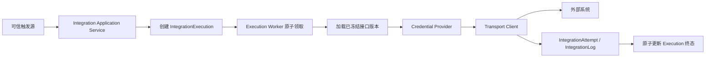
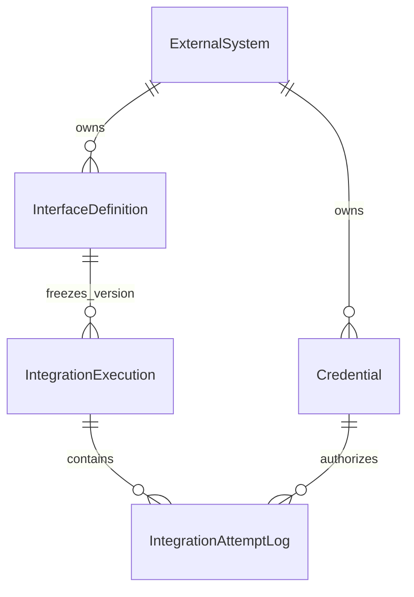
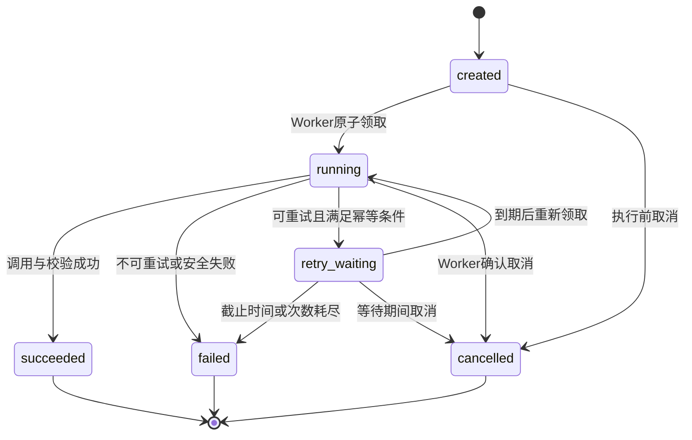
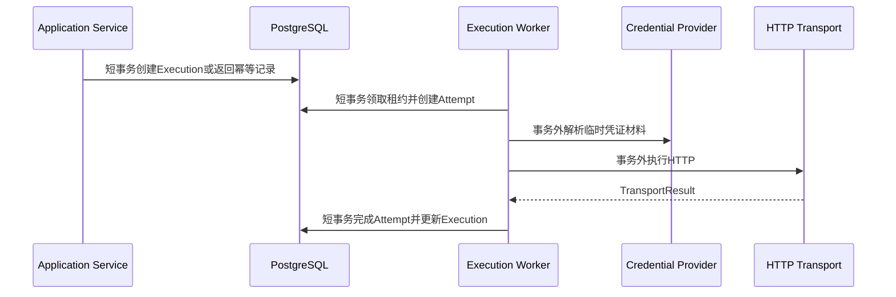

# Sweet Platform Integration Runtime 执行引擎详细设计

## 文档信息

| 项目 | 内容 |
| --- | --- |
| 文档目的 | 冻结 Integration Runtime 的执行对象、状态机、Worker、HTTP、凭证、幂等、并发、事务与错误契约 |
| 上位设计 | [IntegrationFoundationDesign.md](IntegrationFoundationDesign.md) |
| 配置设计 | [IntegrationConfigurationDesign.md](IntegrationConfigurationDesign.md) |
| 配置验收 | [IntegrationConfigurationAcceptanceReport.md](IntegrationConfigurationAcceptanceReport.md) |
| 设计日期 | 2026-08-05 |
| 当前范围 | `IntegrationExecution` 运行时详细设计 |
| 文档性质 | 正式设计，不创建数据库、Migration、Service、Worker 或页面 |

本文继续遵守 [TransactionUsageStandard.md](TransactionUsageStandard.md)、[ErrorHandlingStandard.md](ErrorHandlingStandard.md) 和 [TestInfrastructureStandard.md](TestInfrastructureStandard.md)。文中的字段是领域契约，不等同于已经冻结的数据库列；物理类型、索引名和表名在实施任务中确认。

## 1. Runtime 定位与原则

Integration Runtime 负责把已经启用的外部系统、接口版本和凭证配置转化为一次受控的外部调用。它管理逻辑执行、实际尝试、状态、并发、幂等和技术结果，但不承担 HR、ERP、TMS、WMS 的业务转换规则。

运行时唯一主链为：

必须遵守以下原则：

1. Controller 只接收请求并调用 Application Service，不执行 HTTP、不读取秘密、不管理租约。
2. Runtime 不直接访问任何 `org_*` 表；需要组织事实时只能由后续已注册领域处理端口调用 Organization Provider。
3. Runtime 不复制 Casbin 或 Data Permission 算法。手工触发使用功能权限，执行与日志查询按资源接入现有 Data Permission。
4. HTTP、OAuth Token 请求、证书握手和其他远程调用不进入数据库事务。
5. 任一配置、凭证、网络或协议异常都安全失败，不产生“默认成功”或匿名调用。
6. 平台采用“至少一次执行 + 幂等控制”，不承诺跨网络的绝对恰好一次。

## 2. 核心对象与术语

### 2.1 对象关系

### 2.2 IntegrationAttempt 与 IntegrationLog 命名

上位设计使用 `IntegrationLog` 表示一次真实调用尝试。本设计进一步明确：

- `IntegrationAttempt` 是“一次真实远程调用尝试”的领域名称；关系图中的 `IntegrationAttemptLog` 表示该领域对象唯一对应的持久化记录。
- V1 可以继续使用 `IntegrationLog` 作为该 Attempt 的持久化或管理名称，但必须保持“一条记录对应一个 Attempt”的语义。
- V1 不为了名称同时创建两套内容重复的 Attempt 表和 Log 表。
- 若需要记录 DNS、建连、认证注入、响应校验等阶段事件，应使用结构化运行日志或可观测性系统，不把它们误算成新的 Attempt。

物理对象最终采用 `IntegrationAttempt` 还是沿用 `IntegrationLog`，待实施任务结合现有命名规范确认；`execution_no + attempt_no` 的唯一身份不变。

## 3. IntegrationExecution 设计

### 3.1 职责

`IntegrationExecution` 表示一次逻辑调用。一次 Execution 可以包含多个 Attempt，自动重试不得新建另一个逻辑 Execution；管理员对终态执行进行手工重放时必须创建新的 Execution，并记录来源执行编号。

### 3.2 领域属性

| 属性 | 语义与边界 |
| --- | --- |
| `execution_no` | 服务端生成的全局稳定执行编号，对外查询使用，不暴露数据库主键 |
| 外部系统快照 | 系统 ID、`system_code`、状态版本摘要；不保存基础地址明文副本到日志 |
| 接口快照 | InterfaceDefinition ID、`interface_code`、明确版本；执行期间不得漂移到最新版本 |
| 触发来源 | `manual`、`system_event`、`scheduled` 等受控枚举；一期只启用实际实现的来源 |
| 触发主体摘要 | 用户触发保存 AuditSubject 的稳定标识，系统触发保存注册系统身份；不保存角色名称集合 |
| 业务关联摘要 | 受控 `BusinessReference`，只含资源类型、稳定业务键和安全摘要，不含表名、SQL 或任意表达式 |
| 状态 | `created`、`running`、`retry_waiting`、`succeeded`、`failed`、`cancelled` |
| 当前 Attempt | 已分配的最大 Attempt 序号，单调递增，不回退、不复用 |
| 幂等信息 | 幂等作用域、幂等键和规范化请求 Hash；客户端不能通过随机字段绕过幂等策略 |
| 输入快照 | 经过接口契约验证的结构化输入或受控引用，不含 Credential 秘密和完整 URL |
| 时间信息 | 创建、领取、开始、结束、下一次可执行时间及执行截止时间 |
| 并发信息 | revision、租约持有者、租约到期时间和必要的取消请求时间 |
| 结果摘要 | 最终 HTTP 状态摘要、错误分类、响应大小和不可逆 Hash；默认不保存完整 Payload |
| 关联执行 | 手工重放时记录原 Execution 编号，不修改原执行历史 |

### 3.3 配置快照规则

1. 创建 Execution 时冻结明确的 InterfaceDefinition 版本，不能在 Worker 领取时自动选择“最新版本”。
2. Worker 领取前重新校验 ExternalSystem、InterfaceDefinition 的计算有效状态。
3. Credential 在实际调用前由 Credential Provider 解析，Execution/Attempt 只记录凭证编码和实际使用的安全版本摘要。
4. 当前 Credential 采用覆盖式轮换，不提供历史秘密恢复。排队期间若凭证已轮换，Worker 使用调用前校验通过的当前有效版本，并在 Attempt 中记录该版本；不得假装使用已经不存在的旧秘密。
5. 若业务要求严格绑定旧凭证版本，必须先设计可版本化 Secret Provider，不得把旧密文复制到 Execution 中。

### 3.4 输入快照

异步 Worker 必须在原始 HTTP 请求结束后独立重建请求，不能读取 Controller Request、Gin Context 或客户端完整 URL。V1 冻结 `ExecutionInputSnapshot` 版本 1，结构如下：

| 字段 | 结构 | 规则 |
| --- | --- | --- |
| `path_params` | `map<string,string>` | 只能对应相对路径中已声明的必填占位符，不允许多余参数、斜杠、`..`、百分号或控制字符 |
| `query_params` | `map<string,string[]>` | 只能使用契约白名单；单值/多值由契约声明；键和值均受长度和总量限制 |
| `headers` | `map<string,string[]>` | 名称统一为小写；V1 仅允许 Transport 普通 Header 白名单的安全子集，每项仅一个值 |
| `json_body` | JSON 对象 | 仅允许契约声明的顶层字段；服务端解析后规范化，不保存原始 JSON 字符串；GET 禁止 Body |

InterfaceDefinition 版本保存 `input_contract`，每项定义参数编码、位置、数据类型、必填性、最大长度、是否多值和敏感标记。V1 不引入脚本、JSONPath、模板、函数或字段映射；路径占位符与 Path 契约必须精确一致。已启用版本不能原地修改契约，技术契约变化必须创建新版本。

#### 3.4.1 白名单与敏感边界

快照不允许保存认证秘密。协议、Host、端口、基础地址、完整 URL、代理、DNS、TLS、证书、Credential 引用、Authorization、Cookie、API Key、Token、密码、Client Secret、连接控制 Header、SQL、脚本、模板和表达式均被服务端拒绝。普通 Header 还禁止 `Forwarded`、`X-Forwarded-*` 及 Hop-by-Hop Header。

V1 选择“受控 JSONB 明文存储、只允许已声明非敏感字段”的策略：契约中 `sensitive=true` 的参数不能创建或启用；Body 中出现敏感控制名称同样拒绝。当前没有将业务输入接入 KMS，也不复用 Credential AES-GCM 密钥语义。需要敏感 Body、二进制、Multipart 或大型内容的业务必须等待独立的加密输入存储或受控 File 引用能力，不能通过前端隐藏实现。

快照随 Execution 生命周期留存，但不进入普通 Audit、IntegrationLog、结构化日志或 Response DTO。本阶段不提供查看、复制或导出完整快照的 API。

#### 3.4.2 规范化与 Hash

创建 Execution 时由服务端完成以下处理：

1. 加载明确的 InterfaceDefinition 版本和 `input_contract`。
2. 严格解析输入，拒绝未知字段、未知参数、类型不匹配和非标准 JSON。
3. Header 名称转为小写；Query 多值按稳定顺序排序；JSON 对象使用稳定键顺序重新序列化；JSON 数组顺序保持业务语义。
4. 生成版本 1 的规范化快照字节。
5. 对“InterfaceDefinition 明确版本 + 规范化快照”计算 SHA-256，保存为 `input_hash`。

`request_id`、`trace_id`、Worker ID、Credential 秘密、创建时间和数据库 ID 不参与 Hash。客户端 `input_hash` 仅可作为可选比对值，不能覆盖服务端结果。相同幂等键且 Hash 相同返回原 Execution；Hash 不同返回稳定幂等冲突。

#### 3.4.3 V1 服务端上限

| 限制 | 上限 |
| --- | ---: |
| 契约参数定义 | 128 项 |
| Path 参数 | 32 项、总计 4 KiB |
| Query 参数 | 64 项、总计 16 KiB |
| 普通 Header | 16 项、总计 8 KiB |
| JSON Body | 256 KiB |
| 完整规范化快照 | 384 KiB |
| JSON 最大嵌套深度 | 16 层 |
| 单数组元素数 | 256 项 |
| JSON 字段总数 | 256 项 |
| 单字符串 | 4 KiB |

上限由服务端常量统一控制，客户端不能扩大。创建时和 Worker 加载时均校验；PostgreSQL 同时约束快照类型、版本和记录大小摘要。

#### 3.4.4 Worker 重建与旧记录

Worker 在 Credential 解析和 HTTP 调用前执行：加载快照、校验版本与大小、按冻结契约重新规范化、重算 Hash、与 Execution `input_hash` 比对，然后使用快照重建 Path、Query、普通 Header 和 JSON Body。Credential Provider 最后注入认证，Transport Client 继续执行 URL、SSRF、Header、超时和响应限制。

快照缺失、损坏、版本不支持或 Hash 不一致时，Attempt 以配置错误安全失败且不发送 HTTP。Migration 将没有快照的历史 `created` / `retry_waiting` Execution 收敛为 `failed`，不伪造空快照继续执行；Repository 领取条件也只接受版本 1 且大小有效的记录。

Execution 列表和详情只返回 `input_hash`、快照版本、大小、各类参数数量和是否包含 Body，不返回 Path、Query、Header 或 Body 原值。

## 4. IntegrationAttempt / IntegrationLog 设计

### 4.1 职责

Attempt 表示 Worker 发起的一次真实远程调用。DNS、连接或 TLS 阶段失败也构成一次 Attempt；仅领取后在构造请求前发现配置无效时是否计入 Attempt，统一规则如下：

- 在创建 Attempt 记录前发现配置、状态或并发校验失败：Execution 直接失败，不增加 Attempt。
- Attempt 已原子创建并开始后发生的凭证、网络、超时、远端或响应校验失败：完成该 Attempt 并记录失败。

### 4.2 领域属性

| 属性 | 语义与边界 |
| --- | --- |
| `execution_no + attempt_no` | Attempt 稳定唯一键，Attempt 序号由服务端原子分配 |
| 时间与耗时 | 开始、结束、总耗时；可选记录 DNS、连接、TLS、首字节等安全指标 |
| Worker 摘要 | Worker 实例标识和租约摘要，用于诊断，不作为权限主体 |
| 请求摘要 | Method、受控目标摘要、请求大小、Payload Hash；不记录 Authorization 和完整敏感正文 |
| 凭证摘要 | `credential_code`、类型和安全版本/指纹摘要，不含密文或解密材料 |
| HTTP 结果 | HTTP 状态、响应大小、Content-Type 摘要和响应 Hash |
| 错误信息 | 稳定错误分类、内部原因码和脱敏消息；底层错误仅进入内部日志 |
| 重试判断 | 是否具备重试资格及判定原因，不等于已经安排重试 |
| 结果确定性 | `confirmed` 或 `unknown`；超时、连接中断等可能出现远端结果未知 |

### 4.3 写入规则

1. Attempt 开始记录在短事务中创建，完成时只允许从运行态写入一次终态字段，之后不可修改。
2. `(execution_id, attempt_no)` 必须唯一。
3. Worker 崩溃留下的运行中 Attempt 由恢复流程标记为失败且结果未知，不能删除或复用其序号。
4. 新 Attempt 必须追加，不能覆盖第一次失败原因。
5. 默认不保存完整请求和响应 Payload；日志、错误和审计不得出现密码、Token、Cookie、私钥或 Authorization Header。

## 5. 执行状态机

### 5.1 状态语义

| 状态 | 语义 |
| --- | --- |
| `created` | Execution 已持久化，等待 Worker 领取，尚未开始远程调用 |
| `running` | 已被有效租约领取，正在准备或执行当前 Attempt |
| `retry_waiting` | 当前 Attempt 失败且具备重试资格，等待 `next_run_at`；一期不实现自动调度 |
| `succeeded` | 远程调用及本阶段规定的响应校验成功，终态 |
| `failed` | 配置不可用、不可重试失败、次数耗尽或恢复失败，终态 |
| `cancelled` | 在受控取消流程中终止，终态；不承诺撤销远端已发生的效果 |

### 5.2 状态图

### 5.3 转换约束

- 禁止 `created -> succeeded`，必须经过 Worker 领取和 Attempt。
- 禁止终态回到运行态。手工重放创建新的 Execution。
- `running -> cancelled` 只有 Worker 确认标准 Context 已取消、当前 Attempt 已收敛后才能提交。
- 请求取消并不等于远端事务回滚；结果不确定时 Attempt 必须标记 `unknown`。
- 状态更新必须携带预期状态、revision 和租约所有者，更新行数不为 1 时视为并发冲突。
- `retry_waiting` 是完整状态机的一部分，但 INT-003 一期没有 Retry Worker 时不得自行用 goroutine 或定时 sleep 推进状态。

## 6. Runtime 接口边界

具体 Go 命名在实施任务中按项目风格确定，领域契约至少分为：

### 6.1 Execution Application Service

- `Submit`：校验可信触发上下文、接口版本和输入，创建或返回幂等命中的 Execution。
- `Get`、`Page`：返回 Response DTO，不直接返回 Model；查询权限走现有 Casbin 和 Data Permission。
- `Cancel`：记录取消意图或取消待执行任务，不直接操作 Worker 内部对象。
- `Replay`：对终态执行创建新 Execution，保留来源编号和独立幂等键。

### 6.2 Execution Engine

- `Claim`：领取一批当前实例可以处理的 Execution。
- `Run`：在标准 `context.Context` 中执行一个已领取 Execution。
- `Complete`：追加 Attempt 结果并原子更新 Execution。
- Engine 不接收 `*gin.Context`，不返回 HTTP Response DTO，不读取 Controller Request。

### 6.3 依赖端口

- `ExecutionRepository`：短事务状态与租约原语。
- `AttemptRepository`：Attempt 开始和完成的追加式持久化原语。
- `ConfigurationReader`：只读加载 ExternalSystem、明确 InterfaceDefinition 版本和 Credential 安全引用。
- `CredentialProvider`：解析并应用运行期秘密。
- `TransportClient`：执行受控 HTTP 调用。
- `ConcurrencyGuard`：跨实例并发配额，不承载业务权限。

Repository 只实现数据访问，不判断可重试错误、状态业务规则或权限。

## 7. Worker、租约与并发模型

### 7.1 领取流程

Worker 采用数据库租约或等价的多实例原子领取能力：

1. 在短事务中筛选 `created`，以及后续 Retry Worker 可处理且已到期的 `retry_waiting`。
2. 使用 PostgreSQL `FOR UPDATE SKIP LOCKED` 或受 revision 保护的条件更新领取候选记录。
3. 原子写入 `running`、租约持有者、租约到期时间、revision 和开始时间。
4. 提交事务后才加载秘密并执行 HTTP。
5. 一次领取只返回有限批量，禁止无条件全表加载。

最终采用 `SKIP LOCKED` 还是条件更新，待 PostgreSQL 专项压测确认；无论实现方式，都必须保证同一时刻只有一个有效租约所有者。

### 7.2 租约规则

- 一期采用平台固定租约，不按客户端输入或单次 Execution 自由扩大。
- 平台最大请求时长为 120 秒，完成事务余量为 30 秒，领取与调度安全余量为 15 秒。
- 最低租约按 `120 秒 + 30 秒 + 15 秒 = 165 秒` 计算；默认租约为 180 秒，最大租约为 600 秒。
- Engine 与 Runner 启动时共同校验租约。租约小于 165 秒或大于 600 秒时 Worker 安全拒绝启动，不通过运行期截断或临时续租掩盖配置错误。
- 长耗时调用如确需续租，只能由 Worker 使用 execution ID、租约所有者和 revision 条件续租。
- Worker 不得把数据库事务或 Gin Context 保存到后台任务。
- 租约过期不证明旧远程调用没有生效。重新执行前必须检查幂等能力；无法证明安全时进入 `failed` 并标记结果未知。
- Worker 退出时尽力取消本地请求，但不能把进程退出解释为远端已取消。

### 7.3 并发配额

并发控制至少支持平台总量、ExternalSystem 和 InterfaceDefinition 三层上限。有效上限取三层配置中的最小值。

- 多实例部署必须使用数据库租约槽、分布式并发令牌或等价的全局能力。
- 进程内 semaphore 只能作为减少竞争的优化，不能作为唯一并发控制。
- 领取租约与取得并发配额必须具有可恢复顺序；配额获取失败不得开始 HTTP。
- 并发控制失败安全等待或失败，不能绕过限制直接执行。

### 7.4 一期 Worker 边界

一期实现只领取并执行 `created` Execution。`retry_waiting` 的字段、状态和领取条件在本设计中冻结，但自动扫描、退避、抖动和到期重试由后续 Retry Worker 实现。

### 7.5 统一运行参数契约

配置中心、Transport、Execution Service、Engine 和 Runner 使用同一个服务端 `IntegrationRuntimeLimits` 值对象，不在各层分别维护上限。

| 参数 | 最小值 | 默认值 | 绝对上限 |
| --- | ---: | ---: | ---: |
| 整体请求超时 | 1 秒 | 30 秒 | 120 秒 |
| DNS/连接超时 | 大于 0 | 5 秒 | 30 秒 |
| TLS 握手超时 | 大于 0 | 10 秒 | 30 秒 |
| 响应 Header 超时 | 大于 0 | 15 秒 | 120 秒且不超过整体请求超时 |
| 响应大小 | 1 KiB | 10 MiB | 64 MiB |
| Execution 租约 | 165 秒 | 180 秒 | 600 秒 |

校验发生在接口草稿创建/编辑、接口启用、Execution 创建、Worker 执行前和 Runner 启动时。Transport 在最终构造请求时继续执行同一硬边界校验，不会静默缩短超时、截断响应上限或放宽安全限制。

历史已启用且超出 120 秒或 64 MiB 的接口由幂等 Migration 安全停用，保留原技术字段和历史记录；PostgreSQL CHECK 阻止不兼容版本重新进入 `enabled`。草稿和停用版本仍保留历史值，但通过 Service 无法启用，技术契约调整必须创建或修改草稿版本。

## 8. 幂等设计

### 8.1 平台幂等

幂等键用于避免相同逻辑请求重复创建 Execution。服务端应按“接口明确版本 + 幂等作用域 + 幂等键”建立唯一约束，并保存规范化输入 Hash。

- 相同键、相同输入：返回已有 Execution，不重复创建。
- 相同键、不同输入：返回稳定幂等冲突，不能覆盖原执行。
- 幂等命中终态失败时也返回原执行；手工重放必须使用新的 Execution 和新的重放键。
- 幂等键由可信触发方或服务端规则生成，普通客户端不能用任意作用域覆盖其他业务调用。

### 8.2 远端幂等

- `GET`、`HEAD` 等只读调用可以按接口语义安全重试，但仍受次数和截止时间限制。
- `POST`、`PUT`、`PATCH`、`DELETE` 自动重试前必须确认远端幂等键、业务唯一键或等价保证。
- InterfaceDefinition 需要声明受控幂等 Header/参数策略时，应通过后续配置设计扩展；在该能力实施前，写操作发生结果未知错误时不得自动重试。
- 远端不支持幂等时，平台只能提供至少一次尝试记录和人工处置，不能声称恰好一次。

## 9. Transport Client 设计

### 9.1 职责

Transport Client 只负责安全执行技术调用：

1. 使用 ExternalSystem 的服务端基础地址与已冻结 InterfaceDefinition 相对路径组合目标 URL。
2. 按接口契约构造 Method、Path、Query、Header 和 Body。
3. 让 Credential Provider 在最后阶段注入认证材料。
4. 应用连接、TLS、整体请求和读取超时。
5. 在读取前检查 Content-Length，并在流读取时再次执行硬大小限制。
6. 返回结构化 TransportResult，不解释 HR、组织、订单或库存业务语义。

### 9.2 安全约束

- 默认只允许 HTTPS；开发环境 HTTP 必须由服务端配置显式允许。
- 客户端不能提交或覆盖协议、Host、端口、代理、DNS、Credential 和 Authorization。
- 禁止访问回环、链路本地、云元数据或未批准私网地址；基础地址配置和实际解析结果都需通过 SSRF 防护。
- 重定向默认关闭；确需开启时只能在同一受信任系统边界内，并限制次数。
- Method 使用受控枚举，Header 名和值遵守白名单和大小限制。
- 响应超过限制时立即停止读取并关闭连接，不能截断后当作成功。
- TransportResult 不包含可直接记录的秘密 Header，日志输出必须使用专用脱敏视图。

### 9.3 TransportResult

结构化结果至少包含：

- HTTP 状态和安全响应 Header 摘要。
- 响应 Content-Type、大小、Hash 和受控 Body 读取结果。
- DNS、连接、TLS、首字节和总耗时等可选技术指标。
- 是否收到完整响应、结果是否确定。
- 规范化 Transport 错误，不返回底层网络库原始文本给客户端。

## 10. Credential Provider 设计

### 10.1 职责

Credential Provider 是唯一允许解析集成秘密的运行期端口。它负责：

- 校验 Credential 与 ExternalSystem、InterfaceDefinition 属于同一系统。
- 校验状态为 `active`、未过期、未吊销且类型受当前 Provider 支持。
- 从受控安全存储读取并解密秘密。
- 产生短生命周期的 CredentialMaterial，并按类型安全注入请求。
- 返回实际使用的凭证版本和指纹摘要供 Attempt 记录。

### 10.2 安全边界

- Controller、DTO、Execution Model、普通日志和业务处理器不能获得秘密。
- CredentialMaterial 不能序列化、缓存到全局对象、写入 Context value 或跨 Attempt 复用。
- Provider 不返回密文、nonce、Tag、主密钥或安全存储引用给 Controller。
- 解密、类型不支持、过期或吊销时安全失败，不回退旧秘密或匿名调用。
- Provider 日志只记录 `credential_code`、安全版本摘要和稳定错误分类。
- 内存秘密在请求完成后应尽快释放或覆盖；Go 运行时无法保证绝对内存擦除，不能作不实安全承诺。

### 10.3 类型边界

- Basic、API Key、Bearer Token 可以由对应受控 Provider 注入。
- OAuth Client 需要 Token Endpoint 白名单、访问 Token 缓存、过期和单飞刷新设计。公共接口在一期冻结，但未完成专项设计和测试前必须返回“不支持”，不得临时按静态 Bearer 处理。
- 客户端证书不是当前配置中心已实现类型，不在一期 Runtime 实施范围。

## 11. 事务边界

### 11.1 分阶段短事务

事务边界冻结为：

1. **创建事务**：校验幂等唯一性，创建 Execution 和必要审计记录。
2. **领取事务**：领取租约、校验预期状态、增加 Attempt 序号并创建 Attempt 开始记录。
3. **事务外执行**：加载秘密、构造请求、执行 HTTP、读取与校验响应。
4. **完成事务**：锁定 Execution，校验租约和 revision，完成 Attempt，原子更新 Execution 状态。
5. **业务处理事务**：未来注册领域处理端口自行定义，不能把远程 HTTP 包入领域数据库事务。

禁止：

- Controller 创建事务。
- Repository 自行定义跨对象业务事务。
- 在事务回调中执行 HTTP、OAuth、File、消息或等待重试。
- goroutine 并发使用同一个事务 DB。
- 状态提交失败后返回成功。

### 11.2 完成状态写入失败

HTTP 已完成但数据库状态提交失败时，不能再次假定远端未执行。Worker 应：

1. 保留 request_id、trace_id、execution_no 和 Attempt 信息到结构化内部日志。
2. 让租约到期恢复流程识别未完成 Attempt。
3. 仅在远端幂等得到证明时重新尝试。
4. 无法确认时将结果收敛为 `unknown` 并进入人工处置，不得写成成功或直接重复调用。

## 12. 错误分类

### 12.1 分类表

| 分类 | 典型场景 | 默认重试资格 | 安全处理 |
| --- | --- | --- | --- |
| 配置错误 | 系统/接口停用、版本不存在、路径非法、响应限制无效 | 否 | Execution 失败，返回稳定配置错误 |
| 凭证错误 | 凭证不存在、跨系统、过期、停用、吊销、类型不支持、解密失败 | 否 | 安全失败，不匿名调用；安全存储临时不可用可单独归依赖错误 |
| 网络错误 | DNS 临时失败、连接重置、临时不可达 | 条件允许 | 只有满足幂等与次数限制时进入 `retry_waiting` |
| 超时 | 建连、请求或读取超时 | 条件允许 | 标记结果可能未知；写操作无远端幂等时禁止自动重试 |
| 远端错误 | HTTP 4xx、429、5xx 或协议异常 | 按受控规则 | 429/临时 5xx 可候选重试；业务 4xx 默认不可重试 |
| 响应错误 | Body 超限、Content-Type 不符、响应结构非法 | 默认否 | 整体失败，不把部分响应交给业务处理器 |
| 业务处理错误 | 已注册处理端口校验或领域写入失败 | 默认否 | 由领域 Service 返回稳定错误，不能伪装为 Transport 成功 |
| 并发错误 | 租约丢失、revision 冲突、幂等键输入冲突 | 否 | 当前 Worker 停止提交或调用，交由领取/人工流程收敛 |
| 系统错误 | 数据库、密钥服务、日志存储或内部依赖失败 | 按阶段判断 | 不扩大为成功，记录内部 cause，对外只返回安全错误 |

### 12.2 错误契约

- Attempt 保存稳定 `error_category`、`reason_code` 和安全消息。
- Repository 返回技术错误；Service/Engine 转换为稳定 Runtime 领域错误；Controller/Middleware 映射安全 HTTP 响应。
- 对外禁止返回 URL 中的敏感参数、Header、Payload、底层网络错误、数据库错误、堆栈或秘密材料。
- “是否可重试”是错误分类、接口幂等能力、次数和截止时间共同计算的结果，不由 Transport Client 单独决定。

## 13. 取消、恢复与重放

### 13.1 取消

- `created`、`retry_waiting` 可在条件更新成功后直接进入 `cancelled`。
- `running` 的取消先写入取消请求，由 Worker 取消标准 Context；Attempt 收敛后再进入 `cancelled`。
- 取消不保证远端回滚。已发送请求且未收到确定响应时必须记录 `unknown`。
- 只有功能权限允许的主体可以取消；取消动作进入 Audit。

### 13.2 崩溃恢复

- 恢复器只处理租约已过期的 `running` 记录。
- 先关闭遗留 Attempt 并记录 Worker 丢失，再依据幂等能力决定 `retry_waiting` 或 `failed`。
- 一期未实现 Retry Worker 时，结果未知或租约过期默认进入 `failed`，避免自动重复调用。

### 13.3 手工重放

- 原 Execution、Attempt 和日志保持不变。
- 新 Execution 记录 `replay_of_execution_no`。
- 重新执行前再次校验当前系统、接口版本可用性和 Credential。
- 手工重放使用独立功能按钮、Casbin 权限与审计事件。

## 14. 权限、审计与日志

### 14.1 功能权限

- 创建、取消、手工重放和查看详细技术错误分别配置菜单/API 权限。
- Controller 不通过角色名称判断权限。
- Worker 使用服务端注册系统身份，不伪造用户角色或绕过 API 权限。

### 14.2 数据权限

查询 Execution 和 Attempt/Log 时，如果对应资源启用 Data Permission，必须经过现有：

`SubjectContextBuilder -> Resolver -> DataScopeResult -> Adapter -> Repository`

Runtime 不读取 Grant、Policy 或 Ownership，不复制过滤算法。数据权限异常不得退化为无过滤查询。

### 14.3 Audit 与运行日志

- Audit 记录手工提交、取消、重放和管理命令，使用标准 AuditSubject、request_id、trace_id。
- Attempt/IntegrationLog 记录技术调用事实，不替代管理审计。
- 内部结构化日志可以记录 execution_no、attempt_no、system_code、interface_code、状态、耗时和错误分类。
- 禁止记录完整 values、Authorization、Cookie、秘密、完整敏感 Payload 或内部数据库字段。

## 15. 与现有平台模块关系

### 15.1 Organization

- Runtime 不访问组织表或 Organization Repository。
- HR 调用成功后的法人、组织、员工、岗位和任职转换属于后续已注册 Organization 集成端口。
- Organization Provider 仍是组织事实和权限范围的唯一平台边界。

### 15.2 Data Permission

- Data Permission 控制用户能够查询哪些 Execution/Attempt 数据。
- Integration Runtime 不修改 Resolver、DataScopeResult、MetadataFieldAdapter 或 RegisteredFieldAdapter。
- Transport 执行结果不能被用来绕过业务 Repository 的数据权限。

### 15.3 Audit

- Audit 记录管理主体行为，IntegrationAttempt 记录远程调用技术事实。
- 两者通过 request_id、trace_id 和 execution_no 关联，不互相复制敏感内容。

### 15.4 File

- 默认不使用 File 保存完整请求和响应。
- 后续确需保存大型诊断材料时，只能通过 File Service 的受控存储、签名用途隔离、加密、权限和留存策略实现。
- Runtime 不直接操作对象存储或绕过 File Service。

## 16. 一期实施范围

### 16.1 一期实现

1. IntegrationExecution Model、Migration、Repository、Service 和 Response DTO。
2. 一个 Attempt 对应一条 IntegrationLog/Attempt 记录的持久化能力。
3. Execution 提交、幂等命中、查询、取消和单次手工重放基础能力。
4. 只领取 `created` Execution 的 Worker、租约、revision 和并发保护。
5. HTTP/HTTPS Transport Client、受控 URL 组合、超时和响应大小限制。
6. Basic、API Key、Bearer Token 的 Credential Provider 执行适配。
7. 单次 Attempt 执行、状态收敛、错误分类和安全日志。
8. 功能权限、审计、标准 Context、DTO 白名单和 Data Permission 查询接入。
9. 单元、Repository、Service、Worker race 和 PostgreSQL 专项测试。

### 16.2 一期不实现

1. Retry Worker、自动退避、抖动和到期重试调度。
2. RetryPolicy 配置中心及运行时策略编辑。
3. SyncTask、SyncBatch、定时调度和批次编排。
4. HR 字段映射、Organization 同步规则或任何业务系统转换。
5. OAuth Client Token 获取、缓存与自动刷新，除非后续专项设计先完成。
6. 入站 Webhook、消息队列 Transport、FTP/SFTP 或文件交换协议。
7. 完整请求/响应 Payload 永久留存和在线调试代理。
8. 任意脚本、SQL、模板表达式或客户端完整 URL 执行。

## 17. 实施前待确认项

以下内容不改变本设计语义，但必须在代码实施任务中确认：

1. Attempt 持久化对象最终命名为 `IntegrationAttempt` 还是兼容上位设计的 `IntegrationLog`。
2. PostgreSQL 原子领取采用 `FOR UPDATE SKIP LOCKED` 还是条件更新，以及对应索引。
3. 多实例并发配额采用数据库租约槽还是平台已有分布式能力。
4. 多实例平台总并发和系统/接口并发上限的后续分布式实现。
5. 手工触发第一阶段允许的输入来源与幂等键生成规则。

待确认项不得通过在 Controller 中增加分支、在事务中执行 HTTP、保存明文秘密或默认放行的方式临时解决。

## 18. 设计结论

Integration Runtime 以 `IntegrationExecution` 作为逻辑调用聚合，以一个 Attempt 对应一条 IntegrationLog/Attempt 记录，采用短事务状态管理、事务外 HTTP、租约领取、乐观并发和幂等键保证可恢复执行。执行语义明确为至少一次，不夸大远程一致性；任何配置、凭证、网络、状态或持久化异常均安全失败。

一期只完成单次 Execution Runtime 和 `created` 任务 Worker，不实现自动重试、同步任务或业务转换。后续扩展必须继续通过 ConfigurationReader、Credential Provider、Transport Client 和已注册领域处理端口进入，不得修改 Organization、Data Permission 或在 Controller 中复制执行编排。
