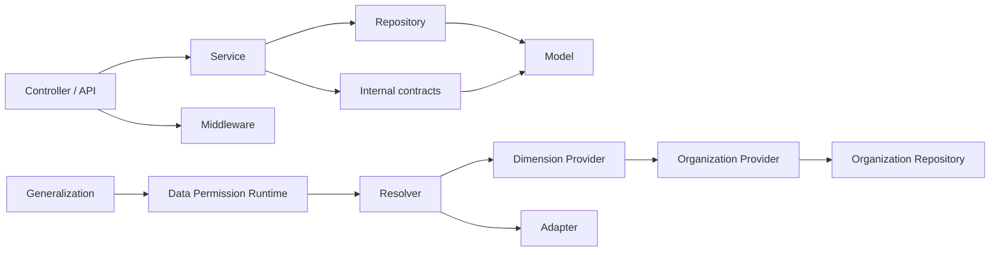

# Sweet Platform 后端代码健康审计报告

## 文档信息

| 项目 | 内容 |
| --- | --- |
| 文档目的 | 审计 `backend/` 的架构边界、代码质量、重复能力、维护成本和测试风险，并形成分级整改 Backlog |
| 审计日期 | 2026-08-04 |
| 审计基线 | `931b534f4ec06997e4b82c57d7d3796f25562c77` |
| 审计范围 | Controller、Service、Repository、Model、DTO、Middleware、Internal、Initialize、Migration 及测试代码 |
| 审计方式 | 文件与行数统计、包依赖扫描、路由与调用引用检索、复杂度启发式扫描、测试基线与全局状态检查 |
| 任务边界 | 只审计并生成报告，不修改代码、不运行完整测试、不调整模块结构 |

本报告以当前仓库真实代码为准。死代码结论采用保守口径：动态注册、Wire 生成、GORM 回调、Migration 注册和稳定领域接口不会仅因静态调用次数少而判定为可删除。

## 审计结论摘要

后端总体架构方向清晰，功能权限、Organization、Data Permission、Generalization 和 Low Code 已形成可识别的领域边界。尤其是 Data Permission 只通过 Organization Provider 获取组织事实，未发现其直接访问组织 Repository；Resolver、Adapter、Provider 和 Generalization 的职责边界符合冻结设计，应继续保护。

当前主要健康风险来自历史代码与新基线并存：认证流程存在两套不同安全规则，异步任务复用请求级 Gin Context，文件签名能力未绑定预览或下载用途；此外，Gin 类型已渗透到 Model 和 Repository，事务入口、DTO 转换和错误日志方式尚未完全统一。以上问题不会否定现有领域架构，但其中三项安全与并发风险应在继续扩大业务接入前优先处理。

综合结论：**架构底座健康，但存在 3 项 P0 风险和若干 P1 维护问题；建议先完成 P0，再开展大规模业务模块接入。**

## 1. 规模统计

### 1.1 总体规模

| 指标 | 结果 | 统计口径 |
| --- | ---: | --- |
| Go 文件 | 365 | 包含测试和生成文件 |
| 人工维护 Go 文件 | 363 | 排除 `backend/docs/docs.go`、`backend/initialize/wire_gen.go` |
| 物理行数 | 93,321 | 包含 2 个生成文件 |
| 人工维护物理行数 | 87,022 | 排除 2 个生成文件 |
| 有效代码行 | 77,821 | 简单词法统计，排除空行和纯注释行 |
| 生产代码有效行 | 46,774 | 非测试、非生成文件 |
| 测试代码有效行 | 31,047 | `*_test.go` |
| 测试文件 | 120 | 约占人工维护 Go 文件的 33.1% |
| 测试代码比例 | 39.9% | 测试有效行 / 全部有效行 |
| Go Package | 33 | `go list ./...` 实际结果 |
| Controller 方法 | 204 | 非测试 Controller 接收者方法 |

测试代码占比接近四成，说明当前平台对领域约束和回归验证投入较高。该比例本身不构成冗余判断，尤其是 Data Permission、Organization、Migration 和查询构建器均属于高风险基础设施。

### 1.2 主要目录规模

| 目录 | Go 文件 | 测试文件 | 物理行数 | 观察 |
| --- | ---: | ---: | ---: | --- |
| `service` | 72 | 43 | 32,774 | 业务编排和主要复杂度集中区 |
| `internal` | 80 | 20 | 11,795 | Data Permission 契约、缓存、错误和基础能力 |
| `repository` | 75 | 14 | 10,455 | 接口较细，包含通用动态查询能力 |
| `controller` | 23 | 9 | 9,216 | 多数为 HTTP 编排，少数文件职责过重 |
| `migrate` | 19 | 11 | 9,101 | Migration、Seed 和约束测试较集中 |
| `dto` | 38 | 6 | 4,069 | 新模块白名单 DTO 较清晰，旧模块仍有 Model 直出 |
| `middleware` | 16 | 7 | 2,739 | 审计分类和认证逻辑是主要增长点 |
| `initialize` | 14 | 3 | 2,229 | 路由和依赖组装，规模可接受 |
| `model` | 13 | 3 | 2,140 | 模型集中，但基础模型耦合 Gin |

审计按 33 个 Go Package 和 9 个核心层次进行。Package 数量适中，没有发现通过大量无意义 Package 人为切碎代码的情况。

## 2. 架构边界审计

### 2.1 Controller

大多数 Controller 遵循“校验请求 DTO、调用 Service、设置统一响应或上抛统一错误”的模式，未发现 Controller 直接访问 Repository。

主要例外：

1. [basic_controller.go](../backend/controller/basic_controller.go#L58) 的后台登录方法直接编排验证码、登录锁定、密码校验、Token、密码修改要求、登录日志和最后登录时间，已超出传输层职责。
2. [auth_api.go](../backend/api/auth_api.go#L240) 另有一套登录与 Token 编排，和后台登录的安全策略不一致。
3. [file_controller.go](../backend/controller/file_controller.go#L35) 同时负责文件业务上下文解析、权限校验、签名 URL、MIME 安全策略、文件引用扫描和流式输出，786 行的 Controller 已形成独立业务子系统。

建议保留 Controller 的 HTTP 适配职责，将认证策略和文件访问能力下沉为聚焦的应用 Service；不要将这些逻辑转移到 Repository。

### 2.2 Service

Service 是当前业务规则和事务编排的主要承载层，方向正确。Data Permission 新 Service 普遍使用稳定错误、白名单 DTO、显式校验和 Service 层事务基线，边界较好。

维护风险集中在少数大型 Service：

- [report_service.go](../backend/service/report_service.go) 同时处理报表 CRUD、发布版本、SQL 预览与安全、数据集、导出、执行日志、菜单发布和 Casbin 授权。
- [sys_table_service.go](../backend/service/sys_table_service.go) 同时处理 DDL、元数据同步、字段、关系、索引、菜单发布、按钮权限和缓存。
- [org_service.go](../backend/service/org_service.go) 覆盖 Organization 全部只读查询、账号绑定、任职、同步记录和树装配。

这些模块应通过内部协作者降低单文件复杂度，但应保留现有领域 Service 门面，不应合并 Report、Low Code、Organization 或 Data Permission 的领域边界。

### 2.3 Repository

未发现 Repository 调用角色权限、Casbin 或 Organization Provider，也未发现 Controller 绕过 Service 直接调用 Repository。新 Data Permission Repository 主要负责稳定业务键、受控筛选、分页和错误传播，未把 Provider 校验或 Policy 业务规则下沉到持久化层。

需要治理的历史耦合是 [BasicRepository](../backend/repository/basic.go#L27) 直接接收 `*gin.Context`，其实现还在结构体中保存 Gin Context。Repository 应只依赖标准 `context.Context` 和数据库抽象，避免传输框架成为持久化契约的一部分。

### 2.4 DTO 与 Model 暴露

Organization 和 Data Permission 已显式转换白名单 Response DTO，符合平台边界。旧模块仍存在直接返回完整 Model 的情况，涉及：

- `SysRole`、`SysMenu`、`SysMenuButton`。
- `SysDict`、`SysDictItem`。
- `SysTable`、`SysTableField`、关系和索引。
- `ReportDefinition`。
- `File`。

[model.Basic](../backend/model/basic.go#L136) 默认暴露创建人、修改人、删除人等审计字段，`File` 等具体 Model 还包含内部存储信息。当前未确认已造成敏感数据泄露，但 Model 直出会使数据库字段新增自动扩大 API 响应，是持续维护风险。建议按模块逐步补齐列表和详情白名单 DTO，不做一次性全仓改造。

### 2.5 Middleware

认证、统一响应、Casbin、请求日志和安全头职责总体明确。主要问题有两项：

1. [auth.go](../backend/middleware/auth.go#L28) 直接依赖具体 `SysUserService`，不利于隔离测试和替换认证用户读取能力。
2. [log.go](../backend/middleware/log.go#L267) 内的访问审计分类函数持续识别配置、低代码和业务动作，Middleware 已承载较多业务路由分类知识。

建议将认证用户查询收敛为小接口，将审计分类和脱敏规则抽取为声明式组件；Middleware 继续负责调用顺序和请求生命周期，不应下沉业务权限判断。

### 2.6 Provider、Resolver、Adapter

该边界是本次审计中最清晰的部分：

- Organization Provider 提供员工、有效任职、组织范围和树关系事实。
- Dimension Provider 通过 `OrgPermissionProvider` 调用组织事实，不直接访问 `org_*` Repository。
- Resolver 组合 Resource、Grant、Policy、Ownership 和 Provider 结果。
- Adapter 将结构化 `DataScopeResult` 转换为受控执行描述，不读取授权配置。
- Generalization 只编排新数据权限运行时与结构化查询。

未发现 Data Permission 反向侵入 Organization，也未发现 Organization 依赖 Data Permission。**Organization Provider、Data Permission Resolver、Metadata/Registered Adapter 和 Generalization 必须继续作为受保护抽象，不应以减少代码量为由合并。**

## 3. 模块依赖审计

### 3.1 当前主要依赖方向

### 3.2 审计结论

| 依赖检查 | 结论 |
| --- | --- |
| Controller 直接访问 Repository | 未发现 |
| Repository 包含 Casbin 或角色权限判断 | 未发现 |
| Data Permission 直接访问组织 Repository | 未发现 |
| Organization 依赖 Data Permission | 未发现 |
| Generalization 绕过 Resolver 自行解析 Policy | 未发现 |
| Adapter 读取 Grant、Policy 或 Provider | 未发现 |
| Model 依赖 HTTP 框架 | **存在**，`model.Basic` 依赖 Gin |
| Repository 依赖 HTTP 框架 | **存在**，`BasicRepository` 依赖 Gin |

### 3.3 反向依赖风险

[model/basic.go](../backend/model/basic.go#L162) 的 GORM Hook 将 `tx.Statement.Context` 断言为 `*gin.Context`，以获取当前用户并写入审计字段。这使最底层 Model 依赖 HTTP 框架，并导致后台任务、命令行、测试或标准 Context 无法一致写入审计人信息。

建议后续建立仅携带审计主体的标准 Context 值，由 Middleware 注入、Service 传递、Model Hook 读取；迁移期间保留兼容适配，但最终从 Model 和 Repository 契约中移除 Gin 类型。

## 4. 重复能力审计

| 能力 | 位置与程度 | 结论 | 建议 |
| --- | --- | --- | --- |
| 认证与 Token 签发 | 后台登录、API 登录、短信登录及其他登录分支重复，且策略已分叉 | 高风险重复 | 建立统一认证应用 Service；不同 Controller/API 仅负责认证方式适配 |
| 事务模板 | `BasicRepository.ExecuteTx`、`service.RunInTransaction`、直接 `db.Transaction` 并存 | 中度重复 | 新代码统一使用 Service 层事务入口，旧模块按领域逐步迁移 |
| 分页 | BasicRepository、Organization、Data Permission 配置、Generalization 各有实现 | 语义差异较大 | 保留专用查询；只抽取页码、总数和响应装配等真正相同部分 |
| DTO 转换 | 新模块显式转换；6 处旧 Service 使用属性复制并用 `fmt.Println` 处理错误 | 中度重复 | 统一显式 mapper 或小型转换函数，错误进入结构化日志或返回链 |
| 错误处理 | 新领域使用稳定错误；旧 Controller 多处将 `err.Error()` 包装为 BadRequest | 中度且有泄露风险 | 在 Service/错误中间件统一分类，禁止把依赖错误文本直接返回客户端 |
| 日志 | 结构化 Zap 为主，仍有 6 处 `fmt.Println` | 低度重复 | 统一结构化日志并携带 request/trace 信息 |
| 权限判断 | Casbin 功能权限与 Data Permission 数据权限分别实现 | **不是重复** | 保持边界，禁止合并为一套模糊权限判断 |
| 查询规则应用 | `repository/util/query.go` 集中处理 AdvancedQuery | 合理公共能力 | 保留单一实现，先补测试再降低内部复杂度 |

事务能力不应简单删除其一后全仓替换。当前 `RunInTransaction` 已明确为新代码基线，建议以新增代码准入规则和领域内小步迁移完成收口。

## 5. 文件粒度审计

### 5.1 过大文件

以下为非测试、非生成文件的主要大文件：

| 文件 | 行数 | 主要职责 | 建议 |
| --- | ---: | --- | --- |
| `service/report_service.go` | 2,898 | 报表定义、发布、SQL、安全、执行、导出、菜单与权限 | P1：拆内部协作者，保留 ReportService 门面和第一阶段架构 |
| `migrate/main.go` | 2,853 | Migration 注册、平台 Seed 和大量字典数据 | P2：按领域拆注册单元，保持顺序和稳定业务键 |
| `service/sys_table_service.go` | 2,505 | 元数据、DDL、关系、索引、发布、权限和缓存 | P1：拆元数据 Schema、发布和缓存协作者，保留 SysTableService |
| `service/org_service.go` | 2,109 | 全 Organization 查询、绑定、任职、同步与树装配 | P2：拆 mapper/装配辅助文件，保留 Organization Service 与 Provider |
| `repository/impl/org.go` | 1,586 | 多个 Organization 聚合查询实现 | P1：按聚合拆实现文件，接口和查询语义不变 |
| `repository/util/query.go` | 1,223 | 动态查询解析、规则应用和排序 | P1：先加强回归与属性测试，再拆解析与应用步骤 |
| `service/data_permission_config_preflight_service.go` | 1,133 | Resource、Policy、Grant 预检 | 当前职责内聚；继续增长时再拆 Validator |
| `middleware/log.go` | 626 | 访问日志、审计分类、脱敏和响应记录 | P1：拆审计分类与脱敏组件 |

### 5.2 复杂函数

启发式分支扫描显示，下列函数兼具长度或较高分支密度：

- `repository/util/query.go` 的 `applyRule`：动态字段、操作符和值类型组合多，是查询安全敏感点。
- `service/org_service.go` 的 `buildStructureOrgTree`：树装配和异常分支多。
- `service/sys_table_service.go` 的 `SyncViewTableFields`、`CreateTable`、`UpdateTableField`：元数据和真实 Schema 一致性复杂。
- `service/file_service.go` 的 `MergeChunks`：文件 I/O、校验和状态组合较多。
- `middleware/log.go` 的 `classifyAccessAudit`：路由分类分支持续增长。

上述复杂度是启发式结果，不等同于正式圈复杂度。整改顺序应是先固定行为测试，再抽取命名步骤；不建议直接重写核心算法。

### 5.3 过小文件

多数短文件是 Repository 端口、DTO、DI 标记类型或编译期边界，具有独立价值，应保留。例如 `LoginLogRepository`、`PrimaryDB` 和小型 Response DTO。

确认无独立价值的文件只有 [repository/impl/file_impl.go](../backend/repository/impl/file_impl.go)：文件除作者头外只有 `package impl`，属于明确清理候选。`table_name.go` 虽只有一个函数，但被 Repository 实现共享，应保留。

## 6. 死代码审计

### 6.1 确定当前不可达或无实现价值

| 对象 | 证据 | 分类建议 |
| --- | --- | --- |
| `repository/impl/file_impl.go` | 空实现文件，无声明 | 确定删除候选 |
| `ApplicationController.GetApplicationByAppKey` | 有 Controller 方法，但路由未注册；Service 方法仍被 API 鉴权使用 | 删除 Controller 候选，保留 Service |
| `TableController.DeleteTableIndexByTableId` | 有 Controller 与 Service 方法，未发现路由或生产调用 | 删除前核对外部 API 契约 |
| `UserController.GetUserByUserName` | 有 Controller 方法，未发现路由或生产调用 | 删除前核对外部 API 契约 |

“路由未注册”表示在当前进程中没有 HTTP 入口，不代表允许立即删除其底层 Service。删除前仍需检查 OpenAPI、外部调用约定和未来显式注册计划。

### 6.2 疑似废弃

以下方法未发现生产调用，但仅凭静态引用不足以直接删除：

- `GeneralizationService.GetFieldById` 及对应 Repository 方法。
- `SysUserService.GetAll`。
- `SysRoleService.CreateRoleMenu`、`DeleteRoleMenu`，可能已由统一权限分配能力替代。

建议为这些对象建立“路由、Wire、测试、文档、外部契约”四步确认清单，通过编译与回归测试后再独立清理。

### 6.3 明确需要保留

以下对象即使当前直接调用较少，也不应视为死代码：

- Organization Provider 的祖先、后代和关系查询契约。
- Data Permission Resolver、Adapter、Dimension Provider 和注册接口。
- Generalization 统一查询链。
- Wire 生成代码和 Migration/Seed 注册入口。
- GORM Hook、序列化方法及由框架反射调用的接口。

## 7. 测试代码审计

### 7.1 当前基线

| 检查项 | 结果 |
| --- | ---: |
| 测试文件 | 120 |
| 测试有效代码行 | 31,047 |
| `gin.SetMode` 调用 | 17 |
| 直接 `sqlite.Open(\":memory:\")` | 22 |
| PostgreSQL 环境变量门控测试文件 | 4 |
| `t.Parallel` | 0 |

测试数量和比例良好，Data Permission、Organization、Migration、Casbin 与动态查询均有专门测试。`internal/test/database.go` 已提供隔离 SQLite 数据库、连接限制、清理和回滚辅助，是可继续推广的健康基线。

### 7.2 重复测试工具

仍有 22 处测试直接创建 `:memory:` SQLite，并在多个 Service、Migration 和 Repository 测试中重复 AutoMigrate。建议在不改变测试语义的前提下复用统一数据库 Helper；DryRun、Migration 专项和需要特殊连接行为的测试可以保留独立初始化。

### 7.3 全局状态与 race 风险

1. 17 处测试调用 `gin.SetMode`，该 API 修改进程级全局状态。当前没有 `t.Parallel`，降低了即时冲突概率，但会阻碍未来并行测试。
2. 多个 Adapter、Registry、Casbin 和 Organization 测试显式启动 goroutine，应继续纳入相关包 `go test -race`。
3. 生产代码中异步 goroutine 直接使用请求级 `*gin.Context`，比测试辅助代码更值得优先处理。

建议通过 TestMain 或统一测试引导只设置一次 Gin 模式；并规定异步任务只能接收复制后的必要值和标准 `context.Context`，不得持有 Gin Context。

### 7.4 PostgreSQL 专项测试

4 个测试文件依赖 `SWEET_TEST_POSTGRES_DSN`，未设置时会跳过 PostgreSQL 真实约束验证。建议 CI 建立明确的 PostgreSQL 专项 Job，并将“执行数量与跳过数量”作为可见结果，避免默认 `go test` 通过被误认为已验证 PostgreSQL 约束。

### 7.5 不稳定测试与工具限制

- 本任务按要求未运行完整测试，不能把历史测试结果作为本次通过结论。
- `go list ./...` 成功识别 33 个 Package，说明当前包图可加载。
- 本机 `staticcheck` 与当前 Go 导出格式不兼容，报错 `unsupported version: 2`，因此未形成有效静态检查结论。应升级工具后在独立治理任务中重新执行。

## 8. 代码规范审计

### 8.1 注释

- 后端解释性注释已基本使用中文，技术名词保留符合规范。
- 未发现 `TODO` 或 `FIXME`。
- 剩余英文主要是 Swagger 标注、技术声明、URL、构建标签和日志文本，不应机械翻译。

### 8.2 错误处理

Data Permission 和 Organization 已形成较稳定的领域错误体系。旧模块仍存在两类不一致：

1. Controller/Middleware 将底层 `err.Error()` 直接包装为 BadRequest，可能泄露数据库或依赖实现信息。
2. Service 中属性映射错误仅 `fmt.Println` 后继续，调用方无法知道转换是否完整。

建议统一为“Repository 传播技术错误、Service 转换稳定领域错误、响应中间件映射外部错误”的三层规则。

### 8.3 命名

整体领域命名清晰。确认存在两个文件名拼写错误：

- `backend/internal/cache/sys_role_cahce.go`。
- `backend/initialize/sonwflake.go`。

建议 P2 单独使用 `git mv` 修复并验证引用。历史 `Id`/`ID` 风格不一致广泛存在，不建议为了形式统一进行高噪声全仓重命名。

### 8.4 日志

结构化 Zap 是主基线，但仍有 6 处 `fmt.Println`，集中在属性映射错误。认证中间件还在每个请求记录固定的 `AuthHandler start/end` 信息，信噪比较低。建议统一结构化字段、request/trace 标识和错误等级，并删除无诊断价值的固定流程日志。

## 9. 复杂度与维护成本分析

### 9.1 最大 Service

`ReportService` 是当前最大 Service。其复杂度部分来自报表第一阶段需要同时维护设计、发布、运行、导出和权限边界，不能通过删除核心能力降规模。建议拆分内部 `ReportPublisher`、`ReportExecutor`、`ReportExporter`、`ReportMenuPublisher` 等协作者，外部仍保留一个稳定门面。

### 9.2 最大 Controller

`TableController` 约 906 行，是最大 Controller；但多数方法仍是薄 HTTP 适配，行数主要来自接口数量和 Swagger 注释。相比之下，`FileController` 虽约 786 行，却包含更多业务与安全逻辑，优先级更高。不能仅按行数决定整改顺序。

### 9.3 最大 Repository

`repository/impl/org.go` 约 1,586 行，是最大 Repository 实现。其查询均属于 Organization 读取侧，但覆盖法人、组织、人员、岗位、任职和同步记录多个聚合。建议按聚合拆文件并保持接口不变，不应把查询移入 Controller 或 Data Permission。

### 9.4 查询构建复杂度

`repository/util/query.go` 是 Low Code 查询安全关键点，`applyRule` 的分支密度最高。该文件的复杂度具有业务必要性，但修改风险大。未来治理应优先增加操作符矩阵、字段类型、空值、非法字段和组合条件测试，再将解析、校验、值转换和 GORM 应用拆成内部步骤。

## 10. 高风险发现

### 10.1 P0：异步 goroutine 复用 Gin Context

[basic_controller.go](../backend/controller/basic_controller.go#L98)、[auth_api.go](../backend/api/auth_api.go#L256) 等登录流程将请求级 `*gin.Context` 传入 goroutine，用于写登录日志和更新最后登录时间；短信服务也存在同类模式。

Gin Context 与请求生命周期绑定，不保证请求结束后继续安全使用。影响包括数据竞争、审计记录不稳定、上下文值失效和测试 race。建议异步前复制 IP、用户 ID、Token 等必要值，并使用新的标准 Context 或同步事务化写入；不要将 Gin Context 传入 goroutine。

### 10.2 P0：认证策略在后台与 API 登录间分叉

后台登录执行验证码、失败次数锁定、密码修改要求和 Token 更新；API 登录重复签发 Token，但未执行同样的锁定与密码修改策略。除非这是经过正式安全设计的渠道差异，否则攻击者可能选择规则更弱的入口。

建议先冻结统一认证策略矩阵，再建立单一认证应用 Service。后台、开放 API、短信和 SSO 只负责凭证获取方式，不自行复制账号状态、锁定、Token 和审计规则。

### 10.3 P0：文件签名能力未绑定访问用途

[signedFileAccessClaims](../backend/controller/file_controller.go#L50) 只签名文件 UUID 和过期时间；预览与下载通过不同 URL 路径区分，但 [signedAccess](../backend/controller/file_controller.go#L433) 不校验 Token 的用途。因而预览 Token 可以替换路径后用于下载，反之亦然。

若预览与下载是不同权限或审计动作，这会破坏能力边界。建议把 `action/purpose` 纳入签名 Claims，并在端点验证；若产品明确认为二者权限完全相同，应合并为一个已文档化的文件读取能力，避免伪装成两个独立权限。

## 11. 整改 Backlog

### 11.1 P0：安全与架构阻塞项

| 编号 | 问题 | 位置 | 影响 | 建议 |
| --- | --- | --- | --- | --- |
| P0-01 | goroutine 复用请求级 Gin Context | `basic_controller.go`、`auth_api.go`、`sms_service.go` | race、审计与用户状态更新不稳定 | 异步任务仅接收复制值和标准 Context；增加 race 回归 |
| P0-02 | 多登录入口认证规则不一致 | `BasicController.Login`、`AuthApi.Login` 及短信/SSO 分支 | 可能绕过锁定、验证码或密码修改要求 | 冻结认证策略矩阵并收口到统一认证 Service |
| P0-03 | 文件签名 Token 未绑定 preview/download | `file_controller.go` | 能力用途可互换，权限与审计语义失真 | Claims 增加用途并严格验证，补交叉重放测试 |

### 11.2 P1：明显维护风险

| 编号 | 问题 | 位置 | 影响 | 建议 |
| --- | --- | --- | --- | --- |
| P1-01 | Model/Repository 依赖 Gin | `model/basic.go`、`repository/basic.go` | 后台任务和测试难复用，层次反向耦合 | 引入标准审计 Context，逐步移除 Gin 类型 |
| P1-02 | API 直接返回完整 Model | Role、Menu、Dict、Table、Report、File Controller | 数据库字段变化自动扩大外部契约 | 按模块建立列表/详情白名单 DTO |
| P1-03 | 事务入口并存 | BasicRepository、Service transaction、直接 GORM | 行为、嵌套与 panic 处理不一致 | 新代码统一 Service 基线，按领域渐进迁移 |
| P1-04 | FileController 职责过重 | `controller/file_controller.go` | 权限、签名、MIME 和流式响应难独立测试 | 抽 FileAccessService，保留 Controller 适配 |
| P1-05 | Report/SysTable Service 过大 | `report_service.go`、`sys_table_service.go` | 修改影响面大，扩展冲突高 | 拆内部协作者，保留稳定领域门面 |
| P1-06 | 动态查询核心分支复杂 | `repository/util/query.go` | 权限与查询条件回归风险高 | 先补矩阵/属性测试，再拆解析和执行步骤 |
| P1-07 | 审计分类集中在 Middleware | `middleware/log.go` | 新业务不断增加分支 | 抽声明式分类器和脱敏策略 |
| P1-08 | 测试数据库与 Gin 模式重复初始化 | 22 处 SQLite、17 处 Gin 模式 | 隔离性不一致，未来并行测试困难 | 推广 `internal/test` Helper，TestMain 设置全局模式 |
| P1-09 | PostgreSQL 约束测试默认可跳过 | 4 个 DSN 门控测试文件 | CI 可能未验证真实数据库语义 | 建独立 PostgreSQL CI Job 并显式报告跳过 |
| P1-10 | 无路由与疑似未调用代码累积 | 3 个 Controller、若干 Service/Repo 方法 | 误导维护者，扩大接口面 | 独立清理 Task，逐项核对契约后删除 |
| P1-11 | 底层错误文本进入响应 | 多个旧 Controller/Middleware | 泄露实现信息，错误语义不稳定 | Service 统一转换领域错误，响应层只映射稳定信息 |

### 11.3 P2：优化项

| 编号 | 问题 | 位置 | 影响 | 建议 |
| --- | --- | --- | --- | --- |
| P2-01 | Migration 主文件过大 | `migrate/main.go` | 注册与 Seed 审阅困难 | 按领域拆文件，保持注册顺序和幂等语义 |
| P2-02 | Organization Service 辅助装配集中 | `org_service.go` | 主流程阅读成本高 | 移动 mapper/tree helper，保留 Provider 与 Service |
| P2-03 | 6 处 `fmt.Println` | 旧 Service 映射逻辑 | 日志不可检索、错误被吞 | 改结构化日志或向上传播 |
| P2-04 | 文件名拼写错误 | `sys_role_cahce.go`、`sonwflake.go` | 搜索与认知成本 | 使用 `git mv` 修正并验证构建 |
| P2-05 | 空实现文件 | `repository/impl/file_impl.go` | 无实际价值 | 独立清理时删除 |

## 12. 治理顺序建议

建议按以下顺序执行，不同时修改多个核心领域：

1. 先处理 P0-01 至 P0-03，并运行认证、文件、全仓测试与 race。
2. 建立标准 Context、事务和错误处理准入规则，优先供新增代码使用。
3. 分模块补齐白名单 DTO，从 File、Report 等内部字段较多的对象开始。
4. 在测试保护下拆 Report、SysTable、File 和审计分类内部协作者。
5. 最后进行死代码、文件名和空文件等低风险清理。

任何治理都不得破坏以下已冻结边界：Organization Provider、Data Permission Resolver、DataScopeResult、Metadata/Registered Adapter、Generalization 统一查询链，以及功能权限与数据权限的分离。

## 13. 验证与限制

本任务为纯审计任务，没有修改业务代码，也没有运行完整 `go test ./...`。已完成的只读验证包括：

- `go list ./...` 成功，识别 33 个 Package。
- 全仓文本引用、路由、依赖、文件规模和测试基线扫描。
- Git 工作区在报告创建前保持干净。

未完成或受阻项：

- 未执行完整测试和 race，报告中的 race 风险来自代码生命周期审计，不是本次动态测试结论。
- `staticcheck` 因本机工具与当前 Go 导出格式不兼容而失败，需升级工具后复核。
- 静态扫描无法证明反射、外部 API 或运行时配置不存在，因此“疑似废弃”对象必须经过独立删除验证。
