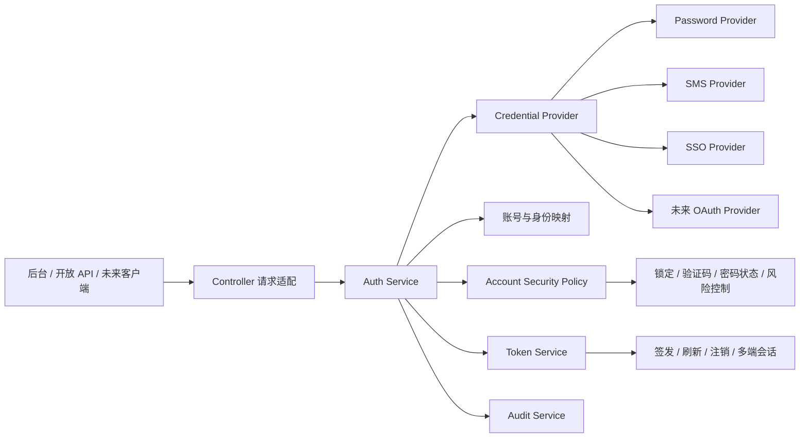
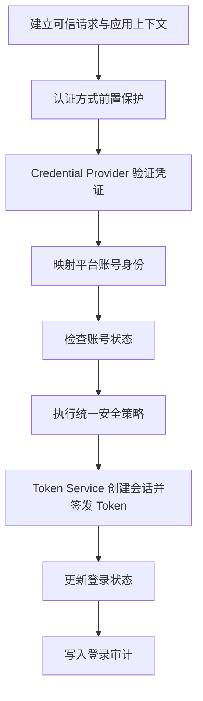

# Sweet Platform 统一认证体系架构设计

## 文档信息

| 项目 | 内容 |
| --- | --- |
| 文档目的 | 冻结 Sweet Platform 统一认证目标架构，消除后台登录、开放 API、短信和 SSO 入口之间的安全策略分叉 |
| 文档状态 | 正式设计基线 |
| 设计日期 | 2026-08-04 |
| 设计依据 | [后端代码健康审计报告](../reviews/PlatformBackendCodeAuditReport.md)及当前仓库认证实现 |
| 适用范围 | 后台登录、开放 API 用户登录、短信登录、SSO 及未来第三方身份源接入 |

本文描述目标架构和后续渐进整改边界，不表示当前代码已经完成统一改造。后续实现不得改变现有接口行为，除非经过独立的兼容性和安全评审。

## 1. 背景与目标

当前平台存在多个用户认证入口：

- 后台密码登录负责验证码、登录失败锁定、密码校验、密码状态提示、Token 签发和登录状态更新。
- 开放 API 密码登录独立完成密码校验和 Token 签发，但未复用后台登录的全部安全策略。
- 短信登录独立校验短信验证码并签发 Token。
- SSO 当前通过外部身份源取得用户，再独立签发 Token。
- 刷新和注销直接处理 Token，未形成统一会话生命周期编排。

这些入口的差异本应只体现在“如何证明身份”，不应形成多套账号状态、锁定、Token 和审计规则。统一认证体系的目标是：

1. 将密码、短信和 SSO 定义为可替换的 Credential Provider。
2. 所有用户认证入口统一经过账号状态和安全策略检查。
3. Token 的签发、刷新、撤销和多端会话由单一 Token Service 管理。
4. 成功和失败的认证尝试都进入统一登录审计。
5. Controller 只适配请求和响应，不再编排完整认证流程。
6. 在保持现有路由和响应兼容的前提下逐步迁移，不一次重写。

## 2. 范围与概念

### 2.1 认证入口与认证方式

“后台”和“开放 API”是访问渠道，“密码”“短信”“SSO”是认证方式。渠道可以约束允许使用哪些认证方式，但不能自行定义一套更弱的账号安全策略。

| 入口 | 凭证来源 | 统一处理要求 |
| --- | --- | --- |
| 后台登录 | 用户名、密码、必要的验证码 | 凭证通过后进入统一账号策略、Token 和审计链路 |
| 开放 API 登录 | 应用上下文中的用户名和密码 | AppToken 只证明调用应用，不能替代用户认证 |
| 短信登录 | 手机号和一次性短信验证码 | 短信验证码只证明手机号控制权，仍需映射并检查平台账号 |
| SSO | 外部身份源返回的授权码或断言 | 外部身份验证成功后，仍需映射并检查本地平台账号 |
| 未来 OAuth / 第三方身份源 | 标准协议令牌或授权码 | 以新的 Credential Provider 接入，不绕开公共流程 |

### 2.2 AppToken 与用户 Token

开放 API 当前使用 AppToken 识别和约束调用应用。目标架构继续区分两类身份：

- AppToken：证明哪个受信应用正在调用平台，形成 `ClientContext`。
- 用户 Token：证明哪个平台账号完成了用户认证，形成用户会话。

两者不能互相替代。开放 API 用户登录必须先建立可信应用上下文，再执行与后台一致的用户认证安全链路。

### 2.3 短信发送与短信登录

短信发送属于凭证准备流程，负责应用校验、发送频率限制、验证码生成、有效期和一次性消费。它不签发用户 Token，也不代表登录成功。

短信登录消费验证码后，只产生“手机号凭证已验证”的结果。平台仍必须完成账号映射、账号状态、安全策略、Token 签发和登录审计。

## 3. 目标架构

认证方法只负责验证凭证。Auth Service 是唯一认证编排入口，账号安全策略、Token 生命周期和审计均为公共能力。

## 4. 统一认证流程

统一用户认证流程冻结为：

### 4.1 建立可信上下文

Controller 从请求中提取并规范化以下信息：

- 认证渠道和认证方式。
- 已验证的应用标识；后台入口使用平台后台客户端标识。
- 请求 ID、Trace ID、客户端 IP、User-Agent 和必要设备标识。
- 凭证载荷。

客户端不得提交或覆盖平台用户 ID、账号状态、锁定状态、角色、Token 策略和审计结论。

### 4.2 认证方式前置保护

在调用 Credential Provider 前执行不依赖账号敏感信息的保护：

- 应用和渠道是否允许该认证方式。
- IP、设备、应用和凭证标识维度的请求频率限制。
- 需要时触发图形验证码或其他挑战。
- SSO 的 `state`、`nonce`、回调地址和来源约束。

前置保护不能代替后续账号状态检查。

### 4.3 凭证验证

Credential Provider 只验证本方式的凭证真实性，并返回受控的 `VerifiedIdentity`：

- Password Provider 验证账号标识和密码。
- SMS Provider 验证手机号、验证码、有效期和一次性消费。
- SSO Provider 验证授权码或断言，并返回稳定的外部主体标识。
- 未来 OAuth Provider 验证授权服务器、客户端、受众、签名和协议状态。

Provider 不签发平台 Token，不决定平台账号是否启用，不查询角色权限，也不写登录成功状态。

### 4.4 身份映射和账号检查

经过验证的身份必须映射到唯一的平台账号。映射失败、多个账号冲突或外部身份绑定异常均视为认证失败。

映射成功后统一检查：

- 账号存在且未被软删除。
- 账号处于启用状态。
- 账号未处于平台锁定或风险冻结状态。
- 当前认证方式允许用于该账号和客户端。
- 密码或凭证状态满足公共策略要求。

任何入口都不得因为外部凭证已经验证而跳过本地账号状态。

### 4.5 安全策略结果

安全策略只返回受控结果：

| 结果 | 语义 |
| --- | --- |
| `allow` | 可以创建正常会话 |
| `challenge_required` | 必须完成额外验证码或风险挑战，不签发 Token |
| `password_change_required` | 只能进入密码修改和注销等受限流程，不签发不受限会话 |
| `deny` | 拒绝认证，不签发 Token |

当前后台登录已经返回密码修改提示。迁移时应先保持现有响应字段，再将其收口为统一的受限会话策略；在受限会话约束落地前，不得宣称所有入口已经统一执行密码状态策略。

### 4.6 Token 签发和审计

只有 `allow` 或明确受控的 `password_change_required` 才能调用 Token Service。Token 成功签发后更新登录状态，并写入成功审计。

凭证失败、身份映射失败、账号禁用、锁定、挑战失败和 Token 签发失败也必须形成失败审计。审计记录可以异步持久化，但认证请求返回前必须确认审计事件已被可靠接收；具体采用同步写入、可靠队列还是事务消息，待后续实现设计确认。异步任务只能接收请求字段快照和标准 `context.Context`，不得保存 Gin Context、Request 或 ResponseWriter。

## 5. 账号安全策略

### 5.1 账号启用与锁定

- 所有认证方式必须检查账号启用状态。
- 已锁定账号不能通过密码、短信或 SSO 绕过锁定。
- 管理员解除锁定必须调用统一锁定能力，而不是只清理某个入口的临时状态。
- 锁定状态和计数键必须采用规范化主体标识，并包含必要的应用或安全域，避免同名账号相互影响。

### 5.2 失败次数

失败计数由 Account Security Policy 统一管理，但按凭证类型采用明确策略：

- 密码错误计入账号密码失败次数，达到阈值后锁定。
- 短信验证码错误计入短信挑战失败次数，并结合手机号、应用、IP 和设备限流；不得复用成可绕过的独立规则。
- SSO 协议错误和上游拒绝优先计入外部身份源及客户端风险计数；已映射账号的异常尝试仍进入账号风险判断。
- 成功登录只清理由策略明确允许清除的失败计数，不清除管理员冻结或高风险标记。

所有阈值、锁定时长和清除规则由统一策略读取，不在 Controller 或 Provider 中硬编码。

### 5.3 密码状态

密码状态至少包括：

- 初始密码或重置后必须修改。
- 密码已过期。
- 密码修改后，旧会话需要失效。
- 密码策略不适用的纯外部身份账号必须有显式账号属性，不能由入口自行猜测。

默认安全规则是：需要修改密码的本地账号不得获得不受限会话。短信或 SSO 不得成为绕过该状态的隐式入口；确需允许外部身份账号不使用本地密码时，应通过明确的账号认证配置表达。

### 5.4 验证码与风险控制

- 图形验证码是风险挑战，不属于 Password Provider 本身。
- 短信验证码既是短信认证凭证，也必须受发送频率、验证次数、有效期和一次性消费保护。
- 风险控制可以基于应用、渠道、IP、设备、时间窗口和失败历史提高挑战等级。
- 风险规则只能增加验证或拒绝，不能在异常时降低为直接放行。

## 6. 核心职责边界

### 6.1 Controller

Controller 负责：

- 请求绑定和基础格式校验。
- 建立可信客户端及请求元数据。
- 选择明确的认证方式。
- 调用 Auth Service。
- 将统一结果转换为现有 HTTP 响应。

Controller 禁止：

- 直接查询账号并比较密码。
- 判断账号锁定、密码状态或风险等级。
- 直接构造 JWT Claims 或决定有效期。
- 自行更新最后登录时间、Token 列表或登录审计。

### 6.2 Auth Service

Auth Service 是唯一认证编排者，负责：

- 校验入口、应用和认证方式组合。
- 调用 Credential Provider。
- 将外部或本地身份映射为平台账号。
- 调用 Account Security Policy。
- 调用 Token Service 创建会话。
- 编排登录状态更新和 Audit Service。
- 将内部错误转换为稳定的认证结果。

Auth Service 不处理功能权限、数据权限、组织权限或业务授权。

### 6.3 Credential Provider

Credential Provider 负责单一凭证类型的验证。统一契约至少包含：

- 稳定的 Provider 编码。
- 支持的认证方式和渠道声明。
- 凭证验证入口。
- 受控身份结果和失败原因码。

Provider 返回的身份结果不包含角色、权限、平台 Token 或账号放行结论。

### 6.4 Account Security Policy

Account Security Policy 负责账号状态、锁定、失败次数、密码状态、验证码挑战和风险结果。它接收可信账号与请求上下文，返回受控策略结果，不负责验证具体密码、短信码或 SSO 断言。

### 6.5 Token Service

Token Service 负责：

- 创建用户会话。
- 生成和校验 Access Token、Refresh Token。
- Token 有效期和 Claims 白名单。
- 刷新轮换、注销、撤销和密码修改后的会话失效。
- 多端会话策略。

Token Service 不验证密码、短信码或 SSO 凭证，也不判断菜单、接口和数据权限。

### 6.6 Audit Service

Audit Service 负责记录所有认证尝试，至少保留：

- 请求 ID、Trace ID、认证时间和认证方式。
- 应用、渠道、客户端 IP 和 User-Agent。
- 可安全记录的平台用户标识；身份未确认时只记录脱敏主体摘要。
- 成功或失败、稳定原因码和耗时。

禁止记录密码、短信验证码、授权码、完整 Token、外部断言和其他敏感凭证。

## 7. Token 生命周期设计

### 7.1 Token 生成

- 用户 Token 只能由 Token Service 签发。
- Access Token 和 Refresh Token 使用不同类型、有效期和用途校验。
- 有效期由服务端按应用、渠道和安全策略配置，入口不得硬编码。
- Claims 使用白名单，至少能够区分主体、签发者、受众、Token 类型、签发时间、到期时间和会话标识。
- Token 不携带密码、手机号、角色名称或完整权限范围。

### 7.2 刷新

刷新必须：

1. 验证 Refresh Token 类型、签名、签发者、受众、有效期和撤销状态。
2. 验证对应会话仍有效。
3. 重新检查账号启用、锁定和必要的安全版本状态。
4. 轮换 Refresh Token，并使旧 Refresh Token 失效。
5. 使用统一 Token 策略生成新的 Token 对。

目标接口应避免在 URL 查询参数中传递 Refresh Token，优先使用受保护的请求体或安全 Cookie。路由变更属于后续兼容整改，不在本设计任务直接实施。

### 7.3 注销与撤销

- 当前会话注销应同时使该会话的 Access Token 和 Refresh Token 不再可用。
- 支持按当前会话、指定设备和全部会话撤销，具体管理入口分阶段实现。
- 密码修改、账号停用和安全冻结应使相关旧会话失效。
- 黑名单或会话存储的保留时间必须覆盖被撤销 Token 的剩余有效期，不使用与 Token 有效期不一致的固定值。

### 7.4 多端策略

Token Service 统一支持以下可配置策略：

- 允许多端并存。
- 限制每个账号的活动会话数量，超过时撤销最早会话。
- 单端登录，新会话建立时撤销其他会话。

多端策略以会话为单位，不依赖字符串拼接的最近 Token 列表。设备标识只能辅助识别会话，不能由客户端单独决定信任等级。

## 8. 认证入口设计

### 8.1 后台密码登录

后台 Controller 保留现有请求格式和验证码获取入口，逐步改为构造 Password Provider 请求并调用 Auth Service。后台渠道不得持有独立的 Token 配置或登录锁定逻辑。

### 8.2 开放 API 密码登录

开放 API 先通过 AppToken 建立可信 `ClientContext`，再调用与后台相同的 Password Provider 和公共安全策略。应用认证成功不能降低用户密码、锁定和账号状态要求。

### 8.3 短信登录

SMS Provider 只接受服务端已生成、未过期、未消费且与应用及手机号匹配的验证码。验证成功后映射平台账号，并统一执行账号启用、锁定、密码状态适用性和风险策略。

验证码消费应具备原子性，避免同一验证码并发成功多次。发送成功、验证失败和重复消费均需使用稳定审计原因码。

### 8.4 SSO

SSO Provider 负责外部协议校验和外部主体解析，身份映射通过稳定的“身份源 + 外部主体标识”完成。邮箱或手机号可以作为经过验证的辅助属性，但不应长期作为唯一外部身份键。

当前钉钉登录可作为第一个 SSO Provider 迁移。外部用户获取和平台账号放行必须分离，避免外部服务返回用户后直接签发平台 Token。

## 9. 扩展机制

### 9.1 新增 SSO 或第三方身份源

新增身份源只需：

1. 实现 Credential Provider 契约。
2. 注册稳定 Provider 编码和支持的渠道。
3. 配置外部身份到平台账号的稳定映射。
4. 声明所需协议保护和风险上下文。
5. 通过统一 Auth Service 完成账号检查、Token 和审计。

不得为每个身份源新增独立登录编排 Service 或复制 Token 签发代码。

### 9.2 OAuth 接入边界

未来 OAuth / OpenID Connect 接入应验证授权服务器、签名、客户端、重定向地址、受众、`state` 和 `nonce`。协议适配只产出受控外部身份，不直接授予功能、数据或业务权限。

### 9.3 Provider 注册规则

- 注册在服务端启动时完成，不允许普通管理 API 动态注入实现。
- Provider 编码稳定且唯一，重复或冲突注册失败。
- Provider 实例可独立测试，不能通过全局可变状态污染其他测试。
- Provider 异常统一转换为认证失败或依赖失败，绝不触发降级放行。

## 10. 安全与错误原则

1. 密码、短信和 SSO 都必须检查平台账号状态、锁定、安全策略、Token 规则和审计要求。
2. 凭证校验、账号查询、缓存、外部 Provider、Token 或审计依赖异常不得签发 Token。
3. 客户端不能指定平台用户 ID、角色、账号状态、Token 有效期或是否跳过安全策略。
4. 外部响应使用有限的稳定错误，不区分“账号不存在”和“凭证错误”等可导致账号枚举的细节。
5. 锁定或限流可以返回统一的稍后重试语义，但不得泄露账号是否真实存在。
6. 内部日志使用稳定原因码记录真实失败阶段，外部错误和内部诊断分离。
7. 不向客户端或日志返回数据库错误、缓存键、外部断言、堆栈、完整 Token 或敏感账号资料。
8. 登录成功状态更新和审计事件接收失败必须可监控并阻止成功响应；不得静默吞掉错误后将认证链路视为完全成功。若 Token 已在内存中生成但尚未返回，应撤销或丢弃该会话。
9. 刷新和注销执行与登录相同的 Token 类型、会话和撤销校验，不由入口自行解释。
10. 所有时间判断使用服务端时钟；验证码、锁定和 Token 的有效期单位必须在配置契约中明确。

## 11. 渐进迁移策略

统一认证采用按职责抽取、按入口迁移的方式，不进行一次性重写。

### 阶段一：冻结契约和策略矩阵

- 固化认证方式、统一结果、错误码、审计字段和账号策略矩阵。
- 为现有后台、开放 API、短信、SSO、刷新和注销补充行为测试。
- 明确现有路由、请求字段和响应字段的兼容要求。

### 阶段二：抽取公共 Token Service

- 将重复的 Claims、有效期、签发、刷新、撤销和登录状态更新收口。
- 保持现有 JWT 格式和接口响应，先不改变客户端调用方式。
- 为现有 Token 建立兼容验证窗口，避免已登录会话无计划失效。

### 阶段三：建立 Auth Service 与 Credential Provider

- 先把当前安全策略最完整的后台密码登录迁入 Password Provider 和 Auth Service。
- 再迁移开放 API 密码登录，并补齐与后台一致的锁定、密码状态和审计。
- 每迁移一个入口，使用同一套契约测试验证安全策略，不保留该入口自己的 Token 编排。

### 阶段四：迁移短信和 SSO

- 将短信验证码验证收口到 SMS Provider，并落实原子消费和统一失败计数。
- 将钉钉身份验证收口为 SSO Provider，分离外部身份获取与本地账号放行。
- 补齐短信和 SSO 成功、失败审计及账号状态检查。

### 阶段五：统一刷新、注销和多端会话

- 所有渠道调用同一 Token Service。
- 逐步从最近 Token 字符串和固定黑名单期限迁移到明确的会话生命周期。
- 新增全会话撤销前先保持当前注销行为兼容，并补齐回归测试。

### 阶段六：删除重复编排

- 全部入口迁移并通过测试后，删除 Controller/API 中重复的密码比较、Claims 构造、有效期常量和登录状态更新。
- 删除只为旧入口存在的临时分流，不长期双跑两套安全策略。
- 更新 Wire 依赖，使 Controller 依赖小型 Auth Service 接口，而不是组合多个认证内部 Service。

每个阶段应独立提交、可测试、可回滚。回滚只能恢复上一阶段已验证实现，不能通过切换到安全策略更弱的入口解决问题。

## 12. 策略矩阵冻结

| 公共检查 | 密码 | 短信 | SSO / OAuth |
| --- | --- | --- | --- |
| 应用与渠道校验 | 必须 | 必须 | 必须 |
| 账号唯一映射 | 必须 | 必须 | 必须 |
| 账号启用状态 | 必须 | 必须 | 必须 |
| 平台锁定状态 | 必须 | 必须 | 必须 |
| 认证方式专属凭证验证 | 密码 | 一次性验证码 | 外部授权码或断言 |
| 密码状态策略 | 必须执行 | 必须执行适用性判断 | 必须执行适用性判断 |
| 风险与挑战策略 | 必须 | 必须 | 必须 |
| Token Service | 统一 | 统一 | 统一 |
| 成功与失败审计 | 必须 | 必须 | 必须 |

认证方式可以拥有不同凭证验证规则，但表中的公共检查不得由入口跳过。

## 13. 明确不包含

本设计不包含：

- 菜单、按钮、接口等功能权限。
- Data Permission 数据权限。
- Organization 组织权限和组织范围计算。
- 角色授权、业务授权和业务审批。
- TMS、WMS、SRM 等具体业务权限。
- 用户自动创建、组织同步或员工绑定规则。
- 本任务中的数据库、API、前端或代码改造。

认证只回答“当前请求主体是谁，以及其会话是否有效”。认证成功不代表用户自动拥有任何功能权限、数据权限或业务操作权限。

## 14. 开发准入条件

后续统一认证代码整改开始前，必须满足：

1. 认证方式、公共策略和 Token 策略有可执行的测试矩阵。
2. 新 Auth Service 不依赖 Gin Context，Controller 只传递标准 Context 和受控请求对象。
3. 登录审计可以覆盖全部入口的成功与失败，并完成敏感字段排除。
4. Token 兼容方案明确，不无计划使现有会话失效。
5. 每个迁移入口均验证账号禁用、锁定、密码状态、依赖异常和审计失败场景。
6. 对外错误与内部诊断原因码分离，账号枚举测试通过。
7. 迁移按入口小步实施，不同时重写认证、用户、权限和组织模块。

## 15. 架构结论

Sweet Platform 统一认证体系冻结为：

**多种 Credential Provider + 单一 Auth Service 编排 + 单一账号安全策略 + 单一 Token 生命周期 + 全入口登录审计。**

后台、开放 API、短信和未来 SSO/OAuth 只是不同的凭证入口。任何新入口都必须通过统一 Auth Service 接入，不能自行检查账号、签发 Token 或省略安全策略。后续整改应优先收口 Token 和密码登录，再迁移短信、SSO、刷新和注销，最终删除 Controller/API 中重复的认证编排。

## 16. AF-002 实现收敛

AF-002 已按上述边界完成存量入口迁移，冻结以下实现细节：

- 后台密码、开放 API 密码、短信验证码和现有钉钉 SSO 均由静态 Credential Provider 接入同一 `AuthApplicationService`。
- `AuthTokenService` 复用现有 JWT 格式，统一签发、校验、Refresh 单次消费和精确有效期撤销；服务端生成的 `jti` 保证轮换唯一，`sid` 关联同一 Access/Refresh 会话并收敛 Logout/Refresh 竞争，旧 JWT 仍兼容解析，未增加新的 Token 协议或客户端可提交 Claims。
- Refresh 和 Logout 均重新读取权威用户状态。停用、删除、锁定、改密或已撤销账号不能继续使用既有会话。
- 密码失败计数、成功/锁定收敛、短信验证码消费与失败次数、Refresh 消费使用 Redis 原子原语；短信和 SSO 失败不机械累计密码失败次数。
- 用户 Login State 在短事务中同步更新，仅保存 Access Token 摘要；不再由 Controller 异步覆盖整个状态。
- 认证审计使用标准 `context.Context` 中的 request ID、trace ID、客户端 IP 和 User-Agent。未知身份只持久化摘要，不保存原始账号、密码、验证码或 Token。
- AppToken 继续表示开放 API 应用身份，不进入用户 Token、Login State 或账号锁定链。
- AppToken 放行前读取数据库权威应用状态；应用停用或密钥轮换会使缓存中的旧 AppToken 快照立即失效。
- 初始密码或过期密码登录只获得服务端受限会话；认证中间件仅允许该会话访问密码修改接口，注销仍由公开的 Token 撤销入口处理，Refresh 在密码状态恢复前拒绝续期。
- API 路径和登录响应字段保持兼容；认证失败统一为不可枚举的稳定错误。Refresh 同时兼容既有 `refreshToken` 和规范化的 `refresh_token` 查询参数。
- 现有客户端仍依赖 `GET /api/refresh_token` 查询参数，AF-002 仅保留为兼容入口并确保应用访问日志脱敏；迁移到受保护请求体或安全 Cookie 仍属于后续兼容整改，不能把当前路径描述为长期安全终态。
