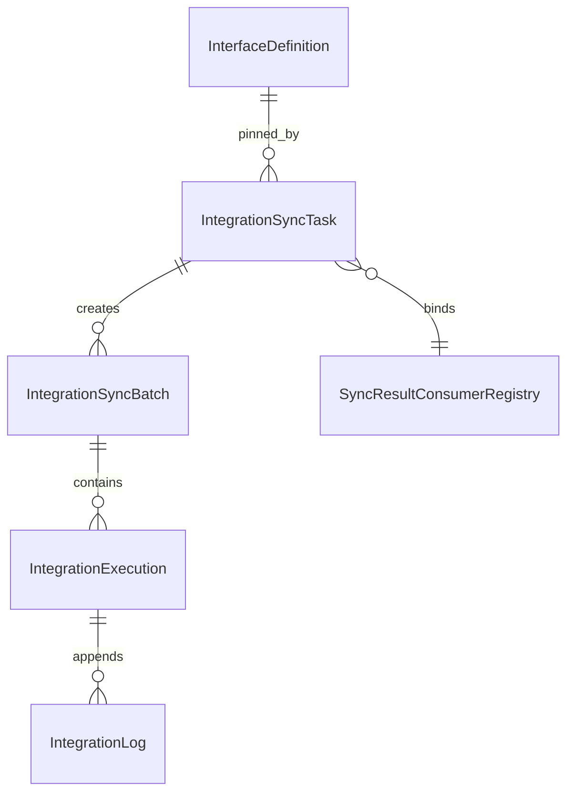

# Sweet Platform Integration Sync 详细设计

## 文档信息

| 项目 | 内容 |
| --- | --- |
| Task | INT-005A |
| 文档状态 | 正式设计 |
| 设计日期 | 2026-08-09 |
| 审计基线 | `8b232a93e8015f43e58f347f43d94683283e7142` |
| 前置设计 | [IntegrationRuntimeDesign.md](IntegrationRuntimeDesign.md)、[IntegrationRetryDesign.md](IntegrationRetryDesign.md) |
| 冻结依据 | [IntegrationRuntimeAcceptanceReport.md](../reviews/IntegrationRuntimeAcceptanceReport.md)、[IntegrationRuntimeFreezeReview.md](../reviews/IntegrationRuntimeFreezeReview.md)、[IntegrationRetryAcceptanceReport.md](../reviews/IntegrationRetryAcceptanceReport.md)、[IntegrationRetryFreezeReview.md](../reviews/IntegrationRetryFreezeReview.md) |

## 1. 定位与目标

Integration Sync 是 Runtime 与业务同步模块之间的受控调度层。它定义可重复触发的同步任务、一次实际运行批次、时间窗口、Checkpoint 和切片顺序，但不执行 HTTP、不解析 Credential、不实现 Retry，也不直接写业务数据。

Sync V1 必须复用已经冻结的唯一执行链：

```text
Sync Application Service / SyncScheduler
  -> SyncBatch
  -> Integration Application Service
  -> IntegrationExecution + RetryPolicySnapshot
  -> IntegrationWorkerRunner
  -> ClaimReadyExecutions
  -> IntegrationLog / Attempt
  -> ExecutionInputSnapshot
  -> CredentialProvider
  -> TransportClient
  -> registered SyncResultConsumer
  -> RetryDecision
  -> Attempt + Execution 原子收敛
  -> SyncBatch / Checkpoint 收敛
```

Sync 不建立第二套 Execution、Attempt、Transport、Credential、Retry 或 Worker。每个切片仍是一条普通 `IntegrationExecution`，每次真实远程调用仍是一条追加型 Attempt。

## 2. V1 决策摘要

| 主题 | V1 决策 |
| --- | --- |
| 触发方式 | `manual`、五段式 `cron` |
| Task 状态 | `draft`、`enabled`、`disabled`，按 `task_code + version` 版本化 |
| 接口引用 | 引用明确 InterfaceDefinition 版本，不动态跟随当前 enabled 版本 |
| Checkpoint | `none`、`timestamp`；不支持 cursor 和自定义 token |
| Lookback | 固定秒数，Checkpoint 推进仍使用逻辑窗口边界 |
| 切片 | 固定时间切片，按窗口升序串行创建和执行 |
| 活动批次 | 同一 `task_code` 最多一个活动 Batch |
| 失败策略 | 固定 `stop_on_failure` |
| Batch 取消 | V1 不提供 |
| BatchItem | 不新增；Execution 直接持有 `sync_batch_id + sync_slice_no` |
| Checkpoint 表 | 不新增；当前值在 enabled SyncTask 版本上维护，Batch 保存前后快照 |
| 响应交付 | 服务端注册、同步调用的 `SyncResultConsumer` |
| 大响应 | 通过时间切片控制；V1 不持久化完整响应 Artifact |
| 调度唯一性 | PostgreSQL 行锁、唯一触发键和活动批次部分唯一索引 |
| 时间语义 | Cron 使用 IANA 业务时区解析；持久化、窗口和领取统一为数据库 UTC |

## 3. 核心对象与职责



### 3.1 IntegrationSyncTask

`IntegrationSyncTask` 描述“如何触发并组织一类同步”。它是版本化技术配置，不是 HTTP 接口、一次执行、RetryPolicy 或业务数据。

### 3.2 IntegrationSyncBatch

`IntegrationSyncBatch` 表示某个 Task 的一次实际运行，冻结触发上下文、逻辑窗口、Checkpoint、切片计划和安全结果摘要。

### 3.3 Execution 关联

每个切片创建一条现有 `IntegrationExecution`。Execution 最多属于一个 Batch，因此采用直接可空外键，不新增关联表。普通手工 Execution 的关联字段为空。

### 3.4 SyncTriggerContext

`SyncTriggerContext` 是 Application Service 内部的受控值对象，不作为任意 JSON 整体持久化。它至少包含：

- `trigger_type`：`manual` 或 `scheduled`。
- `trigger_key`：服务端生成的幂等键。
- `scheduled_for`：计划触发的 UTC 时刻，手工触发为空。
- `triggered_by`：手工触发的 AuditSubject 摘要；系统调度为空。
- `database_now`：同一创建事务读取的数据库 UTC 基准。

这些值按白名单投影到 Batch 字段，客户端不能提交 `trigger_key`、`scheduled_for` 或系统身份。

### 3.5 SyncBatchResult

`SyncBatchResult` 是 Batch 收敛时形成的安全结果值对象，不新增独立表。它包含技术成功/失败数量、业务成功/失败数量、最后完成切片、稳定 reason code 和安全消息，不包含响应正文、Credential 或业务记录明细。

## 4. SyncTask 模型

建议表名：`integration_sync_task`。

| 字段 | 约束与语义 |
| --- | --- |
| `id` | 平台 ID |
| `task_code` | 1-64 字符，稳定逻辑编码，创建后不可修改 |
| `task_name` | 1-128 字符 |
| `version` | 从 1 单调递增 |
| `description` | 最多 512 字符 |
| `status` | `draft`、`enabled`、`disabled` |
| `external_system_id` | 明确 ExternalSystem 引用 |
| `interface_definition_id` | 明确 InterfaceDefinition 版本记录引用 |
| `consumer_code` | 服务端注册的 Consumer 稳定编码 |
| `consumer_version` | 明确 Consumer 版本，不动态漂移 |
| `schedule_type` | `none` 或 `cron`；manual 是触发事实，不是配置类型 |
| `cron_expression` | 五段式 Cron；`none` 时为空 |
| `timezone` | IANA 时区名；`none` 时仍保存默认 `UTC` |
| `next_scheduled_at` | Scheduler 维护的下一 UTC 调度时刻 |
| `last_scheduled_at` | 最近成功创建计划 Batch 的 UTC 时刻 |
| `checkpoint_mode` | `none` 或 `timestamp` |
| `initial_checkpoint_at` | timestamp 模式首次运行起点 |
| `checkpoint_at` | 服务端维护的当前连续成功边界 |
| `lookback_seconds` | 0-604800，默认 0 |
| `window_slice_seconds` | timestamp 模式必填，60-604800 |
| `input_plan` | 版本化、受契约校验的 `SyncExecutionInputPlan` JSONB；不含模板或秘密 |
| `revision` | 乐观锁版本，初始 1 |
| Basic 审计字段 | 平台统一创建、更新、软删除和 AuditSubject 字段 |

V1 不保存以下可配置字段：

- `max_concurrent_batches`：固定为同 task_code 一个活动 Batch。
- `execution_concurrency`：固定为 Batch 内一个串行切片。
- `failure_policy`：固定为 `stop_on_failure`。
- `batch_size`：无记录分页语义，使用 `window_slice_seconds` 控制响应规模。

这些约束写入 Service、数据库 CHECK 和设计常量，避免页面提供并不存在的编排能力。

## 5. Task 状态、版本与引用

### 5.1 状态流转

```text
draft -> enabled
enabled -> disabled
disabled -> enabled
```

- draft 可编辑；enabled 和 disabled 的技术配置不可原地修改。`checkpoint_at`、`next_scheduled_at`、`last_scheduled_at` 和 revision 是服务端运行字段，允许 Scheduler/Coordinator 按条件原子更新，不属于管理员编辑。
- 技术字段变化必须创建新版本，由 Service 在同 `task_code` 下生成下一版本号。
- 同一 `task_code` 同时最多一个 enabled 版本。
- V1 不提供物理删除。
- 存在活动 Batch 时不得停用当前 Task。
- 重新启用 disabled 版本前必须重新校验接口、Consumer、Cron、Checkpoint 和运行租约预算。
- timestamp 模式启用时必须存在 `initial_checkpoint_at` 或从前版本安全继承的 `checkpoint_at`；none 模式的 Checkpoint 和 slice duration 必须为空。

### 5.2 InterfaceDefinition 关系

Task 引用明确 `interface_definition_id`，该记录同时冻结接口 code 和 version。启用 Task 时必须验证：

1. InterfaceDefinition 属于同一 ExternalSystem。
2. 接口版本处于 enabled 且满足 Runtime Limits。
3. 输入契约能够接收 Sync 生成的窗口参数。
4. RetryPolicy 引用合法；Retry 仍由 InterfaceDefinition 冻结到 Execution。
5. Consumer 能接受接口 Content-Type、响应上限和业务对象类型。

InterfaceDefinition 上线新版本不会改变已有 Task。升级接口必须创建新的 Task 版本并重新启用，历史 Batch 继续可解释。

### 5.3 RetryPolicy 关系

SyncTask 不持有 RetryPolicy 字段，也不能覆盖最大次数、Retry Window、Backoff、Jitter 或 `next_run_at`。每条 Execution 仍通过所引用 InterfaceDefinition 冻结 `RetryPolicySnapshot`。

Batch 只观察 Execution 的最终状态。Execution 处于 `retry_waiting` 时 Batch 保持 running，不创建下一切片，也不修改 Retry 调度。

### 5.4 版本切换与 Checkpoint

启用新 Task 版本时，Service 锁定同 `task_code` 的所有版本：

1. 确认没有活动 Batch。
2. 读取前一 enabled/disabled 版本的最新 `checkpoint_at`。
3. 将其复制到新版本；首次版本使用 `initial_checkpoint_at`。
4. 校验新接口和切片配置能够从该 Checkpoint 连续执行。
5. 原子停用旧版本并启用新版本。

这样避免 draft 创建时复制到陈旧 Checkpoint，也无需第三张 Checkpoint 表。

## 6. SyncBatch 模型与状态机

建议表名：`integration_sync_batch`。

| 字段 | 持久化语义 |
| --- | --- |
| `id`、`batch_no` | 平台 ID；全局唯一业务编号 |
| `sync_task_id` | 创建本 Batch 的明确 Task 版本 |
| Task 摘要 | `task_code`、`task_name`、`task_version`、`task_revision`；revision 随每次调度/Checkpoint 推进同步更新，用于拒绝陈旧协调器提交 |
| 接口摘要 | system/interface code、interface version |
| Consumer 摘要 | `consumer_code`、`consumer_version` |
| `trigger_type` | `manual`、`scheduled` |
| `trigger_key` | 全局唯一服务端幂等键 |
| `scheduled_for` | scheduled 的 UTC 调度点 |
| 触发者摘要 | 手工 AuditSubject 的 ID/名称安全摘要；自动调度为空 |
| `status` | `created`、`running`、`succeeded`、`failed` |
| `started_at`、`completed_at` | Batch 生命周期时间 |
| `window_start`、`window_end` | 本 Batch 的逻辑窗口 `[start,end)` |
| `checkpoint_before`、`checkpoint_after` | Batch 前后连续成功边界 |
| 配置快照 | checkpoint mode、lookback、slice duration |
| 计划与进度 | `planned_slice_count`、`current_slice_no`、`execution_count` |
| 技术计数 | `technical_success_count`、`technical_failed_count` |
| 业务计数 | `business_success_count`、`business_failed_count` |
| 结果摘要 | `reason_code`、安全 `result_summary` |
| `revision`、Basic | 乐观锁与审计字段 |

`retry_waiting_count`、Attempt 数量和 HTTP 状态分布可通过 Execution/Log 查询动态统计，不在 Batch 重复持久化。

### 6.1 状态规则

```text
created -> running
created -> failed
running -> succeeded
running -> failed
```

V1 不引入 `partially_succeeded`：顺序切片和 stop-on-failure 下，任一必要切片最终失败即 Batch failed；所有切片技术与业务均成功且 Checkpoint 到达 `window_end` 才 succeeded。

Batch 等待关联 Execution 到达终态。`retry_waiting`、`created`、`running` 都表示 Batch 尚未完成。

V1 不支持 Batch cancel，不批量修改已创建 Execution。管理员仍可按冻结规则取消 eligible Execution；若 Batch Execution 被取消，协调器将 Batch 收敛为 failed 并停止后续切片。

## 7. Trigger 与 Scheduler

### 7.1 手工触发

手工触发仅允许 enabled Task，默认使用当前正式 Checkpoint 到数据库当前时刻，影响正式 Checkpoint。V1 不允许：

- 自定义时间范围。
- 忽略或修改 Checkpoint。
- Dry Run。
- 高级补数。
- 直接创建任意 Execution 输入。

Controller 只调用 Sync Application Service，不创建 goroutine。Service 在短事务中生成 trigger key、Batch 和窗口快照并写管理员 Audit。

### 7.2 定时触发

V1 使用五段式 Cron：`minute hour day-of-month month day-of-week`，不支持秒字段。时区使用 IANA 名称，例如 `Asia/Shanghai`。

当前平台全局 `initialize/corn.go` 是进程内 cron 注册器，没有数据库唯一调度和完整生命周期，不作为 Sync 的调度真值。V1 新增独立 `IntegrationSyncRunner`，通过现有 initialize/Wire 装配：

- 默认 `enabled=false`，生产必须显式开启。
- 实现默认：poll 10 秒、单轮调度 8 个 Task、单轮协调 16 个 Batch、协调并发 1、shutdown 15 秒；所有值均有服务端边界且禁止零间隔。
- 接收应用级 Context，支持幂等 Start、有限 Stop 和 panic 恢复。
- 只创建/推进 Batch 与 Execution，不执行 HTTP。

### 7.3 多实例领取

Runner 每轮在短事务内查询 `status=enabled AND next_scheduled_at <= database_now`，使用 PostgreSQL `FOR UPDATE SKIP LOCKED`。领取后：

1. 以数据库 UTC 读取到期计划点；`scheduled_for` 使用持久化的到期 `next_scheduled_at`。
2. 创建唯一 scheduled Batch。
3. 更新 Task 的 `last_scheduled_at` 和下一计划时间。
4. 提交事务后再创建第一个 Execution。

若同 task_code 已有活动 Batch，本轮不推进 `next_scheduled_at`；活动 Batch 完成后再按 coalesce_one 生成一条覆盖到最近到期计划点的 Batch。手工触发与 scheduled 触发也竞争同一个活动 Batch 唯一约束，只有一个能够创建成功。

数据库约束同时保证：

- scheduled Batch 的 `(task_code, scheduled_for)` 唯一。
- `trigger_key` 全局唯一。
- 同 `task_code` 的 created/running Batch 只有一个。

行锁避免常态竞争，唯一约束负责崩溃、重试和极端并发下的最终防线。

### 7.4 Missed Schedule 与 DST

V1 固定 `coalesce_one`：应用恢复后为一个 Task 最多创建一条补偿 Batch，窗口从当前 Checkpoint 覆盖到持久化的首个到期计划点，不会逐条补发停机期间每个 Cron 点。Batch 与 Task schedule 游标在同一事务提交，下一调度点从本次数据库当前时刻之后计算。

- 所有 `scheduled_for`、窗口和 Checkpoint 持久化为 UTC。
- PostgreSQL `timestamp without time zone` 字段使用与 Runtime 一致的 `CURRENT_TIMESTAMP AT TIME ZONE 'UTC'` 取得数据库 UTC，不依赖应用 `time.Now()` 或会话时区。
- Cron 在配置的 IANA 时区解释。
- 春季跳时不存在的本地时刻跳过。
- 秋季重复时刻对应两个不同 UTC 时刻，由唯一 UTC scheduled key 区分。
- 对 DST 高敏感业务推荐配置 `UTC`；V1 不提供自定义 DST 补偿策略。

## 8. Checkpoint、窗口与 Lookback

### 8.1 Checkpoint 模式

V1 仅支持：

- `none`：每个 Batch 产生一个静态 Execution，不维护时间进度。
- `timestamp`：维护连续成功的 UTC 边界。

不支持 cursor、opaque token、客户端改写或业务脚本计算。

### 8.2 窗口计算

timestamp 模式下：

```text
logical_window_start = checkpoint_at
logical_window_end   = scheduled_for（scheduled）或 database_now（manual）
request_window_start = max(platform_min_time, logical_window_start - lookback)
request_window_end   = logical_window_end
```

Batch 持久化逻辑 `window_start/window_end` 和 `checkpoint_before`。切片按逻辑半开区间 `[start,end)` 生成。若远端 API 仅支持包含式边界，Execution 输入可以使用包含式起止值，边界重复由业务 Consumer 的稳定源 ID 幂等消化。

Lookback 只扩大远端查询窗口，不改变 Checkpoint 推进边界，避免重复回看导致 Checkpoint 倒退。

Lookback 仅应用于 Batch 的第一个切片：第一片请求起点为 `window_start - lookback`，后续切片从各自逻辑起点开始。这样覆盖上次 Checkpoint 附近的延迟更新，又不会让 Batch 内每个切片重复回看同一段历史。

### 8.3 推进规则

Checkpoint 仅在以下事实全部成立后推进到当前逻辑切片结束：

1. Execution 最终 succeeded。
2. Response Consumer 已完成业务校验与事务落库。
3. 当前切片紧接已有 Checkpoint，没有时间缺口。
4. Batch 未失败，Task version/revision 仍匹配。

推进使用 Task 行锁和 revision 条件更新。Retry、HTTP 成功、Attempt 完成或后续片成功都不能单独推进 Checkpoint。

例如 00:00-01:00 成功、01:00-02:00 失败时，Checkpoint 最多为 01:00。由于 V1 stop-on-failure，不会创建 02:00 之后的新片。

## 9. 大响应时间切片

timestamp Batch 按 `window_slice_seconds` 将逻辑窗口升序拆分：

```text
slice 1: [window_start, min(window_start + duration, window_end))
slice 2: [slice1.end, min(slice1.end + duration, window_end))
...
```

- `slice_no` 从 1 单调增加。
- 每次只创建一个当前切片 Execution。
- 当前 Execution succeeded 且 Checkpoint 推进后才创建下一片。
- `retry_waiting` 时等待现有 Retry Worker，不创建下一片。
- failed 或 cancelled 时 Batch failed，停止后续片。
- 不预创建所有切片，不引入 DAG，也不提供失败片独立补跑。

顺序切片牺牲部分吞吐，但天然保证 Checkpoint 连续性，避免中间失败后形成空洞，也使无分页的大型 HR 接口可通过缩小时间范围控制响应上限。

## 10. Execution 创建与关联

### 10.1 SyncExecutionInputPlan

Task 必须保存一个最小、版本化的 `SyncExecutionInputPlan`，明确如何从服务端窗口事实生成 `ExecutionInputValues`。V1 结构只包含：

- `version=1`。
- `static_input`：普通 Path、Query、Header 和顶层 JSON Body 字段的受控字面值。
- `window_start_binding`：目标 parameter location、code 和时间格式。
- `window_end_binding`：目标 parameter location、code 和时间格式。

时间格式 V1 仅允许 `rfc3339`、`unix_seconds`、`unix_milliseconds`。Binding 只能指向 InterfaceDefinition `input_contract` 中明确声明、非敏感、单值的 Path/Query/Header 或顶层 Body 参数；数据类型必须与格式匹配。timestamp 模式必须同时提供 start/end Binding，none 模式不得提供窗口 Binding。

该对象不是模板或通用映射语言：没有变量名、JSONPath、嵌套路径、表达式、函数、脚本、SQL、数据库字段引用或动态 Header。`static_input` 在 Task 创建、编辑时先做结构和字段白名单校验，且不能包含窗口目标字段、认证字段或敏感字段。启用时 Service 使用确定性的边界测试值补齐窗口 Binding，并将完整候选输入交给正式 ExecutionInputSnapshot 规范化器复核。运行时由 Sync Application Service 写入真实服务端窗口值，合并后再次调用同一个规范化器；客户端不能覆盖合并结果，也不会形成第二套快照规范化规则。

接口契约中的其他 required 参数必须由 `static_input` 满足。若计划与新 InterfaceDefinition 版本不兼容，Task 新版本不能启用。

### 10.2 唯一合法创建入口

Sync Coordinator 通过 Integration Application Service 的内部受控端口创建 Execution，例如 `CreateSyncExecution`。该端口复用普通创建的：

- InterfaceDefinition 和 Runtime Limits 复核。
- ExecutionInputSnapshot 契约校验、规范化和 Hash。
- RetryPolicySnapshot 冻结。
- 远端幂等键生成。
- Execution 创建幂等和 Audit 技术边界。

它不允许 Sync Repository 直接写 `integration_execution`，也不允许 Scheduler 构造完整 URL、认证 Header 或 TransportRequest。

### 10.3 关联字段

在 `integration_execution` 增加：

| 字段 | 语义 |
| --- | --- |
| `sync_batch_id` | 可空 FK，指向 Integration SyncBatch |
| `sync_slice_no` | Batch 内从 1 单调递增；非 Sync Execution 为空 |
| `sync_window_start/end` | 当前逻辑切片 UTC 窗口快照 |
| `sync_consumer_code/version` | 服务端注册 Consumer 快照 |

PostgreSQL 部分唯一索引保证 `(sync_batch_id, sync_slice_no)` 在 batch 非空时唯一。一个 Execution 永远最多属于一个 Batch，因此不新增 `integration_sync_batch_item` 或关联表。

这些字段只增加可选来源关联和 Consumer 路由摘要，不改变 Execution 状态机、Attempt 追加、RetryDecision、租约或 Transport 语义。

### 10.4 Batch 到 Execution 幂等

内部创建使用服务端稳定幂等键：

```text
scope = integration_sync_slice_v1
key   = SHA-256(task_code + task_version + batch_no + slice_no + logical_window)
```

同一 Batch 和切片重复协调会返回原 Execution；输入语义不同则稳定冲突。Batch 提交后、Execution 创建前进程崩溃时，下一轮协调仍使用同一键恢复，不会产生重复 Execution。

内部自动创建不伪造管理员 AuditSubject；Batch、Execution trigger source 和结构化技术日志记录其来源。只有手工运行命令本身写管理员 Audit。

## 11. Response Consumer 设计

### 11.1 V1 选择

V1 采用同步、服务端注册的 `SyncResultConsumer`，不持久化完整 Response Artifact。原因：

- 当前 Runtime 只在调用栈内持有受控响应 Body，未建立适合敏感 HR 数据的加密 Artifact 存储。
- 现有通用 File 能力不等价于敏感响应安全存储。
- 同步 Consumer 可以在 Execution 最终 succeeded 前完成业务处理，避免“HTTP 成功但业务未处理”被误报成功。

大型或异步 Artifact 方案作为后续独立安全设计，不在 V1 伪装实现。

### 11.2 注册端口

定义内部端口：

```text
SyncResultConsumerRegistry.Resolve(code, version)
SyncResultConsumer.Consume(ctx, SyncConsumptionRequest) -> SyncConsumptionResult
```

Registry 由服务端初始化注册，元数据至少包含 code、version、支持的 Content-Type、最大响应大小、最大处理时长和支持的 checkpoint mode。Task 页面只能选择注册表返回的条目，不能提交脚本、SQL、模板、反射方法名或动态 Go 插件。

enabled Task 引用的 Consumer 版本必须在应用启动和 Task 启用时存在。部署不得移除仍被 enabled Task 引用的版本；缺失时 Sync Runner 对相关 Task 安全停调并报告稳定配置错误，不能改用同 code 的其他版本。

`SyncConsumptionRequest` 只包含：Execution/Batch/Task/切片标识、窗口、Content-Type、响应大小与 Hash、一次性 Body 副本和安全追踪摘要。它不包含 Credential、Authorization、Cookie 或响应敏感 Header。

`SyncConsumptionResult` 只包含：成功与否、业务对象计数、稳定 reason code、安全消息和可选业务批次引用。

### 11.3 调用顺序与错误

Engine 对 Sync Execution 的顺序固定为：

1. Transport 收到完整且允许的成功响应。
2. 调用冻结的 Consumer。
3. Consumer 在业务模块自己的短事务中完成校验、映射和落库。
4. Consumer 成功后 Execution 才收敛 succeeded。
5. Consumer 失败转为稳定 `business_processing_failed`，结果 confirmed、平台硬禁止 Retry，Execution failed。

HTTP 200 但 JSON 非法、稳定 ID 缺失、父节点规则失败或业务事务失败，都不是完整成功，也不能因 HTTP 成功推进 Checkpoint。

### 11.4 幂等、崩溃与租约预算

Consumer 必须以 `execution_no` 或 `(batch_no, slice_no)` 实现业务落库幂等。若 Consumer 事务已提交、Execution 完成事务前进程崩溃，租约恢复仍按 Runtime 冻结语义收敛 `failed + unknown`，不自动重发；后续正常 Batch 可通过 Lookback 再取相同数据，业务幂等消化重复。

Consumer 在 Execution Worker 调用栈内运行，必须计入租约预算：

```text
required_lease
  >= interface_request_timeout
   + consumer_max_duration
   + runtime_completion_margin
   + claim_safety_margin
```

启用 Task、启动 Sync Runner 和创建 Execution 时都要复核。若现有租约不足，必须在 Runtime 冻结最大租约内显式提高服务端配置；不得临时续租、静默截断 Consumer 或绕过租约。超预算任务不能启用。

## 12. 技术成功与业务成功

V1 不增加两套 Batch 状态机，而是使用一个 Batch 状态加两组计数：

- Attempt 保存 HTTP、Transport 和 Retry 技术事实。
- Consumer 输出业务成功/失败及对象计数。
- Sync-bound Execution 只有技术调用与业务 Consumer 都成功时才 succeeded。
- Batch 只有所有必要切片 Execution succeeded 且 Checkpoint 到达窗口终点时才 succeeded。

Integration SyncBatch 是技术调度批次，不等于 Organization `org_sync_batch`。未来 Organization Consumer 可以为每个 Execution 切片创建一个业务 `OrgSyncBatch`，使用现有 `execution_id` 关联；`OrgSyncRecord` 继续保存具体业务对象结果。Integration 不复制人员、部门或任职明细。

## 13. 协调流程与事务边界

### 13.1 创建 Batch

短事务：锁定 Task、读取数据库时间、验证单活动 Batch、冻结 Trigger/窗口/Checkpoint、创建 Batch、推进 schedule 游标。事务提交后才创建 Execution。

### 13.2 创建切片 Execution

协调器读取 Batch 当前进度，计算唯一下一切片，通过 Integration Application Service 创建 Execution，再以 revision 更新 Batch 的 execution count/current slice。所有步骤可用幂等键恢复。

### 13.3 等待与收敛

协调器轮询关联 Execution 的安全状态：

- created/running/retry_waiting：保持 Batch running。
- succeeded：先读取受控业务结果标记；仅业务结果也为 succeeded 时，才锁定 Batch 与 Task，复核连续窗口并推进 Checkpoint，然后在后续轮次创建下一片或完成 Batch。
- failed/cancelled：Batch failed，不创建后续片。

若 timestamp Batch 的 `window_start == window_end`，协调器创建一条零 Execution 的 succeeded Batch，Checkpoint 保持不变；若 start 大于 end，则配置或时钟事实非法，Batch failed。none 模式始终创建一条静态 Execution。

协调器不读取 Attempt Body、不调用 Credential/Transport、不修改 Retry `next_run_at`。

### 13.4 INT-005C-2 Consumer 交付边界

INT-005C-2 将 `SyncResultConsumerRegistry` 接入既有 `IntegrationExecutionEngine`。Registry 是进程启动时构造的不可变服务端注册集合，以 `consumer_code + consumer_version` 唯一解析实现；不支持动态加载、脚本、SQL、反射方法名或插件。未注册、已停用、版本漂移或运行契约不兼容时，Engine 在 HTTP 前安全失败，不能回退同 code 的其他版本。

同步 Execution 的唯一完成顺序为：受控响应完整读取 -> Consumer 调用 -> Consumer 结果校验 -> Attempt 与 Execution 短事务收敛。`SyncConsumptionRequest` 使用私有字段和只读副本方法，只在调用栈内传递 Body；它不携带 Credential、Authorization、Cookie、Token 或完整响应 Header。Body、完整响应和业务数据均不写入 Integration Model、Audit 或结构化日志。

Execution 仅持久化以下安全业务摘要：`sync_business_status`、稳定 `sync_business_reason_code`、成功/失败计数和长度受限的 `sync_business_reference`。普通 Execution 的这些字段必须为空；Sync Execution 创建时为 `pending`，Consumer 成功后为 `succeeded`，Consumer 失败、超时或 panic 后为 `failed`。数据库不增加 Response Body 或 Response Artifact 字段。

HTTP 2xx 只有在 Consumer 返回合法成功结果后才收敛 Execution succeeded。Consumer 返回业务失败、错误、超时或 panic 时，Execution 收敛 `failed + confirmed + business_processing_failed`；详细诊断只保存稳定安全 reason code。该分支由 Engine 在 RetryDecision 前硬性终止，不进入 `retry_waiting`。

协调器使用已落库的 Consumer 摘要作为 Checkpoint 前置条件。只有 Execution succeeded 且业务状态 succeeded 才能推进连续 Checkpoint；HTTP 成功但 Consumer 失败时 Batch failed，技术成功计数增加、业务失败计数增加，Checkpoint 保持不变。

### 13.5 禁止长事务

Batch/Task 行锁只在短事务内持有。Cron 等待、Execution 执行、Retry 退避、HTTP、Consumer 处理和 Batch 等待都不持有数据库事务。

### 13.6 INT-005C-1 实现落点

- `IntegrationSyncRunner` 是独立生命周期组件，默认关闭；启动顺序为 Execution Worker 后启动 Sync Runner，关闭顺序相反。
- 调度候选直接使用 PostgreSQL `CURRENT_TIMESTAMP` 条件与 `FOR UPDATE SKIP LOCKED`，应用时钟只用于状态观测。
- Batch 创建与 Task schedule 游标更新属于同一短事务；事务提交后由协调轮次调用 Integration Application Service 创建唯一切片 Execution。
- 切片幂等键固定为 Batch + slice，数据库 `(sync_batch_id, sync_slice_no)` 部分唯一索引为最终防线。
- Checkpoint 推进事务同时锁定 Batch、Task 并复核 Execution succeeded、连续窗口、`task_revision` 与 revision；重复协调不会重复累计计数。

### 13.7 Consumer 注册示例边界

未来 Organization 模块只需实现 `SyncResultConsumer` 并由应用初始化层显式提供一个固定版本的 `SyncConsumerRegistration`。注册元数据声明 Content-Type、响应上限、最大处理时长和 Checkpoint 模式；业务实现通过 `Consume(ctx, request)` 管理自己的短事务并以 `NewSyncConsumptionResult` 返回安全摘要。Integration 不引用 Organization Repository，不创建 Organization 事务，也不注册伪 HR Consumer。当前生产注册表为空，因此在真实 Organization Consumer 接入前，相关 SyncTask 不能启用。

## 14. 失败、取消与并发

### 14.1 失败策略

V1 固定 `stop_on_failure`。该策略最适合连续 timestamp Checkpoint：不会因后续片成功而越过失败空洞，也不需要 DAG、失败片队列或复杂部分成功状态。

### 14.2 同一 Task 并发

同一 `task_code` 只允许一个 created/running Batch，不允许不同版本重叠。不同 task_code 可以并发；Sync Runner 只限制协调并发，真实 HTTP 仍进入 IntegrationWorkerRunner 的实例、ExternalSystem 和 InterfaceDefinition ConcurrencyGuard。

Batch 内只允许一个活动切片 Execution。Retry Attempt 仍由原 Runner 调度，不计为新切片。

### 14.3 取消

V1 不提供 Batch cancel。原因是 Sync 无法安全取消 running HTTP，批量取消 retry_waiting 也会跨越冻结的 Execution 聚合边界。

已有 Execution 的合法取消规则保持不变。若管理员单独取消 Batch 所属的 created/retry_waiting Execution，Batch 最终 failed；不会批量取消其他 Execution，也不会推进 Checkpoint。

## 15. 数据库对象与约束

### 15.1 表数量

V1 新增两张表：

1. `integration_sync_task`
2. `integration_sync_batch`

并在 `integration_execution` 增加可空 Sync 关联字段。不新增 BatchItem、Checkpoint 或 Response Artifact 表。

### 15.2 关键唯一键和索引

`integration_sync_task`：

- UNIQUE `(task_code, version)`。
- partial UNIQUE `(task_code) WHERE status = 'enabled' AND gmt_delete IS NULL`。
- 调度索引 `(status, next_scheduled_at, id)`。
- CHECK 状态、schedule/checkpoint 组合、时长范围、input plan version 和 revision；input plan 的完整契约语义由 Service 再校验。

`integration_sync_batch`：

- UNIQUE `batch_no`。
- UNIQUE `trigger_key`。
- scheduled partial UNIQUE `(task_code, scheduled_for) WHERE trigger_type = 'scheduled'`。
- active partial UNIQUE `(task_code) WHERE status IN ('created','running') AND gmt_delete IS NULL`。
- 索引 `(sync_task_id, gmt_create)`、`(status, gmt_create)`。
- CHECK 窗口、Checkpoint、计数非负和触发字段组合。

`integration_execution`：

- FK `sync_batch_id -> integration_sync_batch(id)`，删除受限。
- partial UNIQUE `(sync_batch_id, sync_slice_no) WHERE sync_batch_id IS NOT NULL`。
- 索引 `(sync_batch_id, status, sync_slice_no)`。
- CHECK batch/slice/window/consumer 字段成组为空或成组有效。

### 15.3 Migration 原则

- PostgreSQL 16 真实验证 partial index、CHECK、FK 和 SKIP LOCKED。
- Migration 幂等，SQLite 仅做合理兼容，不宣称验证 PostgreSQL 调度语义。
- 新表没有历史 Sync 数据，不迁移或伪造 Batch。
- 已有 Execution 的 Sync 字段保持 NULL，不改变 Runtime/Retry 历史事实。
- 不物理删除被 Batch 或 Execution 引用的 Task 版本。

## 16. API、DTO、页面与权限

### 16.1 管理 API

建议遵循现有 Integration 路由：

- `/admin/integration/sync-tasks`：分页、详情、创建、编辑 draft、创建版本、启用、停用、手工运行。
- `/admin/integration/sync-batches`：分页、详情、按 Batch 查询 Execution。

不提供 Batch cancel、自定义窗口、修改 Checkpoint、直接执行 HTTP、修改 Retry 或业务 Payload API。

### 16.2 菜单顺序

1. 外部系统
2. 接口定义
3. 集成凭证
4. 重试策略
5. 同步任务
6. 同步批次
7. 执行记录
8. 调用日志

### 16.3 功能权限

SyncTask：`query`、`detail`、`create`、`edit`、`create_version`、`enable`、`disable`、`run`。

SyncBatch：`query`、`detail`。

继续使用 `sys_menu_button` 和 Casbin，不硬编码角色。SyncTask 和 SyncBatch 在 V1 是平台技术对象，没有真实组织归属，不伪造 Organization Ownership 或 Data Permission。跳转 Execution/Attempt 时仍独立执行各自功能权限和 Data Permission query/detail。

### 16.4 DTO 白名单

Task DTO 返回技术配置、状态、接口与 Consumer 摘要、Cron/时区、Checkpoint 时间和输入计划摘要。列表与普通详情不返回静态输入原值，只返回参数 code/location/source/format 等安全结构。draft 编辑使用独立、受 `edit` 权限保护的配置 DTO，且只能返回契约已声明的非敏感字面值；Audit、日志和 Batch DTO 始终不返回这些值。

Batch DTO 返回 Batch 编号、Task 摘要、触发、窗口、Checkpoint、切片/Execution 数量和安全结果摘要。Execution 明细复用现有安全 DTO。

所有 DTO、日志和 Audit 禁止返回完整响应、完整请求、HR 记录、Credential、Authorization、Token、Cookie、Consumer 内部错误或数据库错误。

## 17. Audit、日志与稳定错误

### 17.1 Audit

管理员 Audit：创建 Task、编辑 draft、创建版本、启用、停用、手工运行。

Scheduler 自动触发、Execution Worker 和 Consumer 技术处理不伪造管理员 AuditSubject。自动事实进入结构化日志、Batch 和 Attempt。

### 17.2 安全日志

允许记录：task_code/version、batch_no、trigger_type、窗口时间、slice_no/count、execution_no、Checkpoint 前后时间、Consumer code/version、稳定 reason code 和耗时。

禁止记录：Payload、业务人员数据、Credential、Authorization、Cookie、Token、完整 Query/Header、响应正文和底层异常正文。

### 17.3 稳定错误

至少冻结：

- `sync_task_not_found`
- `sync_task_state_not_allowed`
- `sync_task_revision_conflict`
- `sync_task_version_conflict`
- `sync_task_runtime_incompatible`
- `sync_schedule_invalid`
- `sync_timezone_invalid`
- `sync_checkpoint_invalid`
- `sync_checkpoint_conflict`
- `sync_active_batch_conflict`
- `sync_trigger_duplicate`
- `sync_batch_not_found`
- `sync_batch_state_not_allowed`
- `sync_batch_revision_conflict`
- `sync_slice_invalid`
- `sync_slice_execution_conflict`
- `sync_execution_create_failed`
- `sync_consumer_not_registered`
- `sync_consumer_incompatible`
- `sync_consumer_timeout`
- `sync_business_processing_failed`
- `sync_lease_budget_insufficient`
- `sync_scheduler_config_invalid`
- `sync_scheduler_claim_conflict`

外部错误不暴露 Cron 解析器、数据库、Consumer 堆栈或业务输入原值。

## 18. Organization HR Adapter Scenario

本章只说明接入方式，不冻结 HR 字段映射或开发 Organization 同步。

建议按对象拆分独立 Task：

- 公司增量。
- 部门增量。
- 岗位增量。
- 人员增量。
- 离职人员增量。

每个 Task 引用对应 HR InterfaceDefinition 和服务端注册 Consumer，使用 timestamp Checkpoint、固定 Lookback 和时间切片。无分页、无游标且可能大响应时，通过缩短 slice duration 控制单次响应，不放宽 Transport 上限。

公司、部门、岗位、人员之间不在 Sync V1 建 DAG。运营上可以错峰 Cron；业务 Consumer 必须处理父节点晚到、依赖待解析和重复数据。现有 `OrgSyncRecord` 可记录依赖与业务失败，一人多任职由 Organization 业务模型和稳定源 ID 幂等处理。

一次 Integration SyncBatch 可以包含多个时间切片 Execution；每个 Organization Consumer 可按 Execution 创建一个 `OrgSyncBatch` 并写多条 `OrgSyncRecord`。两类 Batch 的含义保持清晰：

- Integration SyncBatch：技术调度、窗口、Checkpoint 和 Execution 组织。
- Organization OrgSyncBatch：业务对象校验、映射、落库和业务统计。

## 19. 测试与验收设计

后续实现至少覆盖：

1. Task code/version 唯一、单 enabled、状态与 revision。
2. 明确 InterfaceDefinition 版本和 Consumer 引用保护。
3. 五段 Cron、IANA timezone、DST、missed coalesce。
4. PostgreSQL 多实例 SKIP LOCKED、scheduled key 和 active Batch 唯一约束。
5. 手工/定时触发幂等与 AuditSubject。
6. timestamp/no checkpoint、Lookback 和半开窗口。
7. SyncExecutionInputPlan 契约、静态值限制、窗口绑定格式和敏感字段拒绝。
8. 切片边界、第一片 Lookback、最后短片、串行创建和 stop-on-failure。
9. Batch/Execution 唯一关联和崩溃后幂等恢复。
10. retry_waiting 保持 Batch running，Retry 成功后继续下一片。
11. Retry 最终失败、Execution 取消和 Batch failed。
12. Consumer 注册、Content-Type/大小/时限、业务事务和幂等。
13. HTTP 200 + 业务失败不推进 Checkpoint且不自动 Retry。
14. Consumer 提交后进程崩溃的 unknown 与重复业务幂等。
15. 租约预算不足时 Task 不能启用、Execution 不创建。
16. 不在数据库事务中执行 HTTP、Consumer 或等待。
17. Sync Runner 生命周期、panic、优雅关闭和非忙轮询。
18. Execution Worker 全部 ConcurrencyGuard 继续有效。
19. DTO、Audit、日志和页面无 Payload、Credential 或 HR 数据泄露。
20. Casbin、动态按钮以及 Execution/Attempt 独立 Data Permission。
21. PostgreSQL Migration 重复执行、CHECK、FK、partial unique 和 database UTC。
22. 真实 Runner + TLS + registered test consumer 的多切片 E2E。
23. 多实例、取消旁路审计和 race。
24. 浏览器菜单、Task 管理、Batch 详情、深色模式和无权限场景。

## 20. V1 最终范围

### 20.1 纳入 V1

- versioned SyncTask：draft/enabled/disabled。
- manual + 五段 cron。
- IANA timezone 与数据库 UTC。
- `none`、`timestamp` Checkpoint。
- 固定 Lookback 与时间切片。
- 受控 SyncExecutionInputPlan 与窗口参数绑定。
- 同 Task 单活动 Batch。
- Batch 内顺序切片、固定 stop-on-failure。
- Execution 直接 FK 关联 Batch。
- 通过 Integration Application Service 创建 Execution。
- 服务端注册同步 Consumer。
- 技术与业务结果摘要、Checkpoint 连续推进。
- PostgreSQL 多实例唯一调度、页面、权限和安全审计。

### 20.2 明确不支持

- cursor/custom Checkpoint、任意补数窗口和客户端改 Checkpoint。
- Batch cancel、失败片单独补跑、continue-on-failure。
- 并行切片、DAG、任务依赖和 Workflow。
- Event/API trigger、事件总线和外部分布式调度中心。
- Response Artifact、完整 Payload 查看和大型敏感响应持久化。
- 脚本、SQL、模板、表达式、动态插件和字段映射引擎。
- Sync 自行重试、直接 Transport、修改 `next_run_at` 或立即重试。
- HR 字段映射、Organization 落库实现和 OAuth。

该范围足以支撑已知 HR 增量接口：按对象拆任务，以时间窗口切片请求，通过注册 Consumer 进入业务模块，并依靠业务稳定 ID 保证幂等；同时不会把 Integration Sync 扩张为通用工作流平台。

## 21. 后续 Task 拆分

考虑 Scheduler 与 Consumer/业务交付的风险不同，建议将实施拆为：

| Task | 范围 |
| --- | --- |
| INT-005B | SyncTask/SyncBatch Model、Migration、Repository、Service、DTO、Casbin 和配置页面；Execution Sync 关联基础 |
| INT-005C-1 | IntegrationSyncRunner、Cron、多实例领取、Batch 协调、Checkpoint、切片和 Execution 幂等生成 |
| INT-005C-2 | SyncResultConsumer Registry、Runtime 结果交付端口、业务结果收敛、租约预算和 Organization Adapter 边界验证 |
| INT-005D | PostgreSQL 多实例、Runner + TLS + Consumer E2E、页面/权限验收、正式报告与 Sync Freeze Review |

如保持原三段编号，可将 C-1/C-2 作为 INT-005C 子任务，但不得把 Consumer 安全边界和 Scheduler 原子性压缩为一次无审计的大改动。

## 22. INT-005D 实现收口补充

### 22.1 手工触发

`POST /admin/integration/sync-task/:id/run` 只接受 Task ID 和 revision，不接受时间范围、Checkpoint、Execution 输入、Dry Run 或补数参数。Application Service 在一个短事务中锁定 enabled Task，使用数据库 UTC 时间作为 `window_end` 和 `scheduled_for`，复用与定时触发相同的 Batch 快照构造器，并通过 active Batch 与 `trigger_key` 唯一约束和定时触发竞争。

手工触发只创建 `created` Batch；Execution 仍由 Sync Coordinator 通过 Integration Application Service 生成。成功命令写管理员 Audit，Scheduler 和 Consumer 不伪造管理员身份。

### 22.2 数据库时间表达式

Sync 时间字段使用 PostgreSQL `timestamp without time zone` 保存 UTC。候选扫描必须使用 `CURRENT_TIMESTAMP AT TIME ZONE 'UTC'` 与 `next_scheduled_at` 比较，不能直接用带时区的 `CURRENT_TIMESTAMP` 依赖数据库会话时区。验收环境刻意保持 `Asia/Shanghai` 会话时区，未来 UTC Task 不会被提前八小时领取。

Cron 的下一触发点、missed schedule 的 `coalesce_one`、Batch 窗口和 Checkpoint 均以数据库 UTC 基准计算；业务 IANA timezone 只用于 Cron 日历解释。

### 22.3 页面权限加载

同步任务页面只在具备对应功能权限时加载 metadata、ExternalSystem、InterfaceDefinition 和 Consumer 引用；无权限时不得先请求再依赖 403 隐藏。`run` 按钮仅对 enabled Task 且具备 `integration_sync_task_run` 权限的用户显示。

同步批次到 Execution 的明细查询复用 Execution 查询 API，并携带精确 `sync_batch_id`。前端只有具备 Execution query 权限时才发起请求，详情跳转还需要 Execution detail 权限；后端继续执行 Execution 功能权限与 Data Permission。Batch DTO 和 Execution Sync 摘要不返回输入、响应或 Consumer 内部信息。

### 22.4 最终收敛证据

PostgreSQL 16 强制门控覆盖 Migration、partial unique、SKIP LOCKED、数据库 UTC、双 Runner、manual/scheduled 竞争、Execution slice 唯一和 Checkpoint revision。真实 Runner + TLS + test Consumer 场景覆盖两片成功、503 自动 Retry 后继续切片、第二片业务失败停止和 Checkpoint 连续推进。

这些实现细节不改变 Sync V1 的两表模型、顺序切片、stop-on-failure、registered Consumer、无 Response Artifact 和唯一 Runtime/Retry 执行链。

## 23. 最终设计结论

Integration Sync V1 采用“版本化 SyncTask + 两表 Batch 模型 + Execution 直接关联 + PostgreSQL 唯一调度 + 顺序时间切片 + 注册 Consumer”的单链方案。

该方案冻结以下不变量：

1. Sync 只产生和观察 Execution，不执行 HTTP。
2. Runtime/Retry 的 Execution、Attempt、Credential、Transport 和状态机保持唯一真值。
3. Task 固定接口版本与 Consumer 版本，历史 Batch 可追溯。
4. Checkpoint 只在连续切片的技术与业务事实全部成功后推进。
5. 同一 Task 不重叠运行，切片顺序执行，失败立即停止。
6. PostgreSQL 时间、行锁与唯一约束保证多实例调度一致性。
7. HTTP 成功不等于业务成功，完整成功必须经过注册 Consumer。
8. SyncBatch 与 Organization OrgSyncBatch 各守技术和业务边界。
9. Payload、Credential 和 HR 业务数据不进入 Sync DTO、日志或 Audit。
10. 后续 Organization、Retry 或补数能力不得绕过冻结执行链另建调度和 HTTP 路径。

本设计可作为 INT-005B 及后续 Sync 实施的正式基线。

## 24. INT-006B 冻结后受控扩展：Source Window Contract V2

### 24.1 兼容目标

真实 HR timestamp 接口只有包含式时间下界，不能满足 V1 必须同时绑定起止参数的要求。INT-006B 在不修改 V1 的前提下增加 `SyncExecutionInputPlan version=2`。V2 新增服务端白名单字段 `window_mode`：

- `bounded_window`：必须同时提供 `window_start_binding`、`window_end_binding`，语义与 V1 完全一致；
- `lower_bound_only`：timestamp Checkpoint 只允许 `window_start_binding`，且明确禁止 `window_end_binding`。

V1 仍只接受 version 1、不接受 `window_mode`，并继续隐含 `bounded_window`。既有 JSONB、Task、Execution 和页面编辑数据不迁移、不重写。V2 的 JSONB CHECK 只接受上述两个固定编码，应用服务仍以统一 `NormalizeSyncExecutionInputPlan` 和 ExecutionInputSnapshot 契约作为最终边界。

### 24.2 逻辑窗口与请求窗口

两种模式都冻结逻辑半开区间 `[logical_window_start, logical_window_end)`，并继续把它写入 `IntegrationExecution.sync_window_start/end`。区别仅在 HTTP 输入：

```text
bounded_window:
  request_start = first_slice ? logical_start - lookback : logical_start
  request_end   = logical_end

lower_bound_only:
  request_start = first_slice ? logical_start - lookback : logical_start
  request_end   = 不存在
```

协调器仍向计划物化器提供逻辑终点，但 `lower_bound_only` 不把该值注入 HTTP。Consumer 从受控 `SyncConsumptionRequest.WindowStart/WindowEnd` 获得逻辑窗口，并必须按已确认的权威 source change timestamp 分类：窗口内记录可处理；Lookback 记录只能做稳定键幂等重放；`source_change_time >= logical_window_end` 的 future 记录不得写业务对象、不得形成当前 Slice 成功记录，也不得提前影响 Checkpoint。

Checkpoint 仍只由 Coordinator 在 Execution 技术成功、Consumer 业务成功和连续切片成立后推进到 `logical_window_end`。V2 不修改连续推进、stop-on-failure、revision 或数据库时间规则。

### 24.3 响应大小与生产门控

`lower_bound_only` 只解决逻辑窗口和 Checkpoint 正确性，不提供源响应上界。它不能减少 HTTP Body、冒充真正时间切片、解决历史积压或绕过 Transport 64 MiB 上限。对只支持下界的源接口，缩短逻辑 Slice 也不能证明响应会变小，因为源端仍可能返回下界之后直到当前时刻的全部数据。

因此生产初始化和 Catch-up 必须先做受控响应量门控。单次响应超过 InterfaceDefinition 或 Consumer 上限时，Execution/Task 按既有 Runtime 规则失败；不得自动放宽 Transport、保存 Response Artifact、落磁盘临时 Payload 或增加旁路流式实现。人员按公司分区只能使用经服务端批准的静态 partition ID；不得让用户自由输入、动态遍历 Organization 后 fan-out，或在 Organization 内建立 Scheduler。

### 24.4 验证与冻结结论

INT-006B 覆盖 V1 回归、V2 bounded/lower-bound 规范化、禁止伪结束绑定、逻辑窗口过滤、Lookback 幂等、future 拒绝、JSONB CHECK，以及 PostgreSQL 16 + SyncRunner + WorkerRunner + TLS + Organization test consumer E2E。正式变更依据见 `IntegrationSyncSourceContractChangeReview.md`。

该扩展不改变 Sync V1 两表模型、Scheduler、Execution 唯一创建链、Retry、Consumer 注册模型、Checkpoint 连续推进或无 Response Artifact 边界。V2 通过后，`lower_bound_only` 可以作为受控 Source Contract 使用；源 changeTime 时区、精度、同秒完整性及响应规模仍是独立生产 Gate。
