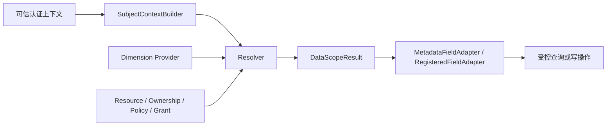

# Sweet Platform 数据权限 V1 最终冻结评审

## 文档信息

| 项目 | 内容 |
| --- | --- |
| 文档目的 | 评审 Data Permission V1 是否具备作为 Sweet Platform 稳定底座的冻结条件 |
| 评审日期 | 2026-08-03 |
| 评审基线 | `eeebe90006b8dca84f54caf6cc94e2c0997a2fac` |
| 评审依据 | [数据权限 V1 正式验收报告](./DataPermissionAcceptanceReport.md)、[数据权限管理员操作手册](../../user-guide/DataPermissionUserGuide.md) |
| 适用范围 | Sweet Platform Data Permission V1 核心模型、配置、解析、适配及低代码执行接入 |

本评审不重新执行技术测试。测试环境、测试命令、PostgreSQL 验证、Demo 结果和安全验收以正式验收报告中的实际记录为准。

## 1. 当前版本范围

Data Permission V1 已形成从配置到执行的完整平台能力。

### 1.1 配置能力

- 数据资源和资源操作：定义需要保护的业务对象及 query、detail、create、update、delete、export、run 等操作。
- 归属定义：支持一个资源配置多个 Ownership，并通过 `ownership_code + dimension_id` 精确确定数据归属。
- 权限策略：支持可复用 Policy 和结构化 PolicyRule；同一 Policy 内多条规则采用 AND。
- 权限授权：支持 role、user 主体，将 Subject、Resource、Operation 和 Policy 关联起来；多个有效 Grant 采用 OR。
- 配置检查：在资源、策略和授权启用前检查归属、维度、规则和引用关系。
- 管理入口：已提供后台配置 API 和“系统管理 > 数据权限”配置中心，按钮权限继续使用平台统一功能权限体系。

### 1.2 解析能力

- `SubjectContextBuilder` 从可信认证上下文构建当前用户、有效角色、企业人员绑定和日期基准。
- Dimension Provider 提供法人主体、管理组织和企业人员事实范围。
- Resolver 解析 Resource、Operation、Grant、Policy、PolicyRule 和 Ownership，并组合 Provider 结果。
- `DataScopeResult` 以四态决策和结构化条件组表达最终数据范围。
- 多 Rule 保留组内 AND，多 Grant、多角色和用户直接授权保留组间 OR。

### 1.3 执行能力

- `MetadataFieldAdapter` 将低代码元数据归属转换为受控过滤树。
- `RegisteredFieldAdapter` 提供固定业务模块的服务端注册和受控执行框架。
- Adapter 不重新解释 Policy，不接收 SQL、表名、字段名、JOIN 或客户端表达式。
- 任一条件转换失败时整体失败，不返回部分过滤结果。

### 1.4 低代码接入

Generalization 查询链已统一接入新运行时，覆盖：

- 列表 rows 与分页 total。
- 详情。
- update。
- delete 与批量删除。
- export。

rows 与 total 复用相同权限结果；用户查询与权限条件按 `UserQuery AND (PermissionGroup1 OR PermissionGroup2)` 组合。详情和写操作将业务 ID 与权限条件一起应用，不采用先读取完整数据再判断的方式。

## 2. 架构冻结结论

Data Permission V1 的唯一运行链冻结为：

职责边界冻结如下：

- `SubjectContextBuilder` 只负责构建服务端可信主体上下文。
- Provider 只提供某个业务维度下的事实值，不计算授权。
- Resolver 只组合配置和权限语义，不生成 SQL，不查询业务数据。
- `DataScopeResult` 只表达结构化决策，不携带数据库执行细节。
- Adapter 只将结构化结果转换为受控执行描述，不读取 Grant 或 Policy。
- 查询构建器或业务 Repository 负责应用执行结果，不自行重复解析权限。

旧数据权限模型和运行实现已经清理。当前架构明确：

- 无旧数据权限链路。
- 无新旧双跑。
- 无兼容回退。
- Resolver、Provider 或 Adapter 失败时不得转入其他权限链路。

## 3. 已冻结设计

### 3.1 Resource 模型

- Resource 表示受数据权限保护的业务对象，不以菜单、路由或接口地址作为身份。
- `resource_code` 是稳定业务编码，创建后不可修改。
- Operation 独立表达 query、detail、update、delete、export 等数据操作。
- 资源启用数据权限前必须通过配置检查。
- 未配置或未启用的数据权限操作使用明确的 `not_applicable` 语义，不调用旧链路。

### 3.2 Ownership 模型

- Ownership 描述资源数据的归属值位于哪里，以及该值属于哪个 Dimension。
- 一个 Resource 可以配置多个 Ownership。
- PolicyRule 必须通过 `ownership_code + dimension_id` 精确匹配 Ownership。
- 不存在隐式主归属，不自动选择第一项，不按 Dimension 猜测字段。
- 绑定方式只允许 `metadata_field` 和 `registered_field`。

### 3.3 Policy 模型

- Policy 是可复用的权限策略，不直接绑定 Resource。
- PolicyRule 显式声明 Ownership、Dimension、范围来源、关系、操作符和必要的指定值。
- 同一 Policy 内多个有效 Rule 使用 AND，不自动改为 OR，也不丢弃规则。
- Policy 与目标 Resource 的兼容性由 Grant 配置和 Preflight 校验。

### 3.4 Grant 模型

- Grant 建立 `Subject -> Resource + Operation -> Policy` 的授权关系。
- V1 主体只支持 role 和 user。
- 不支持岗位、任职、用户组或组织直接授权。
- 多个角色 Grant 和用户直接 Grant 使用 OR 合并，不根据角色名称提供特殊权限。

### 3.5 Resolver 语义

- Resolver 的输入为可信 SubjectContext、Resource 和 Operation。
- Resolver 可以读取数据权限配置并调用 Dimension Provider，不直接读取组织表或业务表。
- 同一 Policy 多 Rule 为 AND，不同 Grant 为 OR。
- 无授权返回 `none`；配置冲突、Provider 失败或类型错误不得扩大权限。
- Resolver 只输出结构化权限语义，不生成 SQL 或 ORM 条件。

### 3.6 DataScopeResult 四态

| 决策 | 冻结语义 |
| --- | --- |
| `not_applicable` | 当前 Resource 或 Operation 未启用数据权限；保持原业务条件，但不表示已授权全部 |
| `all` | 有效授权明确允许当前 Resource Operation 的全部数据 |
| `none` | 明确无授权或安全收敛为无数据 |
| `filtered` | 必须完整应用结构化条件组后才能访问 |

`not_applicable` 不参与授权合并；`none` 不得被 Adapter 忽略；空过滤条件不得转为 `all`。

### 3.7 Adapter 边界

- `metadata_field` 只信任服务端加载并校验的元数据字段标识。
- `registered_field` 只信任服务端注册的稳定 Adapter 和字段编码。
- Adapter 完整保留组内 AND、组间 OR。
- Adapter 不接收客户端权限范围，不返回 SQL、表名、列名、JOIN 或 ORM 表达式。
- 未知 Adapter、注册缺失、类型漂移、Ownership 不匹配或部分条件失败时整体安全失败。

## 4. 安全边界

Data Permission V1 的安全边界已通过正式验收，并作为冻结约束持续有效：

1. 无 Grant、配置缺失、Provider 异常、Resolver 异常和 Adapter 异常均不得返回或降级为 `all`。
2. `deny_all` 和 `none` 必须转为无数据或拒绝操作，不得执行无过滤查询。
3. 客户端不能覆盖服务端确定的 Resource，也不能提交数据权限过滤条件。
4. Ownership 和 Adapter 不接受 SQL、表名、字段名、JOIN 或字段表达式。
5. Ownership 必须在当前 Resource 内精确匹配，不能跨资源复用不兼容配置。
6. rows、total、detail、update、delete、批量删除和 export 不得使用不同权限算法。
7. 无权详情使用业务 ID 与权限条件共同查询，不泄露目标记录是否存在。
8. update、delete 和批量删除无权限时不得写入；批量操作中部分无权必须整体失败。
9. `not_applicable` 不记录为已授权全部，也不作为异常回退结果。
10. 角色名称、管理员名称或固定用户 ID 不得成为绕过数据权限的条件。

后续扩展若破坏任一安全边界，必须停止接入并重新进行架构和安全评审，不得以兼容业务为理由降低失败安全标准。

## 5. 已知限制

以下事项属于 V1.1 规划，不阻止 Data Permission V1 核心架构冻结：

| 已知限制 | 当前边界 | 冻结判断 |
| --- | --- | --- |
| `registered_field` 未接真实 TMS、WMS、SRM | 公共注册和执行框架已完成，真实业务 Repository 尚未接入和验收 | 非阻塞；业务接入时单独验收 |
| create 归属赋值未通用化 | Generalization 创建保持现有业务创建链，尚无统一的新归属赋值规则 | 非阻塞；未承诺为 V1 通用能力 |
| `legal_entity`、`employee` relation 能力有限 | 两者当前只支持 `exact`；`management_org` 支持 `exact` 和 `self_and_descendants` | 非阻塞；按已实现关系使用 |
| 无独立 Resolver 诊断页面 | 已有结构化摘要、配置检查和日志，但没有面向管理员的独立诊断页面 | 非阻塞；不影响运行时正确性 |
| 无角色账号的 user Grant 限制 | SubjectContext 当前要求至少一个有效角色，不能仅凭 user Grant 为无角色账号构建上下文 | 非阻塞；该场景未列入 V1 支持范围 |
| 历史 Gin race 问题 | Organization 并发测试辅助代码存在全局模式竞态；Data Permission 相关 race 已通过 | 非阻塞；不属于数据权限运行链缺陷 |

这些限制必须继续在交付和业务接入说明中保持可见。冻结结论不代表上述能力已经完成，也不允许业务模块通过绕过核心契约自行补齐。

## 6. 后续版本规划

### 6.1 V1.1

V1.1 以补齐已知边界和真实业务验证为主，不改变 V1 核心模型与四态语义：

1. 选择真实 TMS、WMS 或 SRM 资源完成首个 `registered_field` 执行器接入和端到端验收。
2. 设计并实现 create Operation 的通用归属赋值和新归属校验规则。
3. 按真实业务需要评审 `legal_entity`、`employee` 的关系扩展。
4. 增加面向管理员的 Resolver 诊断能力，并继续限制诊断信息不泄露内部字段和权限明细。
5. 单独评审无角色账号使用 user Grant 的产品语义，再决定是否调整 SubjectContext 约束。
6. 修复 Organization 测试辅助代码的 Gin 全局竞态，完善全 Service race 门禁。

### 6.2 V2

V2 只作为候选演进方向，具体能力必须另行设计和验收：

- 更丰富的业务 Dimension 和受控 Provider。
- 经过明确业务论证的复杂策略组合或限制模型。
- 更多固定业务服务、报表和低代码资源的统一治理能力。
- 面向大规模配置的策略治理、影响分析和可观测能力。

V2 不默认接受任意 SQL、客户端表达式、隐式主归属或业务模块自行解析权限。任何新增能力仍需延续结构化配置、可信 Provider、Resolver 和受控 Adapter 边界。

## 7. 冻结结论

**最终结论：通过冻结。**

判断理由：

1. Resource、Ownership、Policy、Grant、Preflight 已形成完整配置闭环。
2. SubjectContextBuilder、Dimension Provider、Resolver、DataScopeResult 和 Adapter 职责清晰，运行链唯一。
3. Generalization 的主要查询和写操作已统一接入，不存在列表、total、详情或写操作使用不同权限链路的情况。
4. 旧数据权限模型和运行链已经删除，不存在双跑、兼容回退或异常回退旧链路。
5. 正式验收已覆盖数据库约束、Demo、前后端测试、相关 race 和安全失败场景，当前验收范围没有平台底座交付阻塞项。
6. 已知限制均有明确边界，属于未承诺能力或后续增强，不改变 V1 核心模型的稳定性。

自本评审通过后，Data Permission 核心架构冻结。后续业务模块不得修改或复制核心模型，不得绕过 Resolver 或 Adapter 自建数据权限链路。

业务扩展必须通过以下正式扩展点完成：

- Resource：登记受保护业务对象和操作。
- Ownership：定义业务数据归属。
- Policy：复用结构化范围策略。
- Grant：向角色或用户授予资源操作策略。
- Provider：提供可信 Dimension 事实范围。
- Adapter：将结构化结果安全应用到低代码或固定业务查询。

涉及核心字段、四态决策、AND/OR 语义、失败安全规则或 Adapter 信任边界的变更，必须进入新版本架构评审，不得作为普通业务需求直接修改。

## 8. Integration 准入判断

**准入结论：允许进入 Integration Foundation。**

原因如下：

1. Data Permission V1 已具备稳定、唯一且经过验收的配置与运行契约，可作为其他平台基础能力的依赖。
2. 当前六项非阻塞限制均有明确范围，不要求 Integration Foundation 先修改数据权限核心模型。
3. 数据权限与集成执行职责可以保持独立：Integration Foundation 负责外部系统连接和执行过程，Data Permission 继续负责资源操作的数据范围。
4. 旧权限链路已经清理，后续模块不会面临新旧权限双重接入选择。

Integration Foundation 开发不得在其任务范围内修改 Data Permission 核心模型、四态决策或安全失败语义。若未来集成场景需要新的 Resource、Ownership、Dimension Provider 或 Adapter，应使用冻结扩展点单独配置或立项评审，不得在集成链路中自行拼接权限范围。
