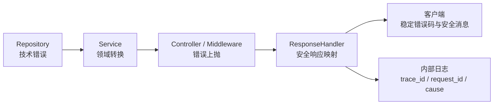

# Sweet Platform 错误处理规范

## 文档信息

| 项目 | 内容 |
| --- | --- |
| 文档目的 | 统一 Sweet Platform 后端技术错误、领域错误和 HTTP 响应错误的职责边界 |
| 适用范围 | `backend/` 中的 Repository、Service、Controller、Middleware、后台任务与测试代码 |
| 审计日期 | 2026-08-04 |
| 审计基线 | `842b78bec21a81d3ef21e365a340abbb66ac6191` |
| 当前统一入口 | `internal/errors` 与 `middleware.ResponseHandler` |

本规范既记录当前仓库的错误处理现状，也作为新增代码和后续模块整改的准入规则。治理采用“新代码强制遵守、旧模块按风险渐进迁移”的方式，不要求一次性重构全仓错误体系。

## 1. 错误分层

平台错误分为技术错误、领域错误和 HTTP 响应错误三层。每层只处理本层职责，不允许 Controller 通过字符串判断数据库错误，也不允许 Repository 构造 HTTP 响应。

### 1.1 技术错误

技术错误来自数据库、缓存、网络、序列化、文件、Token 库或第三方依赖，例如：

- GORM 查询失败、事务提交失败、唯一索引冲突。
- Redis、对象存储或第三方 API 不可用。
- JSON 解析失败、文件读写失败。
- 依赖库返回的超时、连接或协议错误。

技术错误用于内部诊断。除明确属于客户端输入格式错误的情形外，技术错误文本不得成为外部响应消息。

### 1.2 领域错误

领域错误由 Service 根据业务语义产生或转换，必须具有稳定、可判断的含义，例如：

- 资源编码重复。
- 当前状态不允许修改。
- 对象已被引用，不能删除。
- 用户无权限执行操作。
- 业务对象不存在。

领域错误应包含稳定错误码、安全消息和适当的 HTTP 状态；需要保留内部原因时使用错误包装，不得把原因拼接进安全消息。

### 1.3 HTTP 响应错误

HTTP 响应错误由 Controller 或 Middleware 交给统一响应中间件映射。当前外部失败契约包含：

- `status_code`
- `error_code`
- `error_message`
- `success`

内部错误分类和 cause 不进入 JSON。未知错误统一收敛为状态码 500、错误码 10000 和“系统异常”，原始原因只进入内部日志。

### 1.4 分层流向



禁止反向依赖：Repository 不依赖 HTTP，Service 不依赖 Gin 响应结构，Controller 不解析数据库驱动文本。

## 2. Repository 规范

### 2.1 允许行为

Repository 可以返回：

- 数据库驱动或 GORM 错误。
- `gorm.ErrRecordNotFound` 等可被上层识别的技术错误。
- 事务开始、执行、提交或回滚失败。
- 使用 `%w` 包装后仍可通过 `errors.Is`、`errors.As` 识别的技术错误。

Repository 应保留根因，使 Service 能够将已知约束转换为稳定领域错误，也使统一日志能够诊断未知故障。

### 2.2 禁止行为

Repository 禁止：

- 构造 HTTP 状态码或 Gin 响应。
- 依赖 `*gin.Context` 来表达错误语义。
- 将数据库错误改写为面向用户的中文消息。
- 通过索引名、表名或错误字符串判断业务规则后直接返回业务成功。
- 记录错误后返回 `nil`。
- 吞掉事务、唯一约束、外键或连接错误。

### 2.3 NotFound 处理

Repository 可以返回明确的 NotFound 技术错误。Service 必须结合业务语义决定它表示“对象不存在”、幂等成功，还是系统配置缺失。Controller 不得直接把 GORM 的 NotFound 文本返回客户端。

## 3. Service 规范

### 3.1 领域转换

Service 是业务错误语义的所有者。以下情况必须在 Service 转换为稳定领域错误：

- 唯一冲突：转换为“编码已存在”等稳定冲突错误。
- 状态限制：转换为“当前状态不允许操作”。
- 引用保护：转换为“对象已被引用”。
- 权限不足：转换为稳定权限错误。
- 业务对象不存在：转换为对应领域 NotFound。

转换时应保留原始 cause，但对外消息只能来自稳定定义。禁止使用字符串拼接把 `err.Error()` 加入领域消息。

### 3.2 技术失败

Service 无法解释的技术错误必须原样向上传播，或使用 `WrapDatabaseError`、`WrapSystemError` 等安全包装保留 cause。不得把未知数据库、缓存、JSON 或依赖错误包装成可展示的 BadRequest。

### 3.3 参数错误

请求格式和静态校验失败使用稳定参数错误。需要保留解析原因时使用 `WrapParameterError(cause, safeMessage)`，其中 `safeMessage` 必须是预先定义的安全提示。

不得使用：

```go
NewBadRequestError(err.Error())
```

应使用：

```go
WrapParameterError(err, "请求参数格式错误")
```

或直接返回稳定的 `ErrParamInvalid`。

### 3.4 错误链

需要补充上下文时使用 `%w` 或统一包装函数保留错误链。禁止仅使用 `%v` 生成无法识别根因的新字符串。业务判断应使用 `errors.Is`、`errors.As` 或稳定错误码，不得依赖错误消息文本。

## 4. Controller 与 Middleware 规范

### 4.1 Controller 职责

Controller 只负责：

1. 解析请求。
2. 执行静态参数校验。
3. 调用 Service。
4. 将错误交给统一响应中间件。

Controller 可以将已分类领域错误或未知错误交给 `ctx.Error(err)`。`ResponseHandler` 会将未知错误收敛为安全的系统错误，并在内部记录原始原因。

### 4.2 禁止直接返回错误文本

Controller 和 Middleware 禁止：

- 将 `err.Error()` 作为 `error_message`、`message` 或 JSON 字段返回。
- 使用 `NewBadRequestError(err.Error())` 把技术错误伪装成业务错误。
- 通过 `ctx.JSON` 直接序列化 error。
- 向客户端暴露 SQL、表名、字段名、索引名、连接信息、Token 内容或堆栈。
- 因无法分类错误而返回成功。

### 4.3 Middleware 边界

认证、权限和恢复 Middleware 应返回稳定认证、权限或系统错误。Token 库、用户查询和缓存错误不得原样响应。

统一响应中间件必须：

- 识别稳定 `AdminError` 和可识别参数错误。
- 对未知错误返回“系统异常”。
- 从客户端响应中移除内部 cause。
- 对数据库和系统错误记录结构化内部日志。
- 不因日志失败改变原业务错误语义。

## 5. 错误码规范

### 5.1 稳定性

外部错误码是 API 契约，发布后不得随意复用、改义或按底层依赖动态生成。相同业务语义应返回相同错误码，不同模块不得用同一错误码表达冲突含义。

新增错误码必须：

1. 在统一错误定义中登记。
2. 具有唯一、稳定的语义。
3. 配置安全且可本地化的外部消息。
4. 选择正确的 HTTP 状态和错误分类。
5. 增加映射与无泄露测试。

### 5.2 外部错误码与内部原因码

外部响应使用稳定 `error_code`。内部诊断可以额外记录原因码，例如依赖名称、重试阶段或数据库操作类型，但内部原因码不得替代外部错误码，也不得进入默认客户端响应。

禁止将以下内容作为错误码或外部消息：

- PostgreSQL 错误全文。
- GORM 错误字符串。
- 唯一索引名称。
- 第三方 SDK 错误文本。
- 动态 SQL 或请求敏感数据。

### 5.3 HTTP 状态

- 400：客户端参数或明确业务请求无效。
- 401：未认证、Token 无效或失效。
- 403：已认证但无权限。
- 404：按平台安全规范允许公开的对象不存在。
- 409：稳定的状态或唯一性冲突。
- 429：限流、登录锁定或调用频率超限。
- 500：未知系统、数据库或依赖故障。

领域模块可以按现有兼容契约保留历史状态码，但新增错误必须遵循以上语义，不能为了方便全部返回 400。

## 6. 日志规范

### 6.1 内部日志

系统和数据库错误日志至少应包含：

- `trace_id`
- `request_id`
- 稳定操作名或业务对象类型
- 错误分类
- 原始 cause

必要时可以记录 `resource_code`、业务稳定编码或调用阶段，但不得记录密码、Token、验证码、完整权限值集合、请求密钥或敏感业务正文。

### 6.2 外部响应

外部响应只包含稳定状态、错误码和安全消息。日志中的 cause、堆栈、SQL、内部路径及依赖详情不得复制到响应。

### 6.3 日志方式

生产代码使用结构化 Zap 日志。禁止新增 `fmt.Print`、`fmt.Println` 或 `log.Println` 作为错误处理方式。记录日志不能替代错误传播；会影响结果的失败必须继续返回错误。

### 6.4 重复日志

同一错误通常由最能补充业务上下文的一层记录一次。Repository 不应对每次错误重复打印，Service 仅在能够补充稳定业务语义时记录，统一响应中间件负责兜底记录未分类、数据库和系统错误。

## 7. 当前代码审计

### 7.1 审计口径

本次审计覆盖 `backend/` 下 254 个非测试 Go 文件，采用字符串检索并对候选调用点人工复核。统计按调用语句计数，不把测试断言中的 `Error()` 或错误文本算入生产风险。

### 7.2 整改前统计

| 检查项 | 数量 | 文件数 | 风险分类 | 结论 |
| --- | ---: | ---: | --- | --- |
| 生产代码 `.Error()` 调用 | 32 | 13 | 混合 | 19 处进入外部错误候选，13 处仅内部判断、日志或 CLI 使用 |
| `NewBadRequestError(err.Error())` 等直接包装 | 19 | 9 | 3 高风险、16 低风险 | 本 Task 全部整改 |
| 精确 `fmt.Println(error)` | 0 | 0 | 无 | 未发现完全匹配 |
| 带错误参数的 `fmt.Print*` | 6 | 5 | 低风险 | 旧 Service 属性映射日志，未直接进入响应 |
| `return err` 直接传播 | 653 | 75 | 混合 | Repository 传播合理；Service 需按领域语义渐进转换 |
| Controller/API/Middleware `ctx.Error(err)` | 410 | 18 | 无需处理 | 经统一响应中间件安全映射，不等于直接返回错误文本 |

`return err` 的目录分布为：Service 401、Migration 136、Internal 60、Repository 20、Initialize 19、Controller 10、Command 3、Model 2、Middleware 1、Enum 1。该统计只能识别传播形式，不能仅凭语句判定错误是否缺少领域转换。

### 7.3 高风险问题

人工复核确认 3 处会把服务端技术原因作为可展示 BadRequest：

1. 字典查询把缓存或数据库错误文本直接返回。
2. 认证 Middleware 把用户查询的未知错误文本直接返回。
3. 短信模板 JSON 解析把内部配置和解析错误文本直接返回。

本 Task 已分别调整为未知错误统一上抛、`WrapSystemError` 安全包装，外部响应不再包含底层文本。

### 7.4 低风险问题

16 处候选主要是路径 ID、Token subject 和请求 JSON 的解析错误。虽然通常只包含客户端输入或标准库提示，但直接返回依赖文本会造成响应不稳定。本 Task 已统一改为：

- 路径 ID：`ErrParamInvalid`。
- Token subject：`ErrTokenInvalid`。
- 请求 JSON：`WrapParameterError` 加安全消息。

另外 6 处 `fmt.Print*` 位于旧 Service 的属性映射失败分支。它们不会直接泄露给客户端，暂列日志治理 Backlog；后续应改为结构化日志或稳定系统错误。

### 7.5 无需处理项

以下 `.Error()` 使用不构成当前外部泄露：

- Writer 的错误状态检查。
- Migration 对特定约束错误的兼容判断。
- 数据库预检 CLI 经脱敏器输出诊断。
- Report 执行日志保存内部失败摘要。
- 空请求体的 EOF 兼容判断。

其中 Report 执行日志和 EOF 字符串判断仍应在对应模块治理时复核，但不属于本次明确安全整改范围。

## 8. 本次轻量整改

本 Task 只修复已确认的直接错误文本响应，不改变业务流程、API 路径、错误码体系或领域模块语义：

- 14 处路径 ID 解析改为稳定参数错误。
- 1 处请求 JSON 解析改为安全参数消息并保留 cause。
- 1 处 Token subject 解析改为稳定 Token 错误。
- 1 处认证用户查询未知错误改为系统错误包装。
- 1 处字典查询技术错误交给统一响应中间件收敛。
- 1 处短信模板解析错误改为系统错误包装。

整改后，生产代码中 `NewBadRequestError(err.Error())` 类型的直接包装数量为 0；其余 `.Error()` 调用不直接构造客户端错误响应。

本次明确未修改 Data Permission、Organization Provider、Resolver、Adapter，也未调整认证策略、短信业务规则或统一响应 JSON 结构。

## 9. 迁移策略

错误治理不执行全仓机械替换，按以下顺序推进。

### 9.1 新增代码

新增代码必须：

1. Repository 保留技术错误链。
2. Service 转换已知领域失败。
3. Controller 只上抛稳定错误或未知错误。
4. 未知错误由统一响应中间件安全收敛。
5. 错误日志使用结构化字段和 request/trace 标识。
6. 增加稳定错误码、cause 不泄露和未知错误安全收敛测试。

代码评审应拒绝新增 `NewBadRequestError(err.Error())`、`ctx.JSON(...err.Error())` 和错误文本字符串判断。

### 9.2 存量模块

建议按风险渐进整改：

1. 优先审计认证、文件、短信、导出和对外 API 的错误映射。
2. 按模块梳理 Service 中 401 处直接 `return err`，只转换能够明确识别的领域失败。
3. 将 6 处 `fmt.Print*` 改为结构化日志或稳定错误传播。
4. 复核 Report 执行日志对管理员可见的错误摘要边界。
5. 为旧 Controller 增加响应白名单与无底层文本泄露测试。

不得为了减少统计数量而吞错、丢失 cause 或把全部技术错误改成同一个 BadRequest。

### 9.3 模块级验收

每个迁移模块至少验证：

- 已知业务失败返回稳定错误码。
- 未知数据库或依赖错误返回“系统异常”。
- 内部日志保留 trace、request 和根因。
- 响应不包含 SQL、表名、字段名、索引名、Token 或堆栈。
- `errors.Is` 和 `errors.As` 仍能识别被包装根因。
- 错误发生时事务和业务状态不会部分成功。

## 10. 与其他平台规范的关系

- 事务错误的提交、回滚和 panic 规则遵循 [TransactionUsageStandard.md](TransactionUsageStandard.md)。
- 认证入口的安全策略和职责边界遵循 [AuthenticationArchitectureDesign.md](../design/AuthenticationArchitectureDesign.md)。
- 后端整体整改优先级参考 [PlatformBackendCodeAuditReport.md](../reviews/PlatformBackendCodeAuditReport.md)。

本规范不改变 Data Permission、Organization Provider、Resolver 或 Adapter 的既有错误语义；这些模块继续使用已经冻结的稳定错误和安全失败规则。
