# Sweet Platform 系统使用手册

本文面向日常业务用户、只读用户和需要理解基础操作的平台使用者。管理员配置请同时参阅
[平台管理员使用手册](PlatformAdministrationGuide.md)，低代码与字段配置请参阅
[低代码配置手册](LowCodeManual.md)。

页面上实际可见的菜单、按钮和数据由账号权限决定。本文提到某项能力但页面未显示时，
先确认角色菜单权限、按钮权限和数据权限，不要通过修改地址或请求参数绕过限制。

建议第一次使用时按“登录 -> 首页 -> 标准列表 -> 高级查询 -> 查询方案 -> 业务新增/编辑/详情”
的顺序熟悉平台，再进入组织、数据权限、Integration和Report等管理模块。截图均来自当前运行系统
的示例环境，页面数据仅用于说明操作位置。

## 1. 登录与首页

1. 打开平台地址，输入账号和密码登录。
2. 系统启用验证码时，按页面提示完成验证码。
3. 登录后进入首页，可从左侧菜单进入业务模块。
4. 右上角账号菜单可修改密码或退出登录。
5. 页面顶部的主题入口可切换亮色、深色等界面偏好。

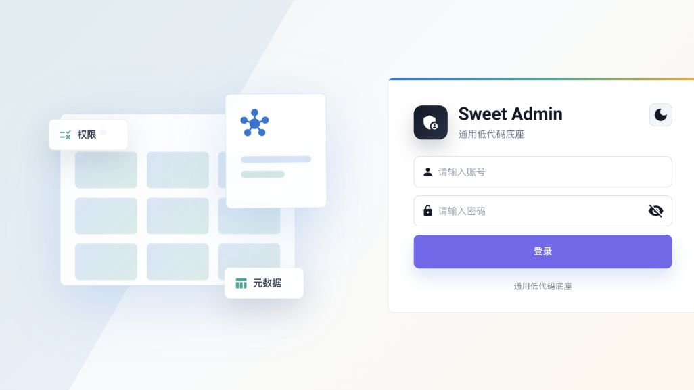

登录成功后，首页显示当前账号可访问的菜单数、低代码页面数、可见操作数和接口权限数。数字明显
少于管理员时通常是权限差异，不是页面加载失败。首页还提供已发布低代码页面入口和最近审计摘要。

账号被锁定、密码过期或登录状态受限时，页面会给出安全提示。不要连续尝试未知密码，
需要管理员处理时提供账号和发生时间，不要发送密码或Token。

## 2. 菜单、面包屑与页签

- 左侧菜单只展示当前账号有权访问的功能。
- 面包屑表示当前位置，可用于判断当前所属模块。
- 顶部页签保存已经打开的页面，关闭页签不会删除业务数据。
- 刷新页面只重新加载当前内容，不会新增权限。
- 通过详情页返回列表时，页面按自身规则恢复查询和分页；Query Center不会额外建立全局页面缓存。

直接输入无权限地址时，系统会拒绝访问或进入404页面。菜单可见并不代表拥有所有按钮，
新增、编辑、删除、执行、发布等动作仍需独立按钮权限。

### 2.1 消息通知中心

Header 的铃铛显示当前账号的未读通知数量。0 条时不显示 Badge，超过 99 条时显示 `99+`。

1. 点击铃铛，查看最近通知。未读消息有轻量底色和未读点。
2. 点击一条通知会标记已读。有可用目标页面时直接进入；没有跳转或当前账号无权时，仍可查看完整纯文本内容。
3. 点击“全部已读”，只会更新当前账号的未读消息。
4. 点击“查看全部”进入消息中心，可按关键词、全部/未读/已读和通知类型查询。

通知只是提醒入口，不会扩大菜单、按钮或数据权限。看到消息但无法进入目标页面时，说明当前账号没有该页面权限；不要通过修改地址绕过授权。退出或切换账号后，系统会停止旧账号的通知轮询并清空其本地通知状态。

## 3. 列表页基础操作

标准列表页通常包含：

- 查询方案选择；
- 关键词输入和搜索；
- 高级查询；
- 业务操作，例如新增、执行、同步；
- 列显示设置和刷新；
- 数据表格、排序和分页。

页面可能因业务形态不同而使用主从、树形、诊断工作台或设计器布局。统一的是权限、查询、
分页和状态等平台机制，不要求所有页面外观完全相同。

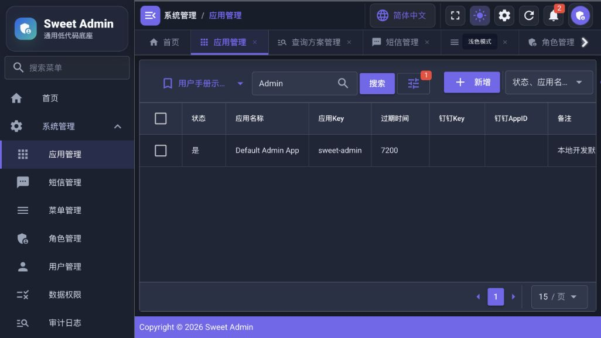

标准列表的查询区和业务操作区有明确分工：查询方案、关键词和高级查询用于缩小结果；新增、执行、
启停等按钮处理业务；列设置和刷新只改变当前视图。只读账号仍可查询和查看详情，但不会显示新增、
编辑、删除等未授权动作。

### 3.1 刷新

点击刷新只重新读取当前条件下的数据。它不会清空关键词、高级条件、排序、当前查询方案
或列显示偏好，也不会重新应用默认方案。

### 3.2 空状态和错误状态

- “暂无数据”：当前业务范围内还没有记录。
- “没有符合当前查询条件的数据”：存在筛选条件，但没有匹配结果。
- “加载失败”：请求未成功，可重试；持续失败时联系管理员。
- “无权限”：账号无页面、动作或数据访问权限。

## 4. 关键词查询

关键词查询用于按页面定义的常用文本字段快速检索。

1. 在关键词框输入内容。
2. 点击搜索或按页面支持的回车操作。
3. 页面回到第1页并查询。

关键词与高级查询会同时生效，二者按AND组合。提交关键词不会清空高级条件、动态绑定、
排序或当前查询方案。清空关键词只移除关键词本身。

不同页面的关键词字段不同，例如名称、编码、账号或描述。关键词不是全库搜索，也不会
自动搜索未声明的敏感字段。

## 5. 高级查询

高级查询按Metadata允许的字段、操作符和值类型构造条件。

### 5.1 简单模式

简单模式适合大多数查询：

1. 选择字段。
2. 选择操作符。
3. 输入或选择值。
4. 添加更多条件时，各条件使用AND连接。
5. 点击搜索应用到业务列表。

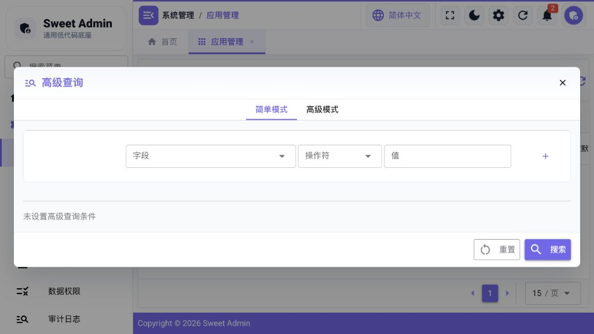

应用后，列表会同时携带关键词和高级条件。高级查询按钮上的数量表示当前已应用的条件数；需要只清除
高级条件时，重新打开弹窗并点击重置，不必清空关键词。

### 5.2 高级模式

高级模式支持AND、OR和嵌套条件组。可编辑深度最多为2层。系统可以读取后端合法的第3层
结构，但会以受限只读方式保留，不能静默压平或删除。

复杂逻辑不能无损转换为简单模式时，简单模式入口会禁用或提示只能继续在高级模式编辑。

### 5.3 字段和值

- 字典字段显示业务标签，不要求输入内部编码。
- 关系字段显示名称，保存和查询时使用受控关系值。
- 日期、时间、布尔和Decimal字段使用对应输入控件。
- NULL相关操作符不要求填写值。
- 不允许查询的字段不会出现在字段列表中。

## 6. 查询方案

查询方案用于保存和复用“怎么查”。方案保存关键词、高级条件、服务端排序和动态绑定，
不保存当前页、每页条数、列宽、列顺序或表格密度。

### 6.1 选择方案

查询方案菜单按可用数据分组显示：

- 我的方案；
- 公共方案；
- 角色方案；
- 页面默认方案。

选择方案后，系统重新校验当前页面、Metadata、字段、操作符和排序，再应用到列表。方案
只增加查询条件，不能扩大数据权限。

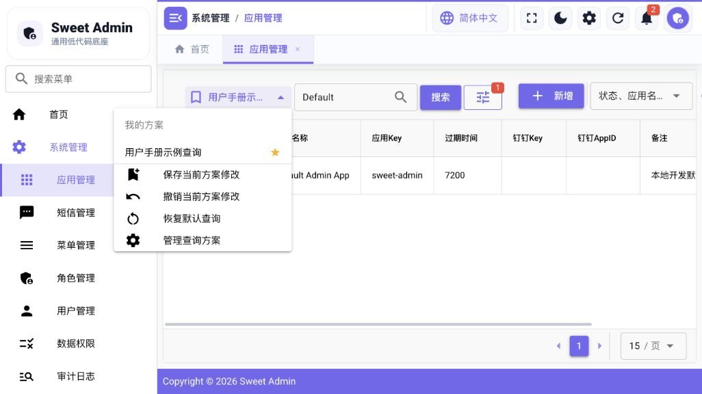

### 6.2 默认优先级

页面首次进入或明确恢复默认查询时，按以下顺序初始化：

1. 当前用户的个人默认方案；
2. 页面默认方案；
3. 页面代码定义的初始查询。

公共方案和角色方案不会自动成为默认方案。

### 6.3 保存方案

在查询方案菜单底部选择“保存当前查询为方案”。普通业务页面只保存个人方案。

- 当前使用自己的个人方案且已修改：可以保存修改或另存为。
- 当前来自公共、角色或页面默认方案：只能另存为我的方案。
- 保存时可将新方案设为个人默认方案。

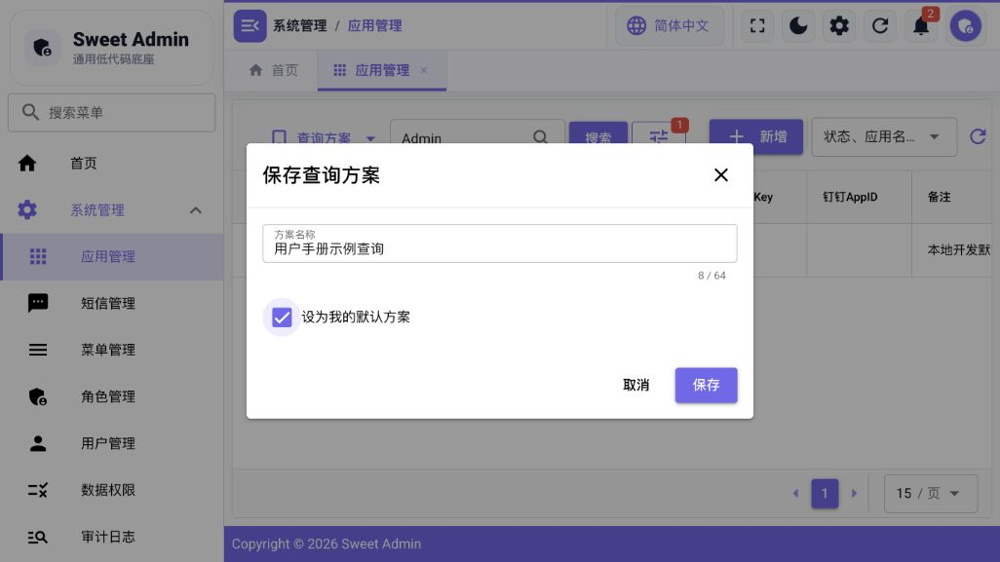

修改关键词、高级查询、排序或快捷条件会显示“已修改”。分页、每页条数和列显示变化不
会产生该标记。切换方案前如有未保存修改，系统会要求确认。

### 6.4 失效方案

- `DEGRADED`：部分字段或条件已失效，不会自动执行；查看问题后进入编辑修复。
- `INVALID`：方案结构、范围或契约整体无效，不能强制运行。

系统不会静默删除失效条件。并发修改冲突时会提示“方案已被其他操作更新，请刷新后重试”，
普通用户不会看到内部revision值。

需要集中维护方案时，从Selector底部进入“管理查询方案”。管理页按我的方案、公共方案、角色方案和
页面默认分为四个页签；“使用”会回到目标业务页面应用方案，编辑和启停是两个独立动作。

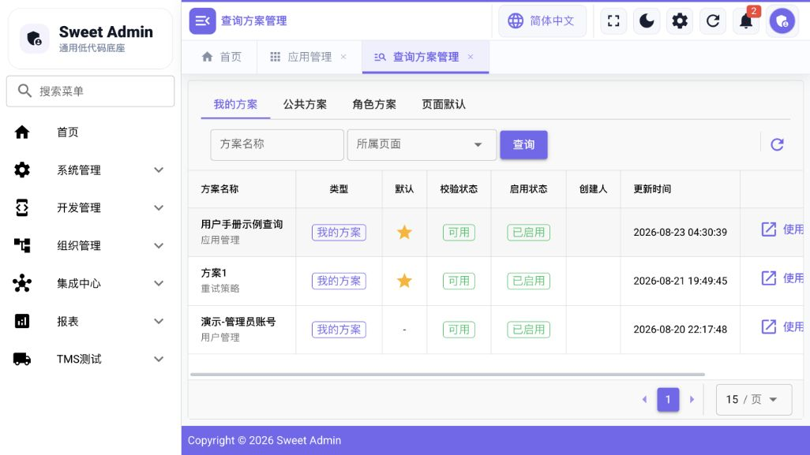

## 7. 快捷条件

只有页面明确配置时才显示快捷条件。

- 时间快捷条件可表示今天、本周、本月等动态时间范围。
- 业务快捷条件由页面提供，例如多个条件组合或当前用户相关条件。

系统不会根据字段名猜测“我的”“异常”或业务主时间。动态值保存为受控Binding，例如当前
用户、当前员工、月初或月末，而不是把当日具体ID和日期永久写入方案。

## 8. 排序、分页与列显示

- 点击允许排序的列头可切换升序、降序或取消排序。
- 修改查询或排序后回到第1页。
- 修改每页条数后回到第1页。
- 翻页和每页条数不属于查询方案内容。
- 列设置可以显示或隐藏可配置列。
- 列偏好属于视图偏好，不随查询方案保存。

长文本和长方案名会截断显示，可通过Tooltip查看完整名称。

## 9. 新增、编辑、详情与删除

### 9.1 新增

点击业务区“新增”，填写必填项后保存。字段控件、长度、Decimal精度、字典、关系和联动
规则由页面或Runtime Metadata决定。

### 9.2 编辑

编辑会加载当前记录。系统维护字段、稳定业务编码或已冻结引用可能只读。保存失败时保持
表单内容，先按字段提示修正，不要重复提交。

### 9.3 详情

详情可能使用抽屉、弹窗或独立页面。关系字段和字典字段优先显示名称与标签，不显示原始
数据库ID。详情中的业务动作仍受按钮权限控制。

### 9.4 删除

删除等危险操作需要确认。系统可能采用软删除、状态停用或受控物理删除，具体以页面提示
为准。存在引用、运行任务或安全约束时，删除会被拒绝。

## 10. 字典管理

字典页面是主从配置工作台：左侧管理字典类型，右侧管理当前字典的字典项。

1. 在左侧搜索或选择字典。
2. 新增或编辑字典时使用稳定字典编码。
3. 在右侧维护显示名称、值、排序和状态。
4. 修改后刷新使用该字典的页面确认标签。

字典值可能已被业务数据引用，不要随意修改稳定值。停用字典项前先确认现有数据的显示和
编辑行为。字典工作台不接入查询方案。

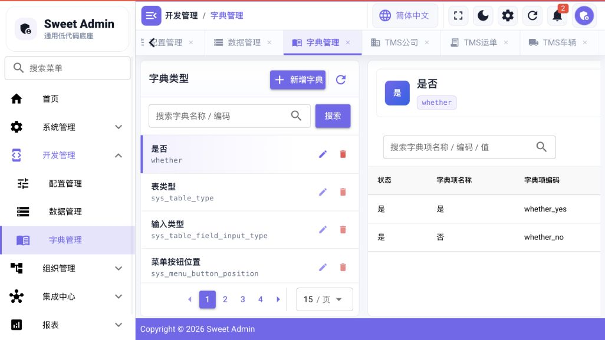

## 11. 数据管理与Metadata

数据管理维护低代码表、字段、关系、索引、列表/表单/详情能力和发布信息。

推荐顺序：

1. 创建或确认数据表Metadata。
2. 配置字段Storage Type、Logical Type、输入类型和显示格式。
3. 配置字典、关系、查询、排序、列表和表单能力。
4. 配置必要索引和关系约束。
5. 配置菜单与按钮后发布。
6. 使用普通权限账号验证列表、表单、详情和数据权限。

字段配置页可以直接确认Storage Type、Input Type、Logical Type、Display Format以及是否参与
列表、查询、表单和详情。发布后，这些配置会进入Runtime Metadata，并影响已发布低代码页面；
只保存Metadata但未发布菜单时，不会自动出现新的业务入口。

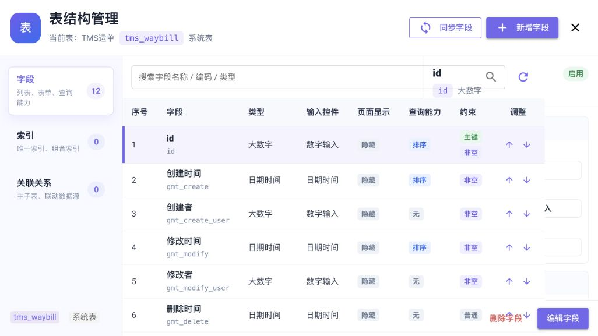

Metadata变更可能涉及真实数据库结构。关系类型、连接表或Key等无法证明无损的结构变化，
普通编辑会被拒绝，需要显式Migration流程。

## 12. 字段类型

当前Canonical Storage Type包括：

| 类型 | 用途 |
| --- | --- |
| BigInt | 大整数和ID |
| Decimal | 金额、单价、重量、比例和精确数量 |
| Varchar | 有长度上限的文本 |
| Text | 长文本 |
| Boolean | 布尔值 |
| Date | 日期 |
| Datetime | 日期时间 |
| Time | 时间 |
| SmallInt | 小范围整数 |
| Json | 结构化JSON |
| Int | 一般整数 |

Decimal通过字符串安全传输，避免JavaScript Number造成精度损失。详细配套规则见
[字段类型与输入类型配套指南](FieldTypeGuide.md)。

## 13. 输入类型

常用输入类型包括输入框、数字、文本域、下拉选择、布尔开关、日期、日期时间、时间、年份、
年月、文件、富文本、JSON、数组、键值、级联和组织选择。

Storage Type决定数据库存储；Logical Type表达业务语义；Input Type决定编辑控件。三者不能
混为一谈。例如Boolean是逻辑语义，开关只是其中一种输入表现。

## 14. 关系与联动

关系字段由目标表、值字段和显示字段组成，统一服务于列表、详情、表单、高级查询和方案预览。
用户选择显示名称，系统保存稳定值。

配置关系时确认：

- 目标表和字段存在且启用；
- 源字段与目标值字段类型兼容；
- 显示字段适合业务识别；
- 必要的唯一约束或外键成立；
- 联动过滤不能由客户端绕过权限。

复杂联动配置见[字段联动配置](LinkageConfig.md)。

### 14.1 已发布低代码页面实操

管理员发布低代码菜单后，业务用户按普通列表操作：

1. 从菜单进入已发布页面，先用关键词或高级查询定位记录。
2. 点击新增，按Metadata生成的控件填写关系、字典、Decimal、Boolean和日期等字段。
3. 保存后在列表确认字典显示标签、关系显示业务名称，Decimal没有精度变化。
4. 打开详情核对只读展示，再按权限执行编辑或删除。
5. 关系字段若显示“关联值未解析”，应由管理员检查Relation的目标表、值字段、显示字段和目标数据，
   不要让用户直接填写数据库ID规避问题。

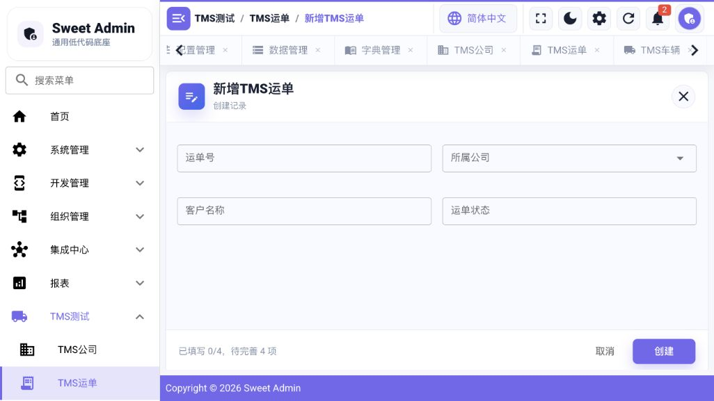

## 15. 组织架构

Organization保存平台内的组织主数据镜像，包括法人、组织单元、组织结构、结构节点、岗位、
员工、任职和同步记录。

- 组织单元是稳定业务主体。
- 结构节点表示组织单元在某个结构视图中的位置。
- 管理结构和法人结构不能混用。
- 组织树用于浏览，不等同于数据权限授权结果。

详细操作见[组织管理使用说明](OrganizationManagementUserGuide.md)。

## 16. 人员档案、岗位与任职

- Employee是业务人员身份，不等于登录User。
- Position是企业岗位，不等于权限Role。
- Assignment记录员工在法人、组织和岗位上的任职关系及有效期。
- 人员列表可显示主法人名称和任职摘要，不显示原始外键ID。
- 账号绑定将Employee关联到平台User，解绑不会删除人员档案。

查看人员档案时，先在人员列表按工号或姓名查询，再打开详情查看基本资料与任职。岗位页面维护企业岗位，
任职信息来自Assignment；角色页面维护平台权限，两者不能互相替代。组织同步批次用于观察一次同步，
同步错误用于定位单条来源数据失败。

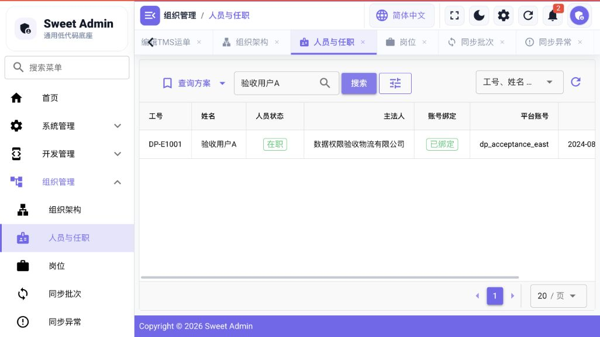

平台包含HR Source Adapter，但真实HR Consumer在生产配置中保持停用。当前不把来源数据猜测
为主任职或兼职，不支持自动再入职，也不会根据姓名、手机号或邮箱猜测人员关系。

## 17. 用户、角色、菜单与按钮权限

功能权限由用户、角色、菜单、按钮和Casbin共同决定。

1. 创建或确认用户。
2. 创建角色并分配菜单。
3. 为角色分配页面按钮。
4. 将角色授予用户。
5. 使用目标账号重新登录验证。

菜单决定页面入口；按钮决定查询、新增、编辑、删除、执行、发布等动作。前端隐藏按钮只是
交互表现，后端仍会校验权限。不要以角色名称或“管理员”字符串代替Capability。

### 17.1 System常用页面

| 页面 | 什么时候使用 | 主要操作与结果 |
| --- | --- | --- |
| Application | 管理调用平台API的应用身份 | 创建应用、启停、轮换Secret；Secret只在受控时机展示 |
| User | 管理平台登录账号 | 新增账号、绑定角色、启停和重置安全状态；Employee资料不在这里维护 |
| Role | 组合菜单和按钮权限 | 保存后授予用户，用户重新登录即可按新权限加载菜单和Capability |
| Menu | 管理固定页、低代码页和按钮 | 菜单提供路由入口，按钮的动作与后端Casbin policy共同形成权限边界 |
| SMS | 维护短信模板并查看发送记录 | 模板状态与供应商结果分开查看，不在日志中暴露验证码或Secret |
| Access Log | 查询后台请求审计 | 按用户、路径和状态排查调用，不展示Token、Credential或敏感Body |

日常用户通常只会使用业务页。创建用户、角色、菜单或应用身份属于管理员操作，具体字段和授权顺序见
[平台管理员使用手册](PlatformAdministrationGuide.md)。

## 18. 数据权限

数据权限决定用户在拥有页面功能权限后还能看到哪些业务数据。它由资源、操作、归属、策略、
规则和授权组成。

查询方案条件与数据权限按AND组合：公共方案、角色方案和页面默认方案都不能扩大授权范围。
列表、数量、详情、编辑和删除应使用同一数据范围事实。

配置和排查见[数据权限管理员操作手册](DataPermissionUserGuide.md)。

### 18.1 完整配置顺序示例

以“运输订单按管理组织及下级组织可见”为例：

1. 创建运输订单Resource，并声明query、detail等受控Operation。
2. 配置Ownership，指定业务记录上的管理组织归属字段。
3. 选择组织Dimension，确认来源是当前用户的Employee与有效Assignment，而不是角色名称。
4. 创建Policy和Rule，表达“当前管理组织及下级组织”。
5. 创建Grant，把Policy授予目标角色或受支持Subject。
6. 运行配置检查，确认资源、操作、归属、维度、规则和授权都有效后再启用。
7. 分别使用管理员与受限账号进入同一业务页面：管理员看到管理员的数据范围，受限账号只看到授权组织
   范围；再用已知ID验证详情也不能越权。

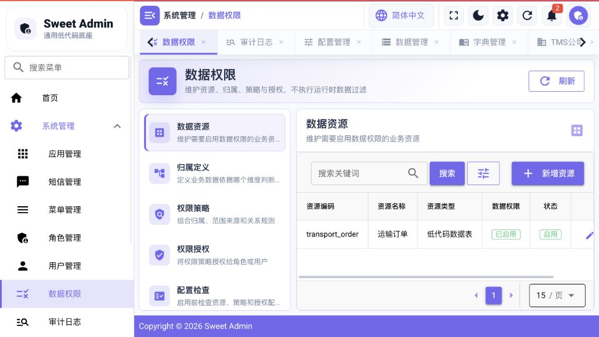

当前示例环境的数据权限资源主要用于配置链路演示。正式交付前，应选一个已经发布并接入该Resource的
业务页面完成双账号数据对比，不能只凭配置检查结果认定页面数据范围已经生效。

## 19. 文件

平台支持普通上传、分片上传、秒传校验、预览、下载和删除。

当前不提供独立“文件中心”页面。文件能力由业务表单或详情中的文件字段调用；如果当前已发布页面没有
配置文件字段，菜单中不会出现单独的文件演示入口。用户在业务表单选择文件并保存，之后从该记录详情
执行预览或下载；删除业务记录不一定等于立即物理删除文件，具体由业务生命周期和引用关系决定。

- 文件类型、MIME、大小和分片大小受服务端配置限制。
- 预览和下载使用不同用途的短期签名，不能互换。
- 文件物理路径、MD5和存储凭证不会显示给普通用户。
- Local存储的分片暂存在当前节点，多实例需要上传会话粘性。
- 放弃上传的临时分片由TTL清理兜底。

预览能力按文件类型按需加载。PPTX、HEIC等较大解析器不会随普通页面首屏加载。

## 20. Integration

Integration用于受控调用外部系统，主要对象包括：

1. 外部系统：根地址和稳定系统编码。
2. 集成凭证：只写秘密和轮换信息。
3. 重试策略：技术失败的退避与上限。
4. 接口定义：路径、Method、输入、超时、响应限制和版本。
5. 同步任务：接口版本、Consumer、调度、窗口、Checkpoint和Lookback。
6. 同步批次：一次调度的总体进度。
7. Execution：一个具体时间片或调用执行。
8. 调用日志：每次HTTP Attempt的安全摘要。

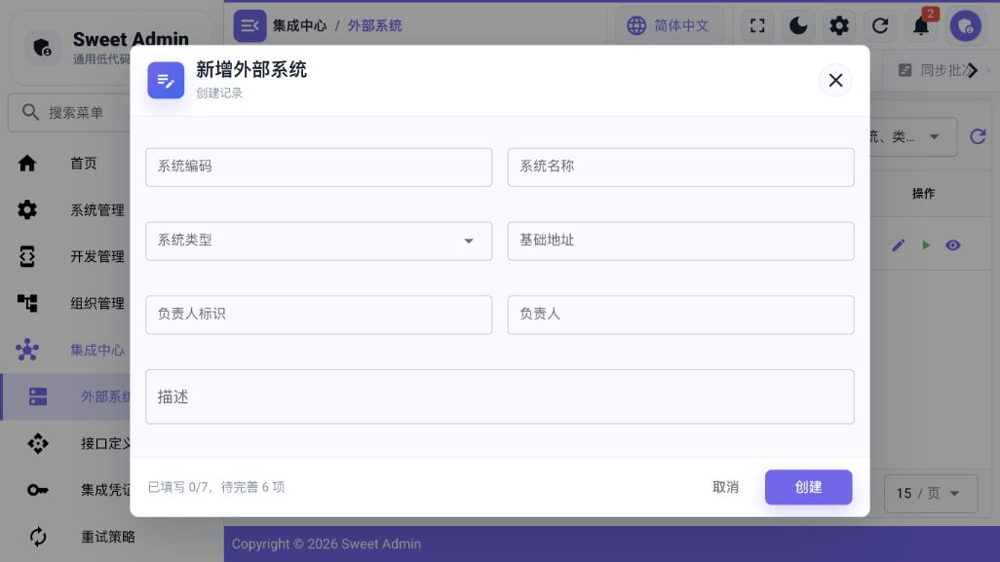

配置一个外部接口时按依赖顺序操作：

1. 新建External System，例如“示例ERP”，填写HTTPS根地址和稳定编码。
2. 新建Credential，选择认证方式并写入测试Secret；列表和详情不会回显完整Secret。
3. 新建Interface Definition，选择外部系统与Credential，填写Method、相对路径、超时和响应上限。
4. 选择Retry Policy。只对连接失败、超时、受控5xx等技术失败重试，业务失败不套技术重试。
5. 需要周期同步时再创建Sync Task，选择接口版本、Consumer、窗口和Checkpoint策略。
6. 手动执行或等待Runner后，从Sync Batch观察批次，从Execution观察状态与重试，从Log定位HTTP Attempt。

示例配置不要使用真实生产Credential：根地址可以使用受控测试服务，路径填写`/api/demo/orders`，
Credential使用专门的测试Secret。测试完成后停用测试对象，日志中不要粘贴Authorization或完整响应Body。

业务动作如启用、停用、测试、执行和重试保留在各业务页面。查询方案只保存列表过滤条件，
不会改变Execution、Retry、Sync或Runtime状态机。

HTTP 200但Consumer业务处理失败时，不进入技术重试；Checkpoint只有连续业务成功后才推进。
Worker和Sync Runner由服务端配置控制，普通管理页面不能启动进程级Runner。

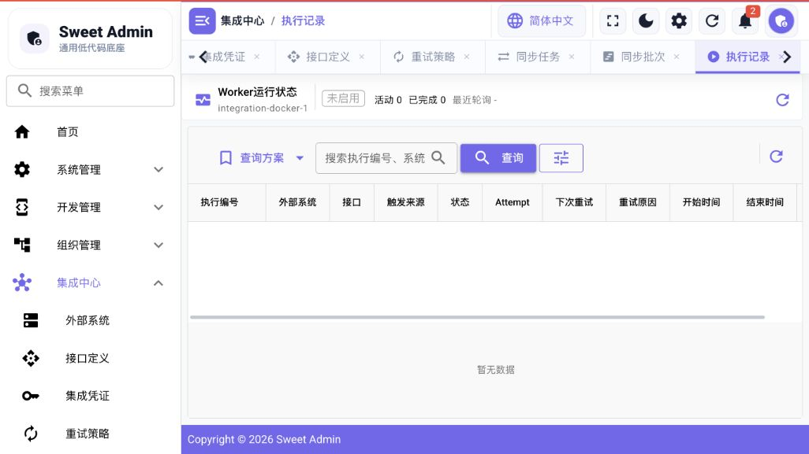

## 21. 查询方案管理

从任一支持查询方案的列表页打开查询方案菜单，选择“管理查询方案”。管理页是隐藏路由，
不创建独立一级菜单。

管理页包含：

- 我的方案：创建、编辑、复制、默认和删除自己的方案；
- 公共方案：所有拥有目标页面权限的用户可用，有共享管理Capability时可维护；
- 角色方案：匹配角色的用户可用，有共享管理Capability时可维护角色范围；
- 页面默认方案：每个Scope最多一个启用默认方案。

公共、角色和页面默认方案可复制为个人方案，副本与来源不建立依赖。用户无法查看、读取、
执行、修改或删除其他用户的个人方案。

## 22. Report当前功能

当前可从“报表中心”运行已发布报表，从“报表管理”维护定义并进入设计器。根据权限可以：

- 创建和编辑报表定义；
- 配置现有table/sql dataset和sheet/cell/binding布局；
- 预览或运行报表；
- 发布版本、查看版本和发布到菜单；
- 导出当前后端支持的结果；
- 查看安全的执行记录。

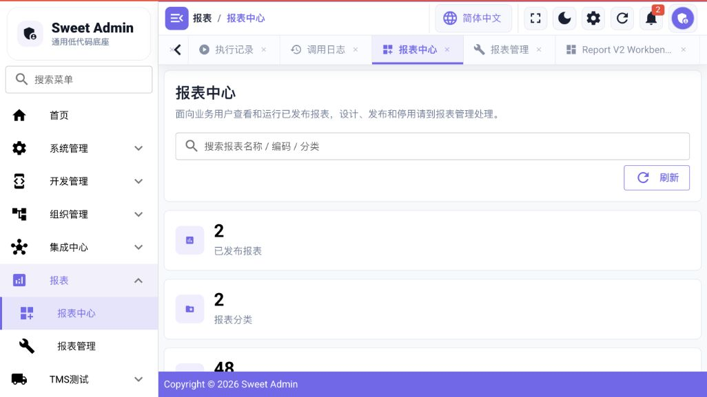

日常运行顺序是：在报表中心选择已发布报表，填写参数，点击查询预览结果，再按按钮权限执行CSV导出。
管理员在报表管理中编辑草稿并进入sheet/cell/binding设计器；保存草稿不会改变已发布结果，重新发布后
运行页才读取新版本。执行失败时查看安全错误摘要和Execution Log，不要要求页面展示底层SQL全文或参数Secret。

普通用户只能看到有菜单、按钮和对象授权的报表。table数据集沿用Metadata和Data Permission；
SQL数据集受只读安全检查、执行Deadline和结果限制，但不会自动注入任意业务表的数据权限。
Report不接入Query Center，也不提供跨表查询设计器、外部数据源、复杂图表
大屏、打印分页、填报、定时调度、邮件订阅或多数据集复杂联动。

## 23. 常见业务操作

### 23.1 保存“本月异常记录”

1. 打开支持查询方案的业务列表。
2. 在高级查询中选择状态和业务日期条件。
3. 日期使用“本月”等动态条件时保存Binding，不保存固定日期。
4. 应用查询，确认结果。
5. 从查询方案菜单保存为个人方案，可按需设为个人默认。

### 23.2 为员工开通页面权限

1. 在人员档案确认Employee与User绑定。
2. 在角色管理确认角色菜单和按钮。
3. 将角色授予User。
4. 若页面启用数据权限，再配置资源、策略和授权。
5. 使用该账号验证菜单、按钮、列表和详情。

### 23.3 排查一次同步失败

1. 查看SyncBatch判断整体状态和Checkpoint。
2. 查看Execution判断时间片、重试和Consumer结果。
3. 查看调用日志判断HTTP状态、耗时和错误分类。
4. 技术失败按重试策略处理；业务失败修复数据或业务规则。
5. 不通过日志或页面索取完整Credential、Authorization或响应Body。

## 24. 常见问题

### 为什么看不到菜单或按钮？

确认用户角色、角色菜单、角色按钮和对象状态。重新登录以刷新认证事实。

### 为什么有页面权限但看不到数据？

检查数据权限、组织绑定、查询条件和当前方案。先恢复默认查询，再使用管理员提供的最小场景
对比，不能通过修改请求参数扩大范围。

### 为什么关键词没有清空高级条件？

这是正常行为。关键词和高级条件组合查询；需要清空高级条件时进入高级查询执行重置。

### 为什么方案不能直接应用？

方案可能引用了已停用字段、非法操作符、失效关系或不允许的排序。查看安全问题摘要并修复，
系统不会自动删除条件。

### 为什么刷新后仍显示“已修改”？

刷新只重新读取数据，不改变当前查询。保存修改、另存为、切换方案或恢复默认查询后状态才会改变。

### 为什么关系字段显示“-”？

可能没有关系值、目标记录不可见、显示字段未配置或目标已停用。管理员应检查Relation Metadata，
不要在页面写ID到名称的临时映射。

### 为什么上传后不能预览？

检查文件类型、MIME、大小、预览权限和签名是否过期。下载可用不代表该类型支持浏览器预览。

### 为什么Report运行被拒绝？

确认报表状态、菜单按钮权限、数据权限、参数和SQL安全检查。只读用户不能通过运行入口获得
设计或管理能力。

### 为什么HR同步菜单没有可执行任务？

HR Source Adapter存在，但生产HR Consumer默认停用。未完成真实来源确认前不能自行启用或
创建猜测性任职数据。
